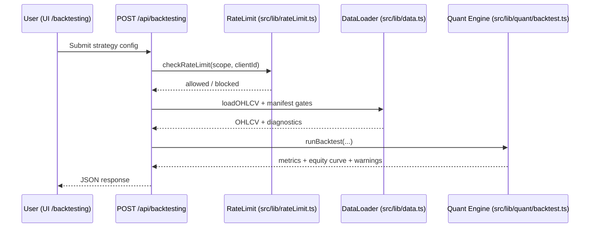
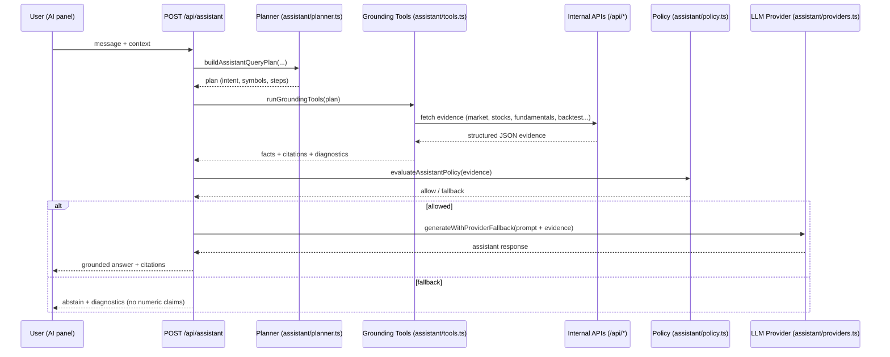

# Presentation Figures (Copy/Paste Pack)

This file collects the thesis figures (Mermaid) in one place for slide decks or presentations.
Source files also exist under `docs/thesis/figures/`.

## Figure 3.1: System Context
```mermaid
flowchart LR
  U[User / Analyst] --> UI[Next.js UI (App Router pages)]
  UI --> API[Next.js API routes (/api/*)]
  API --> Q[Quant Engine (src/lib/quant/*)]
  API --> D[Data Layer (src/lib/data.ts)]

  subgraph RuntimeData[Runtime Data]
    CSV[public/data/*.csv + data_manifest*.json]
    DUCK[public/data/quant_data.duckdb (optional)]
  end

  D --> CSV
  D --> DUCK

  Q --> API
  D --> API
  API --> UI
  UI --> U
```

## Figure 3.2: Module Architecture
```mermaid
flowchart TB
  subgraph App[UI + Routes]
    P[src/app/* pages]
    A[src/app/api/*/route.ts]
    M[src/middleware.ts]
  end

  subgraph Components[src/components/*]
    L[layout/*]
    C[charts/*]
    UIK[ui/*]
    ASUI[assistant/*]
  end

  subgraph Lib[src/lib/*]
    DATA[data.ts + dataBackend.ts + dataManifest.ts]
    QUANT[quant/* (backtest, risk, portfolio, factors, indicators)]
    ASSIST[assistant/* (planner, tools, policy, providers)]
    RL[rateLimit.ts]
  end

  subgraph Scripts[scripts/*.mjs]
    PREP[data:prepare (prepare_data_2018_2025.mjs)]
    SMOKE[smoke/qa]
    EVAL[assistant eval suites]
  end

  subgraph Runtime[public/data/*]
    DS[CSV + manifest + optional DuckDB]
  end

  P --> Components
  P --> A
  A --> Lib
  A --> DS
  PREP --> DS
  SMOKE --> A
  EVAL --> A
  M --> A
```

## Figure 3.3: Data Pipeline and Runtime Contract
```mermaid
flowchart LR
  RAW[Raw datasets (../data/*)] --> PREP[scripts/prepare_data_2018_2025.mjs]
  PREP --> RCSV[public/data/*.csv]
  PREP --> MAN[data_manifest_2018_2025.json]
  RCSV --> LOADER[src/lib/data.ts loaders]
  MAN --> LOADER

  PREP -->|optional| DUCKEXP[scripts/export_duckdb_from_runtime.mjs]
  DUCKEXP --> DUCK[public/data/quant_data.duckdb]
  DUCK --> LOADER

  LOADER --> API[API routes (/api/*)]
  API --> UI[UI pages]
  UI --> USER[User]
```

## Figure 3.4: Backtesting Request Workflow


## Figure 3.5: Grounded Assistant Pipeline


## Figure 3.6: Strategy Forge Workflow
```mermaid
flowchart TB
  subgraph Build[Build Strategy]
    CANVAS[Strategy Canvas (drag-and-drop)]
    AIGEN[AI Strategy Generator (/api/ai/generate-strategy)]
  end

  CANVAS --> SPEC[Strategy Spec (type + params + costs)]
  AIGEN --> SPEC

  SPEC --> RUN[Strategy Lab Run API (/api/strategy-lab/runs)]
  RUN --> EVENTS[Run Events (/events)]
  RUN --> RESULT[Run Result (/result)]

  RESULT --> DIAG[Diagnostics (coverage, gaps, exclusions)]
  RESULT --> KPI[KPI (return, Sharpe, drawdown, etc.)]

  KPI --> COMPARE[Compare Runs]
  DIAG --> COMPARE
  COMPARE --> USER[User decision / iteration]
```

## Figure 4.1: Docker Topology
```mermaid
flowchart LR
  subgraph Compose[docker-compose.yml]
    APP[app (Next.js dev)]
    SMOKE[smoke (scripts/smoke.mjs)]
    QA[qa (scripts/qa.mjs)]
    APPP[app-prod (prod profile)]
    SMOKEP[smoke-prod]
    QAP[qa-prod]
  end

  SMOKE -->|depends_on healthy| APP
  QA -->|depends_on healthy| APP
  SMOKEP -->|depends_on healthy| APPP
  QAP -->|depends_on healthy| APPP
```

## Figure 4.2: Evaluation Pipeline
```mermaid
flowchart TB
  PREP[Prepare runtime data] --> HEALTH[Health probe (/api/health/data?probe=true)]
  HEALTH --> STATIC[Lint + Typecheck]
  STATIC --> SMOKE[Docker smoke]
  SMOKE --> QA[Docker QA]
  QA --> AEVAL[Assistant eval suites]
  AEVAL --> REPORT[Artifacts + report]
  REPORT --> DECIDE{Meets acceptance gates?}
  DECIDE -->|yes| PASS[Thesis demo ready]
  DECIDE -->|no| FIX[Fix + rerun]
  FIX --> PREP
```

