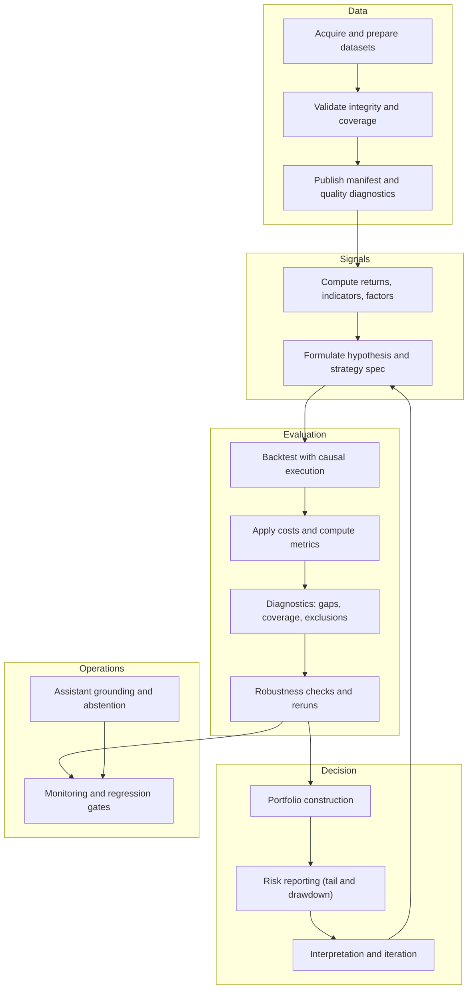
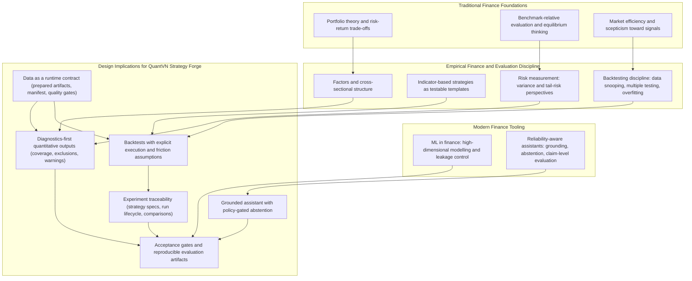

# Chapter 2: Literature Review and Theoretical Background
<!-- archived snapshot: pre-rewrite (2026-02-22) -->

This chapter develops the theoretical and empirical background used to justify the system requirements and evaluation methodology of QuantVN Strategy Forge. The review is organised to preserve a direct link to the product problem stated in Chapter 1: quantitative outputs and assistant-mediated explanations must remain defensible under scrutiny. Accordingly, the narrative begins with traditional finance theory (portfolio choice, equilibrium pricing, market efficiency), then moves to empirical asset pricing and factors, risk measurement, and backtesting discipline, and finally transitions to modern machine learning (ML) in finance and reliability-aware AI assistants.

The thesis adopts a unifying methodological stance: quantitative outputs are conditional statements. A system may compute risk metrics, ranks, factor exposures, or backtest outcomes, but those numbers are meaningful only under explicit assumptions about data integrity, sampling windows, execution models, and evaluation discipline. This conditional view is reinforced by both classical finance theory (assumption-driven) and modern ML and LLM reliability research (generalisation and truthfulness). The chapter culminates in two summaries: Figure 2.1 formalises the end-to-end quant cycle as a workflow, while Figure 2.2 maps the literature to concrete design commitments that are operationalised in Chapter 3.

## 2.1 Portfolio Theory and the Meaning of Risk-Return Trade-Offs
Mean-variance portfolio theory formalises portfolio selection as an optimisation problem over expected returns and return variance, where diversification and covariance structure determine the efficient frontier (Markowitz, 1952). In this view, risk is not a scalar attribute of an asset but a relational property of assets jointly distributed. Covariances, correlations, and overlap windows therefore become first-class objects.

### 2.1.1 Estimation as a System Constraint
The practical interpretation of Markowitz optimisation is constrained by estimation. Expected returns and covariances must be estimated from historical samples, and those estimates are sensitive to window length, missingness, and calendar mismatches. Even without claiming a specific estimator, a reliable system should treat the estimation pipeline as part of the evidence. In a fintech product, this motivates (i) explicit minimum-history constraints, (ii) diagnostics about overlap and exclusions, and (iii) a preference for deterministic, reproducible computation.

### 2.1.2 Portfolio Outputs as Conditional Evidence
Because portfolio outputs depend on estimated inputs, they should be interpreted as conditional evidence rather than as stable truths. A system that provides portfolio optimisation should therefore either constrain the conditions under which it returns an optimisation output or provide transparency about sensitivity and exclusions. This is consistent with the broader thesis view that "reliability" includes not only correctness of computation but also correctness of interpretation.

## 2.2 Equilibrium Pricing and Benchmark-Relative Evaluation
The Capital Asset Pricing Model (CAPM) links expected return to systematic risk exposure, providing a benchmark for risk-adjusted comparisons and motivating beta as a canonical measure of market risk (Sharpe, 1964). While the CAPM is not universally accepted as a descriptive model, its conceptual role persists in practice: benchmark-relative risk attribution, beta-like interpretations, and performance normalisation remain common.

### 2.2.1 Performance Measurement and the Need for Comparable Samples
Performance evaluation literature emphasises that risk-adjusted comparisons depend on consistent assumptions and comparable samples. For example, the Sharpe ratio and related measures are meaningful only if return series are constructed consistently and reflect comparable sampling windows. Early empirical work on mutual fund performance illustrates how performance evaluation becomes a measurement problem rather than a purely narrative one (Sharpe, 1966). For product design, the implication is direct: a system that ranks strategies by risk-adjusted metrics must document and enforce the return-construction and sampling assumptions that define those metrics.

### 2.2.2 System Implication: Alignment and Traceability
A reliable platform should make benchmark alignment explicit. Beta-like quantities depend on synchronised return series; shifting or mismatched calendars can bias estimates. Therefore, the system should surface overlap windows, date alignment methods, and exclusions as part of the returned evidence.

## 2.3 Market Efficiency and the Epistemology of Signals
The efficient market hypothesis argues that prices incorporate available information such that persistent statistical advantages should be hard to obtain without bearing risk premia or exploiting frictions (Fama, 1970). EMH therefore provides a discipline for strategy design: it motivates scepticism toward patterns that appear strong in-sample and encourages explicit justification for why a pattern should persist.

From a product perspective, EMH motivates conservative defaults and transparent diagnostics. If signals are expected to be weak and noisy, then the system should avoid presenting a single backtest as definitive evidence. Instead, it should help users reason about assumptions and limitations.

## 2.4 Empirical Factors and Cross-Sectional Structure
Empirical asset pricing shows that a single market beta is often insufficient to explain cross-sectional return differences. The Fama-French three-factor model extends CAPM by introducing size and value factors (Fama & French, 1993). Later work proposes a five-factor model incorporating profitability and investment-related dimensions (Fama & French, 2015). These models provide a structured bridge between traditional equilibrium reasoning and implementable analytics.

### 2.4.1 Factors as a Design Requirement, Not a Taxonomy
The thesis does not claim that a specific factor set is the only correct model. Instead, the factor literature motivates design constraints:

1. Factor estimates are meaningful only on comparable samples; therefore, symbol coverage and overlap windows must be observable.
2. Factor outputs should be conditional on a declared universe, window, and data-quality contract.
3. Exclusions due to insufficient data should be transparent and reproducible.

These constraints motivate why QuantVN Strategy Forge treats coverage diagnostics and exclusion reasons as product-level outputs rather than as internal logs.

### 2.4.2 Relating Factors to Strategy Workflows
Factors are commonly consumed through workflows such as screening (filtering), portfolio tilts (construction), and explanatory diagnostics (attribution). Therefore, factor analytics should interoperate with screening and portfolio modules under a shared data contract. When the assistant explains a factor ranking, it should reference the underlying computed evidence rather than narrating plausible financial reasoning without traceability.

### 2.4.3 Factor Construction, Regression Attribution, and "Explanations" as Estimates
In practical quantitative workflows, factors are not only "economic concepts" but also concrete engineered time series and cross-sectional portfolios. Even for canonical factors, construction choices matter: the return frequency, the treatment of missing values, and the universe definition all affect the realised factor return series and therefore the measured exposures. In other words, "factor exposure" is not a property that exists independently of the measurement pipeline. It is an estimate computed from a chosen sample under a chosen construction.

A common explanatory workflow is regression-based attribution. Performance is decomposed into contributions from factor exposures and an unexplained residual often described as alpha. This logic is historically connected to equilibrium pricing and benchmark-relative reasoning: CAPM-style decompositions interpret average returns relative to systematic risk exposures (Sharpe, 1964), and multifactor models extend this logic to additional dimensions of risk or characteristic structure (Fama & French, 1993; Fama & French, 2015). In managed portfolio settings, adding momentum to the factor set can change interpretations of persistence by reclassifying part of the return as systematic exposure rather than idiosyncratic skill (Carhart, 1997). The methodological lesson is that explanations are model-dependent. A platform should therefore treat explanations as conditional on the factor set and the estimation window, rather than presenting a single explanatory narrative as uniquely correct.

This conditionality has direct consequences for an AI-assisted strategy system. Users often ask "why" questions that are not purely descriptive, such as why a strategy performed well or why a symbol is ranked highly. A reliability-aware assistant should convert such questions into evidence-grounded statements. For example, an explanation can be phrased as: over the chosen sample and under the selected factor model, the strategy's returns covary with a small set of factor returns, while the residual component is sensitive to costs and window choice. This aligns the explanation with measurable outputs and avoids unsupported causal claims.

From a system design perspective, this motivates three additional design constraints.
1. **Expose factor definitions and sample windows.** Because factor series depend on construction, users should see the factor set, the window, and basic diagnostics rather than being presented with an abstract label alone.
2. **Represent attribution outputs as estimates with uncertainty.** Even if a platform does not implement full confidence intervals, it should communicate that exposures and residuals are estimated from finite samples and may vary across windows. This discourages overinterpretation of small differences and supports comparative analysis under consistent assumptions.
3. **Make factor models interoperable with strategy specifications.** A factor explanation is most useful when it refers to the same returns and the same decision timing used in backtesting. If factor exposures are estimated on returns that are inconsistent with the strategy's execution assumptions, the explanation becomes a narrative detached from the evaluated evidence.

These constraints support the thesis's broader claim that quant outputs should be treated as conditional evidence rather than as unconditional truths. In a fintech committee setting, this perspective is valuable because it ties interpretability to reproducibility: explanations are not only "more understandable" but also traceable to computations under stated assumptions.

### 2.4.4 Discount Rates and Conditional Interpretation
Factor models and characteristic signals are often interpreted as if they were stable properties. However, a large portion of return predictability can be framed as variation in discount rates and risk premia rather than as time-invariant mispricing. Cochrane (2011) emphasizes discount-rate variation as a central lens for interpreting empirical regularities. For system design, this perspective matters because it discourages overconfident narratives. If expected returns vary with state variables and regimes, then a factor exposure or cross-sectional rank should be reported as an estimate conditional on the sample window and the current regime, not as a permanent attribute of a symbol.

In a fintech product, the practical consequence is to shift from declarative claims ("Stock X is a value stock, therefore it will outperform") toward evidence-oriented summaries ("Over the chosen sample, the symbol's computed characteristics align more closely with value-like exposures, under the defined factor construction"). The assistant layer should also avoid attributing causality beyond what is supported by the computed evidence. This is particularly important for committee-facing demonstrations: the system should be conservative in interpretation and explicit about assumptions.

### 2.4.5 Factor Proliferation, Multiple Testing, and Post-Discovery Decay
The empirical factor literature is also shaped by a reliability problem: a large number of candidate factors and characteristics have been proposed, and many are evaluated on overlapping datasets. When a research pipeline tests many predictors, some will appear significant by chance. Harvey et al. (2016) highlight this issue in the cross-section of expected returns, motivating stricter standards for statistical evidence and a more skeptical interpretation of newly proposed factors.

Another important empirical regularity is that published predictability can weaken after discovery. McLean and Pontiff (2016) document that anomaly-based return predictability tends to decline after publication, consistent with learning and arbitrage reducing exploitable structure. For a product, this motivates two design attitudes. First, the system should treat factor and anomaly signals as hypotheses that require re-evaluation rather than as durable edges. Second, the system should support re-runs and comparisons under consistent assumptions so that users can detect degradation over time.

These considerations also motivate the role of diagnostics and gates. A platform that enables easy exploration of many strategies or signals increases the search space and therefore can increase the risk of overfitting to historical noise (Bailey et al., 2016). Therefore, the product should guide the user toward evaluation discipline: explicit transaction frictions, causal execution assumptions, minimum-history constraints, and reproducible reruns are practical mechanisms for resisting the tendency to cherry-pick impressive but fragile outcomes.

## 2.5 Momentum, Persistence, and the Strategy-Design Bridge
Many practical strategies are motivated by empirical anomalies. Momentum, for example, is documented as a cross-sectional regularity in which past winners tend to outperform past losers over intermediate horizons (Jegadeesh & Titman, 1993). Multifactor models incorporating momentum are often used to explain performance persistence in managed portfolios (Carhart, 1997). The existence of such regularities does not imply easy exploitation, but it motivates why strategy-design platforms often include momentum-style rules.

For a product, the implication is again conditionality: strategies inspired by anomalies should be evaluated under conservative assumptions and with explicit costs and diagnostics, because apparent profitability can be sensitive to execution and sample choices.

### 2.5.1 Implementation Sensitivity: Universe, Rebalancing, and Capacity
Anomaly evidence is typically reported under specific portfolio construction and rebalancing conventions. Small implementation choices can materially affect results. For example, how the universe is filtered, how frequently positions are updated, and how signals are formed (ranking vs thresholding) can change turnover and therefore the influence of transaction costs. A product that provides momentum or factor-tilt templates should therefore represent these choices explicitly and allow users to inspect their effect through diagnostics (turnover proxies, exposure measures, and net-vs-gross comparisons).

From a systems perspective, this is another instance of conditional outputs. A momentum rule is not a single number; it is a process that depends on a specification. The platform should treat the specification as the primary object and the backtest metrics as derived evidence under that object. This encourages users to revise hypotheses by modifying explicit parameters rather than by implicitly changing hidden assumptions.

### 2.5.2 Persistence, Factor Adjustment, and Avoiding Overconfident Narratives
Performance persistence is often analyzed through factor-adjusted lenses. Carhart (1997) shows that accounting for momentum as a factor can alter interpretations of performance persistence. The implication for a product is that explanations should be framed carefully. If a strategy's performance is largely explained by known exposures, the correct interpretation is not necessarily that the strategy is "skilled" but that it loads on systematic dimensions. Conversely, if performance remains after accounting for common exposures, the remaining component should still be treated as evidence under assumptions rather than as proof of persistent alpha.

This motivates a conservative assistant behavior. When users ask "why did the strategy work," the assistant should connect explanations to measurable diagnostics and exposures rather than relying on speculative causal stories. A reliability-aware assistant should also highlight that anomaly profitability can weaken over time, consistent with post-discovery decay (McLean & Pontiff, 2016), and therefore should encourage reruns and comparisons under consistent assumptions.

### 2.5.3 Momentum as a Case Study in End-to-End Constraints
Momentum is a useful case study because it links several themes in this chapter: empirical evidence, implementation sensitivity, and evaluation discipline. The original anomaly result is typically framed in terms of forming portfolios based on past returns and holding them over intermediate horizons (Jegadeesh & Titman, 1993). However, implementing such a strategy in a real system requires making several decisions that determine whether the hypothesis is even being tested.

First, timing and information availability matter. A momentum signal based on recent returns must be computed from returns that are known at decision time. If a backtest forms positions at the same close used to compute the signal without accounting for the ordering of information, it can implicitly assume execution at a price that was not actually available when the signal was formed. For a product, this suggests that signal computation and execution should be expressed as a causal pipeline: signals are computed from information available up to time t, and execution is simulated at time t+1 or under another explicitly specified convention. This type of causal bookkeeping is not an implementation detail; it is part of the scientific meaning of the backtest.

Second, turnover and costs are not secondary for momentum-style rules. Portfolio ranking strategies often induce substantial turnover, particularly when the universe is large or the holding horizon is short. Transaction costs and slippage therefore play a central role in determining whether the strategy is viable. Moreover, when turnover is high, a naive cost model can produce a false sense of robustness. The optimal execution literature frames trading as a trade-off between speed (reducing exposure to adverse price moves) and impact (moving the market by trading aggressively), motivating why execution assumptions should be explicit rather than implicit (Almgren & Chriss, 2001). In a thesis platform, a simplified cost model can still be informative if it is accompanied by sensitivity analysis and by a clear separation of gross versus net performance.

Third, momentum connects naturally to factor-based interpretation. Because momentum appears as a systematic dimension in multifactor settings, explanations should distinguish between "alpha" narratives and exposure narratives (Carhart, 1997). A strategy that looks profitable might be profitable primarily because it loads on momentum-like return components that are correlated with other risk dimensions. A reliability-aware assistant should therefore avoid statements that imply persistent skill unless the evidence supports such a claim under the chosen factor model and window.

Finally, the persistence of the anomaly itself should be treated as uncertain. Evidence that predictability decays after publication suggests that any momentum strategy should be periodically re-evaluated rather than treated as a permanent edge (McLean & Pontiff, 2016). This reinforces why the product and the thesis emphasise reproducible workflows: users should be able to rerun the same strategy specification under updated samples, revised cost assumptions, and consistent evaluation gates. In this framing, momentum is not a "template to deploy"; it is a hypothesis family that must be tested repeatedly under transparent conditions.
## 2.6 Technical Analysis and Indicator-Based Strategies
Technical analysis is often implemented through indicators and rules such as moving-average crossovers, RSI thresholds, Bollinger-band breakout/mean-reversion rules, and trend/momentum filters. While such rules are widely used in practice, their evidence base depends strongly on how they are evaluated.

Early empirical work shows that simple technical trading rules can produce in-sample patterns in historical data, motivating both interest and scepticism (Brock et al., 1992). Subsequent research develops computational and statistical frameworks for technical pattern detection and inference, emphasising that technical signals should be assessed with explicit statistical reasoning and careful out-of-sample discipline (Lo et al., 2000).

### 2.6.1 Design Implication: Indicators Are Not Evidence Without Evaluation
Indicator computation is deterministic, but the inference drawn from indicators is not. Therefore, a strategy platform should treat indicator-based strategies as hypotheses to be tested under explicit backtesting assumptions rather than as reusable "recipes" whose performance can be assumed. This motivates why QuantVN Strategy Forge emphasises a backtesting module with explicit execution timing, cost modelling, and diagnostic reporting.

### 2.6.2 Data-Snooping in Rule Discovery and Why "Many Rules" Is a Reliability Risk
Indicator-based strategies are particularly vulnerable to a subtle failure mode: it is easy to generate a large number of plausible rules and then select those that perform best in-sample. This creates the appearance of evidence even when the strategy family is effectively a high-dimensional search. Data-snooping perspectives formalize this risk. White (2000) motivates the need to adjust conclusions when strategies are selected after testing many candidates. Sullivan et al. (1999) apply bootstrap-style reasoning to technical trading rules, illustrating that impressive historical performance can occur through selection on the same sample.

From a product standpoint, this motivates explicit constraints. A strategy builder that makes it easy to try many combinations increases the search space and therefore can increase the risk of backtest overfitting (Bailey et al., 2016). The system does not need to prevent exploration, but it should communicate that a backtest result is conditional evidence under a search process. Practical safeguards include:
- exposing the number of strategies or parameter combinations tested in an experiment log,
- providing sensitivity views (how results change with small parameter perturbations),
- enforcing conservative default assumptions (causal execution, nonzero costs), and
- requiring minimum usable history after cleaning before metrics are reported.

In a thesis product, such safeguards can be implemented as deterministic gates and diagnostics rather than as full statistical corrections. The goal is to reduce user overconfidence by making fragility visible.

### 2.6.3 Data Integrity in Indicator Strategies: Corporate Actions, Survivorship, and Regime Breaks
Indicator strategies operate directly on price series. As a result, they are sensitive to data integrity problems and structural breaks. Even when raw data appear plausible, hidden issues can distort signals:
- **Corporate actions and discontinuities.** Splits, dividends, and symbol changes can introduce discontinuities that resemble large price moves. If the dataset is not adjusted consistently, indicator thresholds and drawdown metrics can be distorted.
- **Survivorship and universe drift.** If the dataset implicitly excludes failed or delisted assets, reported profitability can be biased upward (Brown et al., 1992). In practical platforms, this motivates explicit universe definitions and clear statements about coverage boundaries.
- **Regime breaks and market structure.** Even when data are correct, regimes can change (liquidity, volatility, policy regimes), causing indicator strategies to degrade. This reinforces the need for monitoring and repeatable evaluation rather than one-off demonstrations.

These concerns motivate why data validation should be observable. A reliability-first platform should show what was filtered, which rows were dropped, and which symbols were excluded. When an assistant explains indicator-based results, it should reference these diagnostics rather than presenting results as unconditional truths.

## 2.7 Risk Measurement: Variance, Tail Risk, and Coherence
Risk measurement translates return series into interpretable constraints for decision making. Classical portfolio theory typically uses variance as a proxy for risk, partly because it leads to tractable optimisation and aggregation through covariances (Markowitz, 1952). However, variance and volatility are symmetric measures: they penalise upside and downside deviations equally and can underrepresent adverse outcomes in heavy-tailed return distributions. In many real markets, return distributions exhibit skewness and kurtosis that make downside risk particularly salient for practitioners and fintech users who reason in terms of drawdowns and tail events rather than average dispersion.

Tail-oriented measures address this limitation by focusing on quantiles and tail expectations. Value at Risk (VaR) summarises the loss quantile at a given confidence level, while Conditional Value at Risk (CVaR, also called expected shortfall) summarises the expected loss conditional on exceeding that quantile. CVaR supports convex optimisation formulations and is widely used in risk-aware allocation contexts (Rockafellar & Uryasev, 2000).

### 2.7.1 Coherence and Why the Risk Definition Matters
Risk measures are not interchangeable summaries; they encode properties that affect portfolio aggregation and therefore user interpretation. Artzner et al. (1999) formalise a set of axioms for "coherent" risk measures, including monotonicity, translation invariance, positive homogeneity, and subadditivity. The subadditivity property is particularly relevant for portfolio systems: it expresses the diversification principle that combining positions should not increase measured risk beyond the sum of standalone risks. When a risk measure violates such properties, a platform can inadvertently encourage fragile allocations because optimisation under an incoherent objective may produce counterintuitive or unstable allocations under small distributional changes.

For system design, coherence is less about academic elegance and more about interpretability and user safety. If the platform reports a tail metric, it should communicate what the metric guarantees and what it does not. For example, CVaR can be a more stable target for downside-oriented optimisation, but it still depends on sampling and assumptions about the tail beyond observed data (Rockafellar & Uryasev, 2000).

### 2.7.2 Estimation, Nonstationarity, and the Limits of Point Risk Numbers
The central operational challenge is estimation. Any risk number is an estimator computed from a finite sample. Its reliability depends on usable history after cleaning, overlap across assets, and the stationarity of the underlying process. Short samples and missing data points can materially change tail estimates because tails are defined precisely by rare events. Nonstationarity further complicates inference: a stable-looking estimate over one window can become misleading when volatility regimes shift. Consequently, risk reporting should be treated as conditional evidence under a stated window and data contract, consistent with the broader thesis stance that quantitative outputs are meaningful only under explicit assumptions (Fama, 1970; Hastie et al., 2009).

For a product, the implication is that risk metrics should be accompanied by diagnostics rather than presented as unconditional truths. A reliability-first system should surface the sample window, the number of observations used, the amount of missingness removed, and whether returns were computed at a consistent frequency. These diagnostics help users interpret whether changes in risk reflect actual changes in market behaviour or merely changes in data availability and cleaning.

### 2.7.3 Risk Reporting as a Workflow Input (Not Only a Dashboard Output)
In an end-to-end quantitative workflow, risk metrics serve two roles. First, they are constraints for portfolio construction: mean-variance reasoning uses covariances to allocate capital under a risk tolerance (Markowitz, 1952). Second, they are monitoring signals: the same tail and volatility summaries can be tracked over time to detect drift and regime breaks that may invalidate earlier backtests. This dual role motivates consistent, reproducible computation. If risk is computed differently across experiments, comparisons become narrative rather than evidence-driven.

The platform implication is methodological: tail metrics should not be presented as context-free numbers. A reliability-critical system should either enforce stable preconditions (minimum history, consistent return construction, explicit frequency) or communicate limitations through structured warnings and exported diagnostics.

## 2.8 Backtesting Discipline, Data Snooping, and Multiple Testing
Backtesting is the principal mechanism by which strategy ideas are translated into quantitative evidence. However, backtests can be misleading when strategies are discovered through repeated experimentation.

Bailey et al. (2016) formalise the probability of backtest overfitting and show how the risk rises with the degrees of freedom in the research process. Data-snooping concerns are also emphasised in econometrics: when many strategies are tested on the same sample, conventional significance claims can become unreliable. The "reality check" perspective motivates controlling for selection effects under multiple comparisons (White, 2000). Superior Predictive Ability tests further provide a framework for comparing candidate predictors while accounting for data snooping (Hansen, 2005). In empirical asset pricing, multiple testing issues are also highlighted in the context of factor discovery and the cross-section of expected returns (Harvey et al., 2016).

### 2.8.1 Product Implication: Conservative Defaults and Diagnostics
A thesis product cannot implement every advanced statistical test; however, the literature implies that a product should resist optimistic bias by design. Conservative defaults (causal execution, explicit frictions), clear reporting of assumptions, and diagnostic-rich outputs are pragmatic implementations of the same discipline.

### 2.8.2 Evidence as a Workflow, Not a Screenshot
The core implication for system design is that "evidence" should be reproducible and auditable. A platform should enable rerunning backtests under recorded assumptions and should export diagnostics that explain data coverage, cleaning, and exclusions. This thesis operationalises that requirement through reproducible scripts and acceptance gates (described later), rather than relying on ad hoc demonstrations.

### 2.8.3 Transaction Costs, Slippage, and Execution as First-Class Assumptions
Backtest credibility depends critically on whether simulated execution resembles plausible trading. Even a simple long-only strategy can have performance that is highly sensitive to turnover once realistic costs are applied, and indicator-based or short-horizon strategies can be dominated by frictions if those frictions are underestimated. Therefore, it is methodologically unsafe to treat transaction costs as an optional add-on: they are part of the hypothesis being tested.

At minimum, backtests should distinguish between gross returns (signal-only) and net returns (after costs) to avoid confusing signal strength with unmodelled frictions. A rigorous treatment of execution further recognises that trading itself moves prices in liquidity-limited settings. The optimal execution literature models a trade-off between market impact and timing risk, motivating the idea that execution assumptions should be explicit and parameterised rather than hidden (Almgren & Chriss, 2001). For a thesis platform that targets transparency rather than institutional-scale microstructure, the main implication is pragmatic: strategy evaluation should include explicit cost knobs and should report sensitivity of results to plausible cost ranges.

Execution modelling is also tied to capacity. A strategy can look attractive at small scale but degrade when scaled due to impact and limited liquidity. Because capacity is difficult to estimate without detailed order book data, a conservative product stance is to treat capacity as an uncertainty and to encourage users to interpret backtests as conditional evidence under an assumed cost and liquidity regime rather than as a scalable guarantee.

Practically, this implies that cost modelling should be decomposable and reportable. Rather than presenting a single opaque "cost %" adjustment, systems can expose interpretable components such as per-trade fees, a spread proxy, and a slippage or impact proxy that scales with turnover. Even if these components are simplified, their explicitness encourages users to ask the correct scientific question: whether a strategy's edge is robust to plausible friction regimes. This design also supports comparison across strategy families. A low-turnover factor tilt may be relatively insensitive to costs, whereas a short-horizon indicator strategy may be viable only under optimistic execution assumptions. Making these distinctions visible is a reliability feature, because it reduces the risk that users infer tradability from gross backtest charts.

### 2.8.4 Metric Choice, Sampling Uncertainty, and Overconfident Ranking
Backtests typically report summary statistics such as mean return, volatility, drawdown, and Sharpe ratio. These summaries are convenient, but their stability depends on sample length and return distributional properties. In particular, risk-adjusted metrics such as the Sharpe ratio can exhibit nontrivial sampling behaviour in finite samples and under non-normal returns, implying that small differences in reported Sharpe ratios are often not meaningful (Lo, 2002). This matters directly for product UX: ranking many strategies by a single scalar metric invites overinterpretation when confidence intervals overlap or when results hinge on a small number of extreme observations.

Consequently, the literature suggests two design disciplines. First, systems should expose enough evidence for users to assess stability: windows, number of observations, and whether performance is concentrated in a particular regime. Second, systems should encourage robustness reasoning rather than single-number optimisation. Sensitivity analysis (varying window lengths, rebalancing frequency, cost assumptions, and parameter values) is a practical surrogate for more formal multiple-testing corrections when a product cannot implement the full statistical machinery (White, 2000; Bailey et al., 2016).

## 2.9 End-to-End Quantitative Research Cycle (Data -> Signals -> Backtests -> Portfolios -> Monitoring)
The preceding sections can be synthesised into a single methodological claim: quantitative systems should be designed around an end-to-end research cycle rather than around isolated metrics. In practice, the credibility of a quantitative conclusion depends on the entire chain. A strategy can fail because the signal is weak, because the data are invalid, because execution assumptions are optimistic, or because evaluation was implicitly conditioned on the same data used for discovery. Reliability therefore requires controlling the cycle end-to-end and making that control observable to users.

This section makes the research cycle explicit and ties each stage to the literature. The purpose is not to add new theoretical contributions, but to explain why the system design in Chapter 3 emphasises (i) data contracts and diagnostics, (ii) conservative evaluation assumptions, and (iii) reproducible evaluation gates for the assistant layer. For a fintech committee, the key point is practical: the product should help users distinguish evidence from artefact.

### 2.9.1 Stage 1: Data Integrity and Hidden Biases
Data issues can create systematic biases, not just noise. Survivorship bias is a canonical example. If failed or delisted assets are missing, backtests and performance summaries can be biased upward because the sample overrepresents survivors. Brown et al. (1992) show how survivorship bias can materially distort performance studies, motivating explicit universe definitions and transparent handling of coverage boundaries.

In a product setting, integrity risks tend to recur in recognizable forms:
- **Calendar mismatch and missingness.** Inconsistent trading calendars across symbols and benchmarks can bias covariance estimates and beta-like measures (Sharpe, 1964).
- **Duplicate sessions and price outliers.** Duplicate days or outlier prints can create spurious indicator crossings and distort drawdowns (Brock et al., 1992; Lo et al., 2000).
- **Silent filtering.** Implicit filtering during preparation can change results without being visible at the UI layer.
- **Inconsistent symbol histories.** Heterogeneous listing histories create non-comparable samples for cross-sectional ranks and portfolio optimisation (Markowitz, 1952; Fama & French, 1993).

The design implication is that data must be treated as a runtime contract. The system should expose what datasets exist, which periods they cover, which symbols are included, and what validation rules were applied. When conditions are not met, the system should prefer diagnostic explanations to silent degradation. This principle is particularly important in heterogeneous-universe settings, where coverage varies widely across symbols and time.

### 2.9.2 Stage 2: Feature Construction and Hypothesis Formation
After data are validated, workflows transform raw time series into derived objects: returns, rolling statistics, technical indicators, factor exposures, and cross-sectional ranks. These transformations embed assumptions about windows and sampling. Technical indicators are deterministic, but their semantics depend on window length and the stability of the input series (Lo et al., 2000). Factor models provide structured summaries of cross-sectional variation, but their interpretation depends on the factor definitions and the sample window (Fama & French, 1993; Fama & French, 2015).

Hypothesis formation is where domain judgment enters. EMH encourages scepticism about strong patterns without a reason for persistence (Fama, 1970). Anomaly evidence such as momentum (Jegadeesh & Titman, 1993) motivates plausible strategy templates, but the correct interpretation remains conditional: anomalies may weaken, shift regimes, or be arbitraged away. Evidence of decay in anomaly profitability after publication reinforces the need for cautious interpretation (McLean & Pontiff, 2016).

The product implication is that strategies should be represented as explicit, testable specifications rather than as informal narratives. A strategy spec should include the strategy family, parameter values, execution semantics, and cost assumptions so that the hypothesis is recordable and revisable.

### 2.9.3 Stage 3: Backtesting as Conditional Evidence Under Search
Backtesting produces evidence only with respect to the assumptions that define the simulation. When strategy development is a search process, backtest results are vulnerable to overfitting and selection bias. Bailey et al. (2016) formalise the probability of backtest overfitting, while econometric perspectives emphasise data-snooping risk under repeated comparisons (White, 2000; Hansen, 2005). For technical trading rules, bootstrap-style reasoning highlights how apparent profitability can arise through data snooping even when individual rules look intuitive (Sullivan et al., 1999).

These results motivate practical evaluation commitments that can be implemented as product guardrails:
- Make execution timing explicit and causal (avoid implicit look-ahead).
- Separate gross and net performance (attribute results to signal vs costs).
- Report diagnostics that expose cleaning, gaps, and usable history.
- Treat backtests as comparative evidence, not as proofs of edge.

An additional implication is that backtesting should be coupled with experiment traceability. When strategy development is iterative, the final chosen strategy is typically the outcome of many implicit decisions: parameter tweaks, universe filters, indicator variants, and cost assumptions. From the perspective of data-snooping, those decisions are not neutral; they increase the effective degrees of freedom and can inflate apparent performance (White, 2000; Sullivan et al., 1999; Bailey et al., 2016). Therefore, an evidence-oriented platform should encourage the user to treat a backtest as one step in a logged workflow rather than as a standalone artefact. Practically, this means recording the strategy specification and the evaluation configuration, exposing how many variants were tested, and enabling reruns under the same configuration. Even if the platform does not implement formal selection-adjusted p-values, it can still reduce overconfidence by making the search process visible and by encouraging out-of-sample reruns under consistent protocols (Hansen, 2005).

Furthermore, the reliability of performance ranking is limited by metric instability. Risk-adjusted metrics such as the Sharpe ratio are widely used, but their sampling distributions can be nontrivial under non-normal returns and finite samples, motivating caution when differences are small (Lo, 2002). A pragmatic product response is to enforce minimum history and to surface diagnostic warnings rather than to claim fine-grained ranking precision.

### 2.9.4 Stage 4: Portfolios and Risk Controls
Even if a single-asset strategy appears promising, capital allocation introduces new constraints. Portfolio construction inherits the conditional nature of mean-variance reasoning: outputs depend on overlap windows and covariance estimation (Markowitz, 1952). Risk reporting similarly depends on consistent return construction and sampling windows (Sharpe, 1964). Tail-risk reasoning motivates coherent risk measures and conditional value-at-risk optimisation, but these measures intensify dependence on stable sampling and explicit assumptions (Artzner et al., 1999; Rockafellar & Uryasev, 2000).

The product implication is that portfolio and risk outputs should be presented as conditional summaries with explicit diagnostics. When the data contract is not satisfied (insufficient overlap, quality issues), the system should not silently proceed as if the output were equally reliable.

### 2.9.5 Stage 5: Monitoring, Drift, and Iteration
Quantitative systems should be treated as iterative processes rather than one-off analyses. Predictability can decay as markets learn or as conditions change. McLean and Pontiff (2016) document that anomaly-based predictability tends to weaken after publication, consistent with learning and arbitrage reducing exploitable structure. More broadly, nonstationarity motivates monitoring and repeatable evaluation rather than static validation.

For a product with an assistant layer, monitoring has an additional dimension: provider variability and prompt sensitivity can change answer quality even when deterministic tools are stable. Consequently, reliability gates and reproducible evaluation suites become part of the operational lifecycle rather than only thesis experiments.

Figure 2.1 summarises the end-to-end research cycle framing used throughout this thesis.

Figure 2.1: Quantitative research and evaluation cycle (conceptual).

## 2.10 Machine Learning in Finance: High-Dimensional Prediction and Factor Modelling
ML extends empirical finance by allowing nonlinear interactions and high-dimensional feature sets. In asset pricing contexts, ML can improve prediction and cross-sectional ranking by combining many features under regularisation and careful validation (Gu et al., 2020). Related work connects ML to factor modelling and interpretable structure, suggesting that ML-based approaches can be used to estimate factor structures and risk premia under strong evaluation discipline (Kelly et al., 2019).

### 2.10.1 Generalisation and Robustness
General statistical learning principles distinguish training fit from generalisation, emphasising that high-dimensional models require control of complexity and robust evaluation (Hastie et al., 2009). In finance, nonstationarity and regime change make generalisation difficult. Therefore, a product that incorporates ML-inspired components should include explicit evaluation gates and regression tests to detect when behaviour degrades.

### 2.10.2 Deep Learning for Financial Prediction and the Baseline Problem
Deep learning has been applied to financial prediction tasks, often motivated by the ability of recurrent and sequence models to capture nonlinear temporal dependencies. For example, long short-term memory (LSTM) networks have been studied in the context of market prediction, with reported performance that depends strongly on the data representation, sampling choices, and evaluation setup (Fischer & Krauss, 2018). While such results indicate that deep models can extract useful structure, they also highlight a recurring problem in applied finance ML: the baseline is often underestimated. Simple linear models, volatility-scaled rules, or factor-based predictors can be competitive, and a complex model may appear to "win" primarily because the comparison is not controlled rigorously.

For a fintech system, the purpose of citing deep learning is not to claim that a platform should automatically deploy complex predictive models. Rather, it is to emphasise that model complexity amplifies evaluation risk. When users (or an assistant) propose a sophisticated model, the system should respond by strengthening the evidence requirements: clear baselines, walk-forward evaluation, and explicit reporting of sample windows and leakage controls (Hastie et al., 2009; Gu et al., 2020).

### 2.10.3 Time-Series Validation and Leakage Control
Validation in finance differs from typical i.i.d. settings because time ordering is part of the data-generating process. If training data include information that would not have been available at decision time, the resulting backtest becomes an artefact of leakage rather than evidence of predictability. Leakage can occur through many channels: using future-adjusted prices incorrectly, constructing features that implicitly use future returns, or selecting assets based on information that is only known ex post (for example, survivorship-based universe definitions). These risks reinforce why the thesis treats data integrity and causality as primary system concerns rather than optional "data cleaning."

As a practical stance, a thesis platform should make time causality explicit in both model evaluation and backtests: signals should be shifted to reflect information availability, and evaluation should be organised as forward-looking splits rather than random shuffles. This is consistent with the broader learning-theoretic distinction between fit and generalisation (Hastie et al., 2009) and with empirical finance practice where predictability claims are credible only when out-of-sample protocols are transparent (Gu et al., 2020).

### 2.10.4 Thesis Positioning
This thesis does not claim a new alpha model. Instead, it adopts ML-inspired evaluation discipline to motivate reliability gates and evidence grounding. Strategy suggestions and assistant outputs should be testable by deterministic backtesting, and numeric comparisons should trace to internal tool outputs.

## 2.11 Finance LLMs: Capability Context, Not a Substitute for Evidence
Recent work explores language models specialised for finance tasks. BloombergGPT is an example of a large language model trained on a mixture of general data and financial domain data, motivated by improvements in finance-specific language understanding and generation (Wu et al., 2023). FinGPT provides an open-source framing for financial LLM development and adaptation (Yang et al., 2023). These references provide capability context: domain adaptation can improve task performance.

However, capability does not imply reliability for numeric decision support. A model may produce plausible narratives or numbers without computation. Therefore, a product-level design should treat the assistant as an orchestration layer that retrieves evidence and applies policy gating before generating narrative explanations.

## 2.12 Grounded Generation and Reliability-Aware Evaluation for Assistants
Retrieval-augmented generation (RAG) conditions generation on retrieved context to improve factuality and reduce unsupported statements (Lewis et al., 2020). In a reliability-critical finance product, the retrieval source can be the platform's deterministic internal tools rather than open-web documents, improving auditability and reproducibility.

### 2.12.1 Grounding Is Necessary but Not Sufficient
Grounding alone does not guarantee truthfulness. TruthfulQA demonstrates that models may mimic human falsehoods even when they appear helpful and confident (Lin et al., 2022). Claim-level evaluation motivates scoring atomic assertions rather than holistic answer impressions, enabling fine-grained measurement of factual precision (Min et al., 2023). Abstention is also critical: SQuAD 2.0 demonstrates that systems must learn when to answer and when to decline due to insufficient evidence (Rajpurkar et al., 2018). Hallucination detection work such as SelfCheckGPT motivates evaluating consistency and contradiction under sampling-based checks (Manakul et al., 2023).

### 2.12.2 Tool Use and Agentic Orchestration
Recent agentic frameworks emphasise combining reasoning with tool use. ReAct proposes interleaving reasoning and action, motivating tool-grounded reasoning loops (Yao et al., 2022). Toolformer explores learning to use tools via self-supervision, motivating a systematic view of tool invocation as part of model capability (Schick et al., 2023). RAG evaluation frameworks such as RAGAS provide a way to measure RAG quality along dimensions such as faithfulness and answer relevance, motivating the idea that grounding pipelines should be evaluated rather than assumed (Es et al., 2023).

In this thesis, these ideas are instantiated pragmatically: the assistant is designed as a planner-to-tools-to-policy-to-provider pipeline. Tools retrieve evidence from deterministic internal services; policy gating blocks unsupported numeric claims; and the provider stage is used for narrative explanation only after evidence sufficiency is satisfied.

## 2.13 Synthesis: Design Implications for QuantVN Strategy Forge
The reviewed literature motivates a single overarching thesis implication: in quantitative finance, numbers are conditional estimates, and reliability is achieved by making the conditions explicit and verifiable. This implication becomes a product requirement in systems that aim to support decision-making. QuantVN Strategy Forge therefore treats reliability not as a user preference but as a design constraint that shapes data handling, computation, presentation, and assistant behaviour.

First, traditional finance theory implies interpretability constraints. Portfolio and risk analytics should be computed only on aligned, validated return series with explicit assumptions; otherwise, quantities such as beta, volatility, and efficient-frontier outputs can be misleading (Markowitz, 1952; Sharpe, 1964). In product terms, this motivates minimum-history constraints, calendar alignment policies, and evidence-bearing diagnostics rather than silent defaults.

Second, empirical finance and evaluation discipline imply transparency constraints. Factor analytics and backtesting should surface diagnostics that reveal coverage, exclusions, and fragility, and should adopt conservative assumptions to resist optimistic bias and overfitting incentives (Fama & French, 1993; Fama & French, 2015; Bailey et al., 2016; White, 2000; Harvey et al., 2016). In product terms, backtests are best treated as comparative evidence within a traceable workflow, not as proofs of edge.

Third, modern AI assistant literature implies evidence constraints. Conversational interfaces can improve usability, but must be grounded, evaluated at the claim level, and permitted to abstain when evidence is missing (Lewis et al., 2020; Lin et al., 2022; Min et al., 2023; Manakul et al., 2023; Rajpurkar et al., 2018). In product terms, a finance assistant should behave as an orchestrator of evidence retrieval and interpretation, with policy-gated abstention as a reliability feature.

Figure 2.2 summarises how the literature reviewed in this chapter translates into system-level requirements and methodological commitments that will be instantiated in Chapter 3.

Figure 2.2: Literature-to-design map (from finance theory to system requirements).

Chapter 3 translates these implications into the system architecture and methodology of QuantVN Strategy Forge, and Chapter 4 reports implementation-linked evaluation results using reproducible gate suites.

The goal is a system whose outputs remain defensible under scrutiny and rerunnable over time.

