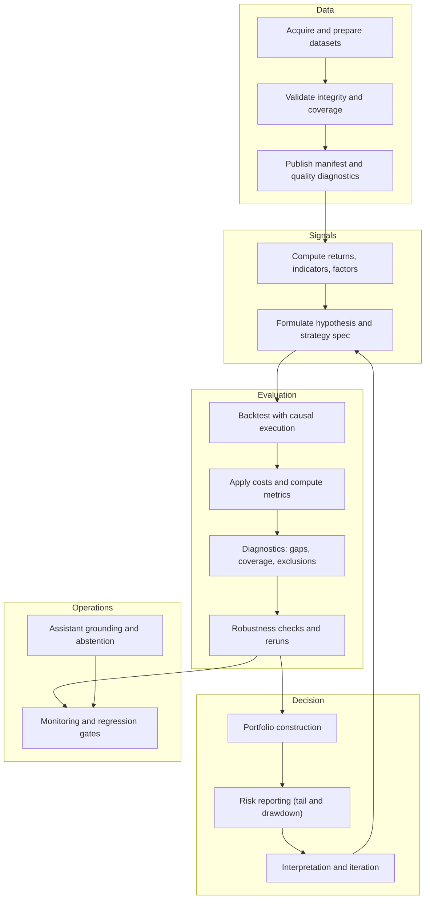
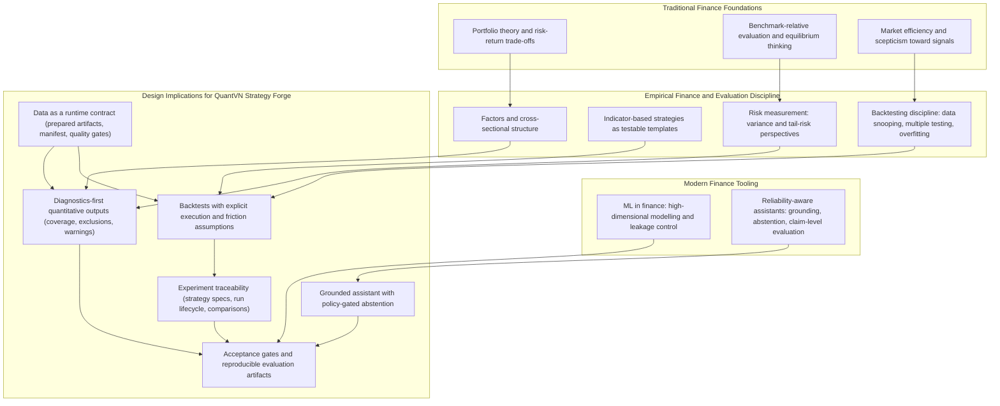

# Chapter 2: Literature Review and Theoretical Background

This chapter reviews the theoretical and empirical foundations used to justify the system requirements and evaluation methodology of QuantVN Strategy Forge. The review is organised to preserve the "golden thread" from Chapter 1: the thesis problem is not only usability, but defensibility. Quantitative outputs (risk metrics, factor exposures, and backtest results) and assistant-mediated explanations must remain credible under scrutiny. Accordingly, the narrative begins with classical finance theory (portfolio choice, equilibrium thinking, and market efficiency), transitions to empirical asset pricing and strategy research practice (factors, momentum, backtesting discipline, and risk measurement), and then connects these foundations to modern machine learning (ML) evaluation discipline and reliability-aware AI assistants.

A unifying stance guides the chapter: quantitative outputs are conditional statements. A system may compute numbers, but those numbers are meaningful only under explicit assumptions about data integrity, calendar alignment, sampling windows, execution modelling, and evaluation protocols. Classical finance theory is built on assumptions and conditional reasoning (Markowitz, 1952; Sharpe, 1964), and modern ML and LLM reliability research reinforces the same idea through generalisation and truthfulness concerns (Hastie et al., 2009; Lin et al., 2022). The chapter culminates in two summaries. Figure 2.1 expresses the end-to-end quant research cycle as a workflow, and Figure 2.2 maps the reviewed literature to concrete design commitments that are operationalised in Chapter 3.

## 2.1 Risk-Return Foundations: Portfolio Choice as Estimation
Mean-variance portfolio theory frames portfolio selection as an optimisation problem over expected return and return variance, where diversification and covariance structure determine the efficient frontier (Markowitz, 1952). A key systems implication follows immediately: risk is not a scalar attribute of an asset but a relational property of joint returns. Therefore, any portfolio or risk output is conditioned on aligned return series and on the quality of estimated inputs.

In practice, estimation becomes a system constraint. Expected returns and covariances must be estimated from finite samples that can be short, missing, or misaligned across symbols. Even without committing to a specific estimator, a reliability-conscious platform should make estimation preconditions explicit (minimum history, overlap requirements) and surface diagnostics about exclusions and sample size. This is not a purely technical detail: because portfolio outputs are functions of estimated inputs, portfolio weights and efficient-frontier shapes should be interpreted as conditional evidence rather than stable truths.

## 2.2 Benchmarking and Equilibrium Thinking: Comparable Samples and Attribution
Equilibrium pricing models motivate benchmark-relative evaluation by linking expected return to systematic risk exposure. The Capital Asset Pricing Model (CAPM) provides a canonical baseline and motivates beta as a measure of market risk (Sharpe, 1964). Although CAPM is not universally accepted as a descriptive model, its conceptual role persists in practice: risk-adjusted evaluation, benchmark alignment, and attribution remain standard analysis patterns.

Performance evaluation, however, is a measurement problem. Risk-adjusted metrics (including the Sharpe ratio) are meaningful only if return series are constructed consistently and reflect comparable sampling windows. Early work on mutual fund performance makes this sensitivity explicit and highlights how evaluation depends on measurement choices rather than narrative alone (Sharpe, 1966). For a product-oriented thesis, the implication is direct: any platform that reports risk-adjusted rankings should document and enforce the return construction and alignment assumptions that define those metrics. Beta-like estimates, in particular, depend on synchronised calendars; mismatched dates can bias estimates and create false confidence in the output.

## 2.3 Market Efficiency and the Epistemology of Signals
The efficient market hypothesis argues that prices incorporate available information such that persistent statistical advantages should be difficult to obtain without bearing risk premia or exploiting frictions (Fama, 1970). For system design, EMH serves as a discipline rather than as a claim of impossibility: it motivates scepticism toward any single backtest as evidence of durable edge. Apparent patterns may be artefacts of data mining, sample selection, or implementation choices.

In applied platforms, this epistemic stance should shape how signals are presented. Signals should be treated as hypotheses to be evaluated under controlled assumptions and compared under consistent protocols, not as facts to be asserted. A reliability-oriented platform therefore needs to make the context of evidence visible: windows, universe definitions, overlap diagnostics, and exclusions. Without these constraints, systems risk producing outputs that are numerically correct but interpretatively misleading.

## 2.4 Empirical Factors, Discount Rates, and the Multiple-Testing Problem
Empirical asset pricing models interpret returns through systematic factors that capture cross-sectional structure. The three-factor model (market, size, value) and later extensions such as the five-factor model (adding profitability and investment) provide widely used baselines for interpreting strategy returns beyond raw performance (Fama & French, 1993; Fama & French, 2015). Factors are not simply taxonomies: they motivate diagnostics such as factor exposures, attribution regressions, and comparisons against factor-mimicking portfolios.

However, factor outputs are conditional estimates. Factor construction choices (sorting rules, weighting, and rebalancing frequency) interact with data processing decisions (return definitions and corporate action handling) and can change estimated exposures. Discount-rate theory reinforces conditional interpretation: expected returns depend on time-varying discount rates, so factor premiums are not constant truths (Cochrane, 2011). These considerations motivate a practical thesis implication: factor analytics should be presented with explicit assumptions and limitations, and systems should support window controls and rolling diagnostics to reduce regime-driven overinterpretation.

A further reliability concern is factor proliferation and multiple testing. When many candidate factors are tested, false discovery becomes likely, and reported premiums can decay after discovery. Harvey et al. (2016) formalise the multiple-testing concern in factor discovery, and McLean and Pontiff (2016) document post-publication weakening in anomaly-based predictability. For a thesis platform, the implication is conservative: factor and anomaly findings should be treated as hypotheses requiring robustness checks rather than as stable edges that justify confident numeric claims.

## 2.5 Strategy Design as Search: Momentum, Technical Rules, and Execution Assumptions
Momentum illustrates both the promise and fragility of strategy design. Jegadeesh and Titman (1993) document intermediate-horizon momentum, and subsequent work connects performance persistence and evaluation sensitivity to implementation details and measurement choices. In mutual fund contexts, persistence measures can be sensitive to how performance is measured and to sample selection (Sharpe, 1966; Carhart, 1997). These findings motivate a general principle: a strategy's apparent strength can be an artefact of choices that are easy to vary and hard to notice unless the workflow makes them explicit.

This motivates a workflow view of strategy development: strategy design is a search process over model families, parameter grids, universes, and windows. Search creates a reliability risk because repeated experimentation can produce apparently strong strategies that are overfit to noise. Bailey et al. (2016) formalise this as the probability of backtest overfitting increasing with the size of the search space. A platform that supports strategy design should therefore encourage traceable experimentation and discourage overconfident inference from a single "best" backtest.

Indicator-based strategies provide a useful lens because they can be expressed as modular templates, but the literature also shows why these strategies require disciplined evaluation. Empirical work finds that simple technical rules can exhibit statistical patterns, yet the reliability of such findings depends on controlling data snooping and testing protocols (Brock et al., 1992; Lo et al., 2000; Sullivan et al., 1999). In product terms, indicator templates are valuable not because they are guaranteed profitable, but because they allow a system to represent hypotheses in a structured way, evaluate variants consistently, and provide diagnostics that prevent users from mistaking in-sample fit for evidence.

Execution modelling and transaction costs are a second critical conditionality. Strategies can look attractive in gross terms but fail net of plausible frictions. The optimal execution literature models a trade-off between market impact and timing risk and motivates the requirement that execution assumptions be explicit rather than hidden (Almgren & Chriss, 2001). For a thesis product that prioritises transparency, the practical implication is pragmatic: expose interpretable cost assumptions and discourage the inference that gross charts imply tradability or scalable capacity.

Finally, performance metrics themselves can be unstable in finite samples. Even widely used metrics such as the Sharpe ratio can have nontrivial sampling behaviour, implying that fine-grained ranking by small differences is often overconfident (Lo, 2002). A reliability-conscious UX should therefore surface sample size, windows, and warnings when differences are not practically meaningful.

## 2.6 Risk Measurement: Variance, Tail Risk, and Coherence
Risk measurement formalises the downside of uncertain returns, but the interpretation of risk numbers depends on their definitions and on data quality. Variance-based measures are widely used, yet they treat upside and downside symmetrically. Coherent risk theory motivates properties such as subadditivity and monotonicity and provides a principled basis for tail-oriented measures (Artzner et al., 1999). Conditional Value at Risk (CVaR, expected shortfall) operationalises tail-risk control and supports convex optimisation formulations that are attractive in practical systems (Rockafellar & Uryasev, 2000).

The system implication is not to compute every available risk metric, but to ensure that each reported risk metric is supported by sufficient and aligned data. Tail metrics, in particular, can be sensitive to missingness and sample size. Therefore, a reliability-driven platform should either enforce minimum history and stable calendars or return explicit limitations and diagnostics.

## 2.7 End-to-End Quantitative Research Cycle (Data -> Signals -> Backtests -> Portfolios -> Monitoring)
The reviewed literature supports a single methodological claim: quantitative conclusions are credible only when the entire research cycle is controlled end-to-end. Data defects can create systematic biases rather than mere noise. Survivorship bias is a canonical example: if failed or delisted assets are missing, performance summaries can be biased upward because the sample overrepresents survivors. Brown et al. (1992) show how survivorship bias can materially distort performance studies. In parallel, EMH motivates scepticism toward persistent advantages and therefore motivates reruns and robustness checks rather than one-off validation (Fama, 1970). Post-discovery decay reinforces the need for monitoring and repeatable evaluation protocols (McLean & Pontiff, 2016).

For the thesis problem, the implication is operational: a platform should treat data readiness, evaluation configuration, and diagnostic completeness as contracts and should make the research cycle visible rather than implicit. This framing also prepares the transition to reliability-aware assistants. If users can query the system through conversational prompts, the assistant should still be constrained by the same evidentiary workflow, not by fluent text alone.

Figure 2.1 formalises this end-to-end cycle.

Figure 2.1: Quantitative research and evaluation cycle (conceptual).

## 2.8 ML in Finance and Reliability-Aware Assistants: Evaluation Discipline for Interactive Systems
ML extends empirical finance by enabling nonlinear interactions and high-dimensional feature sets. In asset pricing contexts, ML can improve cross-sectional ranking and prediction by combining many features under regularisation and careful validation (Gu et al., 2020). Related work connects ML to factor modelling and interpretable structure (Kelly et al., 2019). However, general statistical learning principles distinguish training fit from generalisation, and finance adds the difficulty of nonstationarity and regime change (Hastie et al., 2009). Therefore, ML results are conditional on evaluation protocols as much as on modelling choices.

Deep learning for financial prediction can be effective under disciplined protocols, but it also illustrates the baseline and leakage problem: performance claims can be inflated when validation does not respect temporal ordering or when baselines are weak. Time-series prediction studies motivate careful protocol design to avoid misleading comparisons (Fischer & Krauss, 2018). In a product-oriented thesis, the key implication is transferable: reliability is improved by explicit evaluation gates, protocol transparency, and repeatable artifacts, even when the product itself is not an ML research contribution.

Reliability constraints become stricter when users interact via language. Finance-specific LLMs such as BloombergGPT (Wu et al., 2023) and FinGPT (Yang et al., 2023) highlight that domain data and training can improve capability, but capability is not a substitute for evidence. Truthfulness evaluations show that models can produce fluent but false answers (Lin et al., 2022). Claim-level evaluation frameworks motivate assessing answers as collections of atomic claims with evidence support (Min et al., 2023). For unanswerable requests, abstention is a first-class requirement, illustrated by unanswerability benchmarks in question answering (Rajpurkar et al., 2018). Sampling-based hallucination checks further motivate evaluating consistency rather than trusting a single response (Manakul et al., 2023).

Retrieval-augmented generation (RAG) conditions generation on retrieved context and can improve factual grounding (Lewis et al., 2020). In a finance product, retrieved context can be deterministic internal tool outputs rather than open-web documents, improving auditability and reproducibility. Yet grounding is necessary but not sufficient: the assistant must still be evaluated for faithfulness and must abstain when evidence is missing. RAG evaluation frameworks such as RAGAS reinforce that grounding pipelines should be measured rather than assumed (Es et al., 2023).

Finally, tool use and agentic orchestration provide a practical way to enforce evidence-first behaviour. ReAct motivates interleaving reasoning and action in tool-grounded loops (Yao et al., 2022), and Toolformer explores learning to use tools, reinforcing that tool invocation can be treated as a first-class capability (Schick et al., 2023). In this thesis, these ideas motivate an assistant design that acts as an orchestrator of evidence retrieval and interpretation, with policy-gated abstention as a reliability feature and with behaviour validated through reproducible evaluation gates in later chapters.

## 2.9 Synthesis: Literature-to-Design Commitments
The reviewed literature motivates one overarching implication: in quantitative finance, numbers are conditional estimates, and reliability is achieved by making the conditions explicit and verifiable. This implication becomes a product requirement in systems that aim to support decision-making. QuantVN Strategy Forge therefore treats reliability not as a user preference but as a design constraint that shapes data handling, computation, presentation, and assistant behaviour.

First, classical finance theory implies interpretability constraints. Portfolio and benchmark-relative analytics should be computed only on aligned return series under explicit assumptions; otherwise, quantities such as beta, volatility, and efficient-frontier outputs can be misleading (Markowitz, 1952; Sharpe, 1964). Second, empirical finance and strategy research practice imply transparency constraints. Factor analytics and backtests should surface diagnostics that reveal coverage, exclusions, and fragility, and they should adopt conservative assumptions to resist optimistic bias and overfitting incentives (Fama & French, 1993; Fama & French, 2015; White, 2000; Sullivan et al., 1999; Bailey et al., 2016; Harvey et al., 2016; Hansen, 2005). Third, modern assistant reliability research implies evidence constraints. Conversational interfaces can improve usability, but numeric claims must be grounded, evaluated at the claim level, and permitted to abstain when evidence is missing (Lewis et al., 2020; Lin et al., 2022; Min et al., 2023; Manakul et al., 2023; Rajpurkar et al., 2018).

Figure 2.2 summarises how the literature reviewed in this chapter translates into system-level requirements and methodological commitments that are instantiated in Chapter 3.

Figure 2.2: Literature-to-design map (from finance theory to system requirements).

Chapter 3 translates these commitments into the system architecture and methodology of QuantVN Strategy Forge, and Chapter 4 reports implementation-linked evaluation results using reproducible gate suites. The goal is a system whose outputs remain defensible under scrutiny and rerunnable over time.
