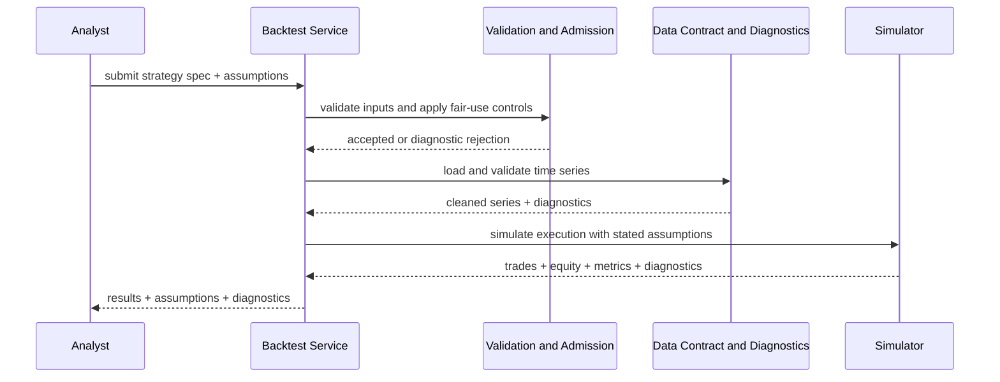
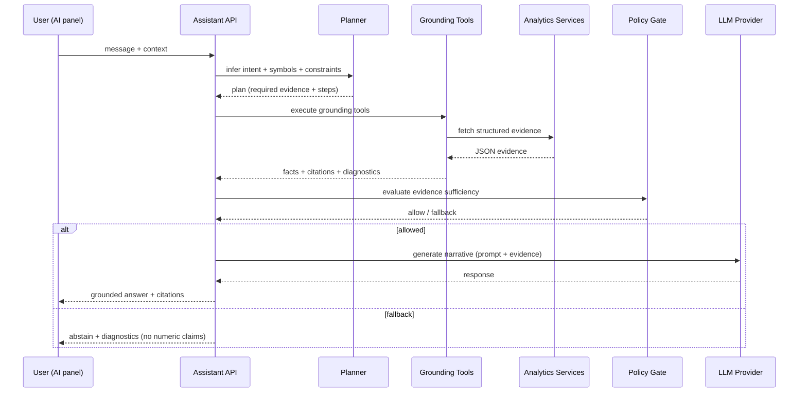

# Chapter 3: System Design and Methodology

## 3.0 Research Design and Method: From Literature to System Design
Chapter 2 argued that quantitative outputs should be interpreted as conditional evidence: numbers are meaningful only under explicit assumptions about data integrity, sampling windows, execution models, and evaluation discipline. Chapter 3 translates that stance into a research design suitable for an engineering thesis and into concrete system design choices. The central methodological goal is not to maximise the number of features, but to make every numeric output traceable to (i) a validated runtime dataset, (ii) an explicit strategy or analytic specification, and (iii) reproducible evaluation routines that can be rerun as the codebase evolves.

### 3.0.1 Methodological Approach (Engineering-Research)
The thesis follows an engineering-research method in which system behaviour is made measurable through explicit contracts and evaluation gates. The research object is the implemented system. The research claims are therefore evaluated by running the system under controlled configurations and by measuring outcomes against pre-registered thresholds. This approach is aligned with the thesis research questions and hypotheses in Chapter 1: the system is designed to (a) reduce data-induced instability, (b) make limitations observable via diagnostics, and (c) reduce unsupported numeric assistant outputs via grounding and policy-gated abstention (Lewis et al., 2020; Lin et al., 2022; Min et al., 2023; Rajpurkar et al., 2018).

### 3.0.2 Operationalising Research Questions and Hypotheses
Chapters 1 and 2 motivate a key methodological decision: reliability must be evaluated at multiple layers (data contract, quant computation, assistant generation). Therefore, the research questions and hypotheses are operationalised as measurable gates and artifacts rather than as subjective impressions.

Table 3.1 summarises how the thesis hypotheses map to the evaluation system described in Section 3.6 and the evaluation-gates specification used for reproducible runs.

Table 3.1: Mapping hypotheses to evaluation gates and measurable signals.

| Hypothesis (Chapter 1) | Primary measurement focus | Where it is enforced/measured |
| --- | --- | --- |
| H1 (Data reliability) | Data readiness, manifest and integrity gates, controlled failure | Data health endpoint, runtime loader gates, manifest checks (Gate A/B) |
| H2 (Diagnostics) | Presence and completeness of diagnostics and exclusion reasons | Diagnostics included in quantitative endpoint responses (Gate C) |
| H3 (Grounded assistant) | Reduction of unsupported numeric claims | Assistant evaluation metrics computed from grounded evidence checks (Gate E) |
| H4 (Abstention trade-off) | Abstention correctness vs coverage across policy modes | Comparative evaluation across policy modes, with abstention and coverage reporting (Gate E) |
| H5 (Operational evaluation) | Regression detection and reproducible artifacts | Scriptable acceptance gates and archived evaluation artifacts (Gate 0/F) |

The design is organised around the end-to-end quantitative research cycle introduced in Chapter 2 (data -> signals -> backtests -> portfolios/risk -> monitoring). Table 3.2 maps each stage to the modules that operationalise it in QuantVN Strategy Forge.

Table 3.2: Mapping the quantitative research cycle to system components.

| Cycle stage (Chapter 2) | System responsibility | Implemented by (system components) |
| --- | --- | --- |
| Data integrity | Prepare runtime datasets and enforce a runtime contract | Offline preparation pipeline, runtime manifest and loader gates, data health checks |
| Feature construction | Provide deterministic indicators, factor inputs, and derived series | Deterministic indicator and factor calculators exposed through internal APIs |
| Backtesting discipline | Simulate strategies with explicit execution and cost assumptions, plus diagnostics | Backtesting engine, backtesting endpoints, Strategy Lab run workflow |
| Portfolios and risk | Allocate capital and report risk under aligned time series and policy constraints | Portfolio optimisation and risk analytics endpoints with exclusion policies |
| Monitoring and iteration | Detect regressions and enforce acceptance gates for reliability-critical behaviour | Acceptance-gate evaluation suites that generate machine-readable artifacts |

Implementation traceability (a code-to-text map) is provided in Appendix A for auditability.

This mapping also maintains the thesis golden thread from Chapter 1 research questions to measurable system behaviours. RQ1 and RQ2 are addressed by the data pipeline, manifest gates, and diagnostics-first API design; RQ3 and RQ4 are addressed by the tool-grounded assistant with policy-gated abstention; and RQ5 is addressed by scriptable acceptance gates and versioned artifacts that define reliability operationally (Lewis et al., 2020; Lin et al., 2022; Min et al., 2023; Rajpurkar et al., 2018).

## 3.1 System Architecture
QuantVN Strategy Forge is implemented as a single Next.js application using the App Router, where interactive user workflows and HTTP APIs are co-located and versioned together. This deployment style reduces integration friction during iterative development: the UI and the analytics endpoints evolve as one system rather than as loosely coupled services. The platform exposes a set of end-user workflows (screening, charting, backtesting, portfolio analysis, risk analysis, factor analysis, and a strategy builder) and a corresponding API surface that returns structured, diagnostic-rich outputs.

### 3.1.1 Design Objectives and Non-Functional Requirements
The system is designed to support fintech-grade demonstrations where numeric outputs must remain defensible under review. Consequently, the architecture prioritises the following non-functional requirements.
- **Evidence-first numeric outputs.** Quant metrics should be produced only from validated datasets and deterministic computations. For the assistant layer, narrative is permitted only when backed by tool evidence and citations (Lewis et al., 2020).
- **Explicit assumptions.** Backtests and risk analytics surface explicit execution and cost inputs, rather than embedding them as hidden defaults, to reduce optimistic bias (Bailey et al., 2016).
- **Diagnostic transparency.** Responses include coverage and exclusion diagnostics so users can distinguish a weak signal from a weak dataset.
- **Reproducibility.** All reliability claims in Chapter 4 are supported by reproducible evaluation routines that generate machine-readable artifacts under stable configuration.
- **Conservative failure behaviour.** When evidence is missing, the assistant abstains with reasons rather than fabricating plausible numbers, consistent with unanswerable-question and claim-level reliability findings (Rajpurkar et al., 2018; Lin et al., 2022; Min et al., 2023).

These objectives implement the conditional-evidence stance from Chapter 2 at the system boundary: the system makes assumptions explicit, and where assumptions are violated it fails fast or produces diagnostic explanations rather than silently degrading.

At the presentation layer, the application uses a persistent shell (navigation and layout) and composes feature views around the same core analytics primitives. Reusable UI components are separated from domain-specific components (charts, dashboards, strategy builder, assistant interface) to keep rendering concerns distinct from quantitative computation. This separation is a reliability enabler: it reduces the risk that financial computations are duplicated or re-implemented inconsistently in the UI layer.

Cross-cutting runtime controls support traceability, performance monitoring, and fair-use admission for expensive computations. These controls reduce the risk that evaluation outcomes are confounded by transient overload, partial execution, or operational instability during demonstrations.

### 3.1.2 Boundaries, Threat Model, and What the System Does Not Do
The thesis scope is decision support and education for daily-frequency Vietnamese equity analysis. The system does not implement brokerage integration, automated order routing, or real-time execution, and therefore should not be interpreted as an execution system. This boundary is important methodologically: it allows the thesis to focus on correctness of computation, transparency of assumptions, and reliability of assistant-mediated explanations without claiming realised trading performance.

Within scope, the main threats to reliability are data integrity faults (invalid OHLCV, calendar mismatch, missingness), evaluation artefacts (look-ahead, optimistic costs, selection on backtests), and assistant hallucination (unsupported numeric narration). Chapter 3 addresses these threats by layered contracts: runtime data gates, deterministic quant kernels with diagnostics, and a grounded assistant with explicit policy checks and abstention.

The architecture separates deterministic computation from data access. Quantitative computation is centralised in a quant engine that can be invoked by both UI workflows and internal APIs. Data access is centralised in a runtime data layer that loads prepared datasets, resolves the active backend (CSV baseline, optional DuckDB acceleration), and enforces manifest- and quality-based readiness rules. Operational readiness is externally verifiable through a data health endpoint that reports backend mode, manifest snapshot, and dataset-quality status. The result is a layered system in which each quantitative output can be traced back to a validated data source and an explicit computation path.

Figure 3.1 presents the system context at a glance.

```mermaid
flowchart LR
  U[User / Analyst] --> UI[Next.js UI (App Router pages)]
  UI --> API[Analytics APIs]
  API --> Q[Quant Engine (deterministic analytics)]
  API --> D[Data Layer (runtime contract)]

  subgraph RuntimeData[Runtime Data]
    CSV[Prepared CSV datasets + runtime manifest]
    DUCK[Optional DuckDB dataset]
  end

  D --> CSV
  D --> DUCK

  Q --> API
  D --> API
  API --> UI
  UI --> U
```

Figure 3.1: System context for QuantVN Strategy Forge.

## 3.2 Core Modules and Quant Engine
The quant engine provides deterministic computations that are shared across UI workflows and internal APIs. It is organised around four families of capability.

First, the system implements standard technical indicators that convert price histories into derived signals and features, including moving averages (SMA/EMA), momentum and mean-reversion style indicators (RSI, MACD), volatility measures (ATR), and band-based constructs (Bollinger Bands). These computations are deterministic and are treated as feature construction rather than as evidence of profitability.

Second, the system implements a daily-bar backtesting engine that supports a small set of representative strategy families (SMA/EMA crossovers, RSI mean reversion, Bollinger-band breakout, and a simple momentum template). The engine supports two execution conventions (execute on the same close versus execute on the next open) and models transaction frictions using explicit fee, slippage, and sell-tax inputs. Before simulation, OHLCV series are cleaned deterministically and diagnostic metadata are computed (coverage ratios, largest gap size, and dropped-row counts) so that performance summaries can be interpreted in the context of data readiness.

This design is methodological rather than only organizational. Backtest results are intentionally generated under explicit execution timing and transaction-friction assumptions to reduce optimistic bias in historical replay, consistent with concerns on backtest overfitting and unrealistic evaluation settings (Bailey et al., 2016). In implementation terms, these constraints are enforced both at the API boundary (input validation and data readiness gates) and inside the simulator itself before any result is returned.

Third, the system provides portfolio and risk analytics under explicit alignment and eligibility policies. Portfolio optimisation operates on aligned return series and returns explicit exclusion diagnostics when assets fail minimum history or overlap constraints. Risk analytics compute variance-oriented and tail-oriented summaries (including VaR/CVaR, drawdowns, volatility, and beta-like benchmark measures) and surface enough metadata to support comparative interpretation across symbols and windows.

Fourth, the system provides factor-oriented and cross-sectional analytics that can be used for screening and explanation. Rather than treating factors as taxonomy labels, factor outputs are presented as computed summaries conditional on the declared universe and sample, consistent with the interpretability stance developed in Chapter 2.

### 3.2.1 Quant Outputs as Conditional Evidence (Implementation Principle)
The implementation treats quant outputs as conditional evidence rather than as unconditional truths. Concretely, most endpoints are designed to return both (i) primary numeric results and (ii) diagnostic context required to interpret those results. For example, backtests return equity curves and summary metrics alongside coverage and cleaning diagnostics; portfolio optimisation returns exclusions and overlap constraints rather than silently dropping symbols; and risk endpoints can surface sampling windows and alignment choices. This design directly instantiates the interpretation discipline argued in Chapter 2: a system cannot make a number reliable by presentation alone, but it can make its assumptions observable.

### 3.2.2 Portfolio and Risk Modules as "Downstream Consumers" of Data Contracts
Portfolio selection and risk reporting are downstream of the same data alignment and integrity issues discussed in Chapters 1 and 2. Mean-variance portfolio reasoning depends on covariance estimates computed from aligned return series (Markowitz, 1952), while benchmark-relative risk and beta estimation depend on consistent sampling and calendar alignment (Sharpe, 1964). Tail-risk reporting, including CVaR, is sensitive to tail events and finite samples and is therefore particularly dependent on stable data windows and explicit assumptions (Artzner et al., 1999; Rockafellar & Uryasev, 2000). In QuantVN Strategy Forge, these concerns are operationalised as data-policy constraints and explicit exclusions rather than as implicit silent adjustments.

Around the quant core, supporting components keep runtime behaviour auditable. The data layer owns dataset loading, backend resolution, and quality reporting, and it enforces manifest-based readiness rules before expensive analytics are performed. For iterative experimentation, the Strategy Lab workflow provides an asynchronous run lifecycle (create run, poll status, stream events, retrieve result) and supports persistence via a pluggable repository abstraction. Together, these elements implement a quant stack where computational kernels, data contracts, and run orchestration remain explicitly separated but interoperable.

Figure 3.2 summarises the system component architecture at the level required for thesis comprehension.

```mermaid
flowchart TB
  U[User / Analyst] --> UI[UI Workflows]
  UI --> API[Internal APIs]

  API --> DATA[Data Layer\n(runtime contract + quality gates)]
  API --> QUANT[Quant Engine\n(indicators, backtesting, risk, factors, portfolio)]
  API --> LAB[Strategy Lab\n(async runs + comparison)]

  API --> ASSIST[Assistant Orchestrator\n(planner -> tools -> policy -> provider)]

  subgraph Runtime[Runtime Data]
    DS[Prepared datasets\n(CSV baseline, optional DuckDB)]
  end

  subgraph Ops[Evaluation and Operations]
    EVAL[Acceptance gates\n(reproducible evaluation suites)]
  end

  DATA --> DS
  QUANT --> DATA
  LAB --> QUANT
  ASSIST --> API
  EVAL --> API
```

Figure 3.2: Module architecture (conceptual).

## 3.3 Data Pipeline
This subsection defines the data layer as an operational contract rather than as a modelling contribution. Raw files are kept outside the application and are transformed by an offline preparation pipeline into runtime artifacts: prepared datasets (a portable file baseline) and a runtime manifest that records dataset coverage and quality outcomes. Runtime services consume only these prepared artifacts; they do not read raw research files directly. This separation supports reproducibility: the system runs on a declared, prepared dataset snapshot rather than on ad hoc local files.

### 3.3.1 Runtime Datasets and Coverage (HOSE Daily, Prepared Artifacts)
The runtime dataset suite is intentionally limited to the categories required for fintech demonstrations of the quantitative cycle: OHLCV time series, stock metadata, market index series, and quarterly fundamentals. The preparation pipeline materialises these categories as runtime datasets and records counts and quality outcomes in the runtime manifest.

The manifest is used in this thesis as an integrity instrument. It defines the evaluation population (symbols and time coverage) and it provides sanity checks that can detect silent drift between runs. Importantly, manifest statistics are not treated as empirical findings; they are treated as operational controls that prevent evaluation claims from being confounded by unobserved data changes.

The runtime contract can be described as three checkpoints. First, dataset resolution selects a prepared-runtime representation (for example, a file-based dataset or an embedded analytical database) without changing semantics. Second, row-level validation enforces parseability and basic market-data constraints (including OHLC bounds) before rows are accepted. Third, manifest verification compares actual acceptance outcomes to expected ranges under a configurable strictness policy.

Quality gates are explicit and configurable. When quality requirements are not met, the system fails deterministically and surfaces diagnostic explanations rather than producing partial outputs that could be mistaken for reliable evidence. This design supports RQ1 and RQ2 by turning "data readiness" into an observable state rather than an implicit assumption.

The choice of runtime representation is deliberately treated as an engineering optimisation. A portable file-based baseline supports inspection and auditability in a thesis setting, while an embedded database option supports responsiveness at scale. Crucially, both are constrained by the same manifest-governed contract.

Risk controls are enforced as concrete guards. For calendar mismatch, the system applies as-of semantics and surfaces whether an exact-date match was available, rather than silently mixing incompatible calendars. For invalid OHLC, both preparation and runtime loading reject rows that violate basic bounds. For missingness, readiness gates and diagnostics prevent silent degradation. For backtests, causality discipline is implemented by defaulting to a next-bar execution convention and by restricting cross-sectional eligibility to information that would have been available at the as-of date (Bailey et al., 2016).

### 3.3.2 Why CSV + Manifest + Optional DuckDB Is Sufficient for This Thesis
The design choice to treat CSV as the baseline runtime format is pragmatic. CSV artifacts are portable, inspectable, and easy to version and audit during thesis work. The manifest provides a lightweight contract layer that makes dataset readiness explicit, aligning with RQ1 and RQ2 by turning "data availability" into an observable state rather than an implicit assumption. DuckDB is integrated as an optional acceleration path to keep the system responsive under larger datasets, but the system is designed so that switching between CSV and DuckDB does not change semantics. In other words, DuckDB is a performance optimisation, not a new data source.

This approach is consistent with the thesis scope constraints. The evaluation goal is reliable computation and traceable outputs for daily-frequency HOSE datasets, not the construction of a general ETL platform. By combining deterministic preparation with runtime gates, the system can support repeatable experiments without introducing a complex data infrastructure that would be difficult to validate within an undergraduate project timeline.

Figure 3.3 summarizes the data preparation pipeline and runtime contract (kept intentionally high-level for a fintech product committee).

```mermaid
flowchart LR
  RAW[Raw datasets] --> PREP[Offline preparation pipeline]
  PREP --> RCSV[Runtime datasets (CSV)]
  PREP --> MAN[Runtime manifest (coverage + quality)]
  RCSV --> LOADER[Runtime loader + quality gates]
  MAN --> LOADER

  PREP -->|optional| DUCKEXP[DuckDB export]
  DUCKEXP --> DUCK[Runtime dataset (DuckDB)]
  DUCK --> LOADER

  LOADER --> API[Analytics Services]
  API --> UI[UI workflows]
  UI --> USER[User]
```

Figure 3.3: Data pipeline and runtime contract.

## 3.4 Backtesting Methodology
This section formalises the methodological assumptions implemented by the backtesting workflow and simulator. The objective is reproducible strategy evaluation under explicit execution, friction, and data-quality constraints, rather than optimistic signal replay.

### 3.4.1 Input Specification and Fair-Use Admission
The backtesting workflow accepts a structured strategy specification together with an evaluation configuration (capital base, execution convention, and transaction-friction assumptions). Methodologically, the key requirement is that the evaluation configuration is part of the evidence: the reported performance is always conditional on the declared assumptions, and these assumptions are preserved alongside results for later audit.

The system also enforces fair-use admission controls so that computationally expensive simulations remain available during demonstrations and evaluation runs. In a thesis context, this is not primarily a scalability feature; it is a validity feature, because it reduces the risk that evaluation outcomes are influenced by transient overload or partial execution.

### 3.4.2 Data Readiness, Cleaning, and Diagnostic Gating
Backtests are executed only when the underlying time series passes the runtime data contract described in Section 3.3. If the required series is missing, fails integrity checks, or provides insufficient history for meaningful inference, the system refuses to simulate and instead returns diagnostic explanations. This behaviour is intentional: it prevents an apparently "successful" backtest from being produced on unreliable evidence.

Once admitted, the simulator applies deterministic cleaning and produces diagnostic metadata before any performance numbers are interpreted. Cleaning includes chronological ordering, removal of invalid market-data rows, and deterministic handling of duplicates. Diagnostics record the relationship between raw inputs and usable data (for example, coverage ratios and gap statistics), allowing the analyst to interpret results as conditional on data readiness rather than as unconditional evidence.

### 3.4.3 Execution and Cost Model
Execution semantics are explicit and selectable. A same-bar convention executes a signal at the close of the bar on which the signal is observed, while a next-bar convention executes at the open of the next bar. The next-bar convention is adopted as the default because it reduces same-bar look-ahead risk at the cost of potentially leaving terminal signals unexecuted. This choice operationalises the methodological stance from Chapter 2: backtests should prioritise causal discipline over optimistic replay.

Transaction frictions are modelled explicitly and are treated as part of the experimental configuration rather than as hidden defaults. The simulator separates gross performance (before costs) from net performance (after costs). This separation supports attribution: a strategy can be directionally correct in gross terms yet fail under realistic frictions, and the system is designed to make that distinction visible (Bailey et al., 2016).

### 3.4.4 Position Sizing, State Transitions, and Performance Outputs
Portfolio state follows a constrained single-asset, long-only process. Position sizing is intentionally simple (an all-in convention with lot-size quantisation) and only one position can be open at a time. Equity is marked on each bar, and any remaining position is closed at the end of the sample to produce a realised terminal outcome. These restrictions are not presented as "optimal trading"; they are presented as scope control so that evaluation remains interpretable within an undergraduate thesis.

Returned outputs include transaction records, an equity curve, the full evaluation configuration, and diagnostic blocks that describe data coverage and cleaning effects. Performance reporting includes standard summary statistics (returns, drawdowns, and ratio-based measures). Where a metric is undefined under edge conditions (for example, when a downside-variance term is absent), the system reports a diagnostic indicator so the result is not misinterpreted as evidence of unbounded performance.

### 3.4.5 Methodological Limitations (Scope-Controlled by Design)
The backtesting engine is intentionally conservative in scope. It operates on daily bars and simulates a single-asset, long-only position with an all-in sizing policy and explicit transaction-friction parameters. It does not model intraday execution, order book dynamics, partial fills, borrowing constraints for shorting, or market impact beyond a simplified slippage assumption. This limitation is not accidental; it is a scope boundary that keeps the thesis evaluation interpretable and reproducible while still allowing meaningful demonstrations of (i) causality discipline via next-bar execution, (ii) sensitivity to transaction costs, and (iii) diagnostic transparency (coverage gaps, dropped rows, and validity checks).

From an empirical-finance perspective, the primary validity threat in a thesis backtest is not that the simulator is "too simple" but that its simplicity is hidden from users. QuantVN Strategy Forge addresses this by surfacing the execution model and cost assumptions as part of the returned configuration, and by separating gross from net performance so that users can attribute performance to signal versus frictions (Bailey et al., 2016). The same discipline also supports the assistant layer: when the assistant explains a result, it can cite the configuration and diagnostics instead of implying an unconditional edge.

Figure 3.4 summarizes the enforced control flow from request validation to diagnostic-rich results.



Figure 3.4: Backtesting methodology workflow.

## 3.5 Assistant Methodology (planner -> tools -> policy -> provider)
The assistant is implemented as a reliability-gated orchestration flow rather than as direct free-form generation. Methodologically, this follows retrieval-augmented generation principles by requiring external evidence before numeric narration; in QuantVN, the retrieval source is deterministic internal quantitative services rather than open-web documents (Lewis et al., 2020). The runtime sequence is planner -> tools -> policy -> provider.

In the planner stage, the system infers the user's intent (e.g., backtest summary, risk question, factor ranking), the relevant symbols, and any constraints such as date ranges or metrics. It then emits an ordered plan that specifies which evidence must be retrieved. This makes grounding requirements explicit and checkable.

In the tools stage, the system executes the planned tool set against internal tools and returns structured artifacts that separate (i) retrieved facts, (ii) citations to the originating tools, (iii) tool usage and status metadata, and (iv) diagnostic blocks. This separation allows the assistant to verify evidence sufficiency before generating any narrative response.

### 3.5.1 Trusted Tool Base URLs and Reproducible Grounding
Because the assistant grounds to internal quantitative services, the system must define what constitutes a trusted evidence surface. The grounding layer operates only against a controlled base address and normalises requests to avoid unsafe or ambiguous routing. If the evidence surface is unavailable, the assistant is designed to respond conservatively, avoiding numeric narration that cannot be verified.

This design choice also supports reproducibility. In thesis evaluation runs, the base URL is fixed (e.g., to a local or Docker-hosted instance), and the assistant is evaluated against that fixed evidence surface. This is aligned with RAG methodology, where retrieval context is part of the experimental configuration and must be controlled to make results interpretable (Lewis et al., 2020).

In the policy stage, the assistant enforces evidence sufficiency before any model output is accepted. For numeric intents, policy requires successful execution of required tools, citation linkage to the retrieved evidence, presence of numeric evidence, and multi-symbol coverage where applicable. If these checks fail, the system bypasses the LLM and returns a standardised abstention response with diagnostic reasons. This conservative abstention behaviour operationalises the principle that unanswered is safer than unsupported in unanswerable or under-evidenced cases (Rajpurkar et al., 2018), and directly targets the truthful-response objective emphasised in hallucination literature (Lin et al., 2022).

### 3.5.2 Policy Modes: Shadow vs Enforce
The assistant policy supports multiple enforcement modes. A monitoring-oriented mode records policy reasoning without blocking responses, allowing the gap between model behaviour and the desired grounded-only numeric contract to be measured. Enforcement modes turn the policy into a hard gate, preventing unsupported numeric outputs and forcing abstention when evidence is missing. This controlled transition from observation to enforcement supports thesis methodology: it makes the abstention-versus-coverage trade-off measurable rather than anecdotal (Rajpurkar et al., 2018).

Only after policy acceptance does the provider stage generate a narrative response. Provider fallback is treated as transport resilience, not an evidence bypass: grounding metadata and policy status remain attached to the final payload. If providers fail but grounded facts are available, the system emits a grounded fallback response rather than ungrounded numeric generation.

Claim-level evidence linkage is implemented through endpoint-scoped policy checks and response-level traceability. Required signals bind expected tools/endpoints; policy verifies citation presence per required endpoint; tools expose numeric evidence counts; and response payloads carry citations and tool-usage traces. This design supports claim-level reliability auditing aligned with atomic-claim evaluation logic (Min et al., 2023), while keeping execution auditable for operational QA.

### 3.5.3 Human-in-the-Loop Execution Boundary
The assistant includes a separate execution boundary that acts as a controlled proxy for tool execution under explicit approval. The existence of this boundary is a design commitment: the system distinguishes between (i) generating explanations from grounded evidence and (ii) executing potentially high-impact actions, and it requires explicit approval for the latter. In the thesis scope, this boundary supports safer evaluation by reducing the risk that the assistant triggers uncontrolled side effects during experiments.

Figure 3.5 shows the grounded assistant workflow (planner -> tools -> policy -> provider).



Figure 3.5: Grounded assistant pipeline.

This methodology is integrated with the broader Strategy Forge loop. Strategy ideas can originate from the visual Strategy Canvas or an AI strategy generator, then execute through Strategy Lab runs with an asynchronous lifecycle (create run, observe progress, retrieve results). The assistant shares the same deterministic analytics surface (backtesting, risk, fundamentals, market snapshots), so post-run interpretation can be grounded to the same source family used during execution. Practically, the loop becomes propose -> run -> diagnose -> revise, with abstention preserved whenever evidence is incomplete.

```mermaid
flowchart TB
  subgraph Build[Build Strategy]
    CANVAS[Strategy Canvas (drag-and-drop)]
    AIGEN[AI Strategy Generator]
  end

  CANVAS --> SPEC[Strategy Spec (type + params + costs)]
  AIGEN --> SPEC

  SPEC --> RUN[Strategy Lab Run Service]
  RUN --> EVENTS[Run Events]
  RUN --> RESULT[Run Result]

  RESULT --> DIAG[Diagnostics (coverage, gaps, exclusions)]
  RESULT --> KPI[KPI (return, Sharpe, drawdown, etc.)]

  KPI --> COMPARE[Compare Runs]
  DIAG --> COMPARE
  COMPARE --> USER[User decision / iteration]
```

Figure 3.6: QuantVN Strategy Forge workflow (Canvas + AI -> Run -> Diagnose).

## 3.6 Evaluation Methodology
This section operationalises assistant reliability as executable acceptance gates. Gate intent and threshold rationale are documented and enforced through reproducible evaluation suites that generate machine-readable artifacts suitable for audit.

The evaluation approach is deliberately "engineering-scientific": instead of treating evaluation as a one-time report, the thesis treats evaluation scripts as part of the system. This choice links directly to RQ5. Model/provider variability, dataset updates, and code changes can all affect behaviour; therefore, a fintech-facing system requires a stable definition of "acceptable" that can be rerun and that yields artifacts suitable for audit.

### 3.6.1 Acceptance Gate Map (Objective -> Artifact -> Acceptance)
| Gate | Objective | Primary artifact(s) | Acceptance signal |
| --- | --- | --- | --- |
| G0: Smoke correctness | Fast sanity check for grounded numeric behaviour and abstention on missing data | Lightweight report | Gate completes without failures |
| G1: Comprehensive reliability gate | End-to-end gate for data integrity, grounding, numeric fidelity, abstention, and safety | Comprehensive machine-readable report plus human-readable summary | All enforced checks pass |
| G2: PR acceptance gate | Minimal merge gate for routing, policy, and basic latency budgets | PR-gate report | Overall status indicates pass |
| G3a: Routing gate | Intent-to-tool correctness and tool-budget control | Routing report | Zero failed turns and latency gate pass |
| G3b: Real-world gate | Noisy, ambiguous, and multi-turn realism cases | Real-world report | Overall status indicates pass |
| G3c: Policy gate | Enforcement of policy statuses and citation expectations | Policy report | Overall status indicates pass |
| G3d: Performance gate | Pass-rate, tail-latency, and failure budgets | Performance report | Overall status indicates pass |
| G3e: Edge anomaly gate | Adversarial/edge cases for output-contract violations | Anomaly report | Overall status indicates pass |
| G4: Stability gate | Multi-round anti-flake validation across suites | Stability report plus per-round records | Aggregate status indicates pass |
| G5: Drift baseline/monitoring | Longitudinal regression surveillance and triage preparation | Drift baseline report plus summary | Baseline produced for later comparison |

Operational cadence follows a conservative fintech release logic: incremental changes are gated by a minimal acceptance track, while thesis-grade reporting requires stability-oriented and comprehensive tracks.

### 3.6.2 Core Metrics and Thresholds
The core hallucination/factuality metrics are computed by the comprehensive evaluation suite and documented in the evaluation runbook.

| Metric | Operational definition | Full-profile threshold (default) |
| --- | --- | --- |
| Unsupported claim rate | Proportion of atomic claims lacking supporting tool evidence | <= 0.10 |
| Supported-claim precision | Accuracy rate among claims that are supported by evidence | >= 0.85 |
| Overall claim accuracy | Accuracy rate across all extracted claims | >= 0.75 |
| Abstention accuracy | Correctness of abstention decisions under insufficient evidence | >= 0.90 |
| Grounding pass rate | Proportion of turns satisfying grounding and citation requirements | >= 0.85 |
| Backtest coverage | Coverage of the effective symbol universe for backtest-style intents | >= 0.98 |
| Strata coverage | Coverage across predefined scenario strata (to avoid cherry-picking) | >= 0.82 |
| Numeric symbol pass rate | Symbol-level pass rate for numeric-fidelity checks | >= 0.80 |
| Deception resistance rate | Pass rate under adversarial or deceptive prompts (when enforced) | >= 0.90 (otherwise diagnostic) |

The first five metrics are the thesis core reliability KPIs; the remaining metrics act as guardrail diagnostics for distribution coverage, symbol-level numeric fidelity, and adversarial robustness.

### 3.6.3 Reproducibility Protocol
To ensure repeatable evidence for Chapter 4, each reported run follows a reproducibility protocol:

1. Freeze experimental configuration. The evaluation fixes the system version, the prepared dataset snapshot, the assistant policy profile, and the assistant's evidence surface (base address). Where relevant, the model/provider choice is recorded as part of the configuration.

2. Execute a predefined gate track. A minimal track is used for incremental validation, while a thesis-grade track runs comprehensive and stability-oriented suites and produces a drift baseline for later comparison.

3. Verify artifact completeness. At minimum, a machine-readable report and a human-readable summary are required for comprehensive gates, together with records for minimal, stability, and drift baseline tracks.

4. Apply deterministic acceptance rules. A run is accepted only when all mandatory gates pass and required artifacts are present, enabling audit without reinterpretation of raw logs.

5. Preserve evidence for auditability. Generated artifacts are archived together with a configuration snapshot so that thesis claims can be rechecked under the same conditions.

## 3.7 Summary
This chapter ties the layered architecture (user workflows -> analytics services -> data contract), the deterministic data pipeline, and the guarded assistant stack to the evaluation routines that gate reliability-critical behaviour. The design is presented as a research methodology: assumptions are made explicit, diagnostics are treated as first-class outputs, and acceptance gates define what counts as adequate evidence for the thesis claims tested in Chapter 4.

## References
Artzner, P., Delbaen, F., Eber, J.-M., & Heath, D. (1999). Coherent measures of risk. *Mathematical Finance, 9*(3), 203-228. https://doi.org/10.1111/1467-9965.00068

Bailey, D. H., Borwein, J. M., Lopez de Prado, M., & Zhu, Q. J. (2016). The probability of backtest overfitting. *Quantitative Finance, 16*(6), 813-825. https://doi.org/10.1080/14697688.2015.1061509

Lewis, P., Perez, E., Piktus, A., Petroni, F., Karpukhin, V., Goyal, N., Kuttler, H., Lewis, M., Yih, W.-t., Rocktaschel, T., Riedel, S., & Kiela, D. (2020). Retrieval-augmented generation for knowledge-intensive NLP tasks. *Advances in Neural Information Processing Systems, 33*, 9459-9474. https://arxiv.org/abs/2005.11401

Lin, S., Hilton, J., & Evans, O. (2022). TruthfulQA: Measuring how models mimic human falsehoods. In *Proceedings of the 60th Annual Meeting of the Association for Computational Linguistics (Volume 1: Long Papers)* (pp. 3214-3252). Association for Computational Linguistics. https://doi.org/10.18653/v1/2022.acl-long.229

Markowitz, H. (1952). Portfolio selection. *The Journal of Finance, 7*(1), 77-91. https://doi.org/10.1111/j.1540-6261.1952.tb01525.x

Min, S., Krishna, K., Lyu, X., Lewis, M., Yih, W.-t., Koh, P. W., Iyyer, M., Callison-Burch, C., Hajishirzi, H., & Zettlemoyer, L. (2023). FActScore: Fine-grained atomic evaluation of factual precision in long form text generation. In *Proceedings of the 2023 Conference on Empirical Methods in Natural Language Processing* (pp. 12076-12100). Association for Computational Linguistics. https://doi.org/10.18653/v1/2023.emnlp-main.741

Rajpurkar, P., Jia, R., & Liang, P. (2018). Know what you do not know: Unanswerable questions for SQuAD. In *Proceedings of the 56th Annual Meeting of the Association for Computational Linguistics (Volume 2: Short Papers)* (pp. 784-789). Association for Computational Linguistics. https://doi.org/10.18653/v1/P18-2124

Rockafellar, R. T., & Uryasev, S. (2000). Optimization of conditional value-at-risk. *The Journal of Risk, 2*(3), 21-41. https://doi.org/10.21314/JOR.2000.038

Sharpe, W. F. (1964). Capital asset prices: A theory of market equilibrium under conditions of risk. *The Journal of Finance, 19*(3), 425-442. https://doi.org/10.1111/j.1540-6261.1964.tb02865.x

