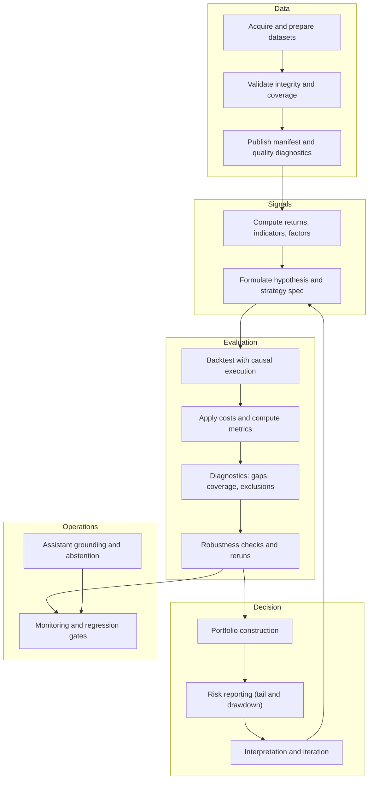

# Figure 2.1: Quantitative Research and Evaluation Cycle (Conceptual)

```mermaid
flowchart TB
  subgraph Data["Data"]
    A["Acquire and prepare datasets"]
    B["Validate integrity and coverage"]
    C["Publish manifest and quality diagnostics"]
  end

  subgraph Signals["Signals"]
    D["Compute returns, indicators, factors"]
    E["Formulate hypothesis and strategy spec"]
  end

  subgraph Eval["Evaluation"]
    F["Backtest with causal execution"]
    G["Apply costs and compute metrics"]
    H["Diagnostics: gaps, coverage, exclusions"]
    I["Robustness checks and reruns"]
  end

  subgraph Decision["Decision"]
    J["Portfolio construction"]
    K["Risk reporting (tail and drawdown)"]
    L["Interpretation and iteration"]
  end

  subgraph Ops["Operations"]
    M["Monitoring and regression gates"]
    N["Assistant grounding and abstention"]
  end

  A --> B --> C --> D --> E --> F --> G --> H --> I --> J --> K --> L --> E
  I --> M
  N --> M
```

