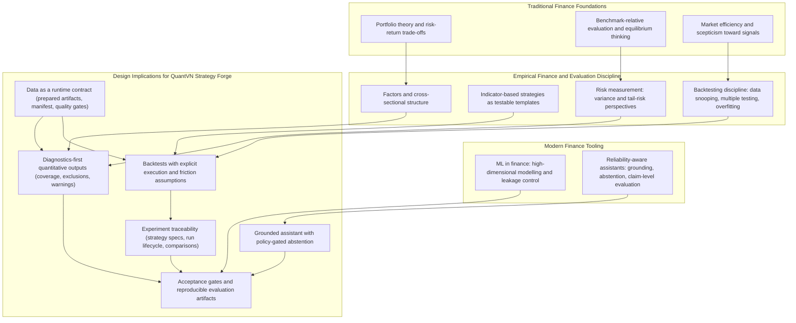

# Figure 2.2: Literature-to-Design Map (From Finance Theory to System Requirements)

```mermaid
flowchart TB
  subgraph Trad["Traditional Finance Foundations"]
    A["Portfolio theory and risk-return trade-offs"]
    B["Benchmark-relative evaluation and equilibrium thinking"]
    C["Market efficiency and scepticism toward signals"]
  end

  subgraph Emp["Empirical Finance and Evaluation Discipline"]
    D["Factors and cross-sectional structure"]
    E["Indicator-based strategies as testable templates"]
    F["Backtesting discipline: data snooping, multiple testing, overfitting"]
    G["Risk measurement: variance and tail-risk perspectives"]
  end

  subgraph Modern["Modern Finance Tooling"]
    H["ML in finance: high-dimensional modelling and leakage control"]
    I["Reliability-aware assistants: grounding, abstention, claim-level evaluation"]
  end

  subgraph Imp["Design Implications for QuantVN Strategy Forge"]
    J["Data as a runtime contract (prepared artifacts, manifest, quality gates)"]
    K["Diagnostics-first quantitative outputs (coverage, exclusions, warnings)"]
    L["Backtests with explicit execution and friction assumptions"]
    M["Experiment traceability (strategy specs, run lifecycle, comparisons)"]
    N["Grounded assistant with policy-gated abstention"]
    O["Acceptance gates and reproducible evaluation artifacts"]
  end

  A --> D
  B --> G
  C --> F

  D --> K
  E --> L
  F --> L
  G --> K

  H --> O
  I --> N

  J --> K
  J --> L
  K --> O
  L --> M
  M --> O
  N --> O
```

