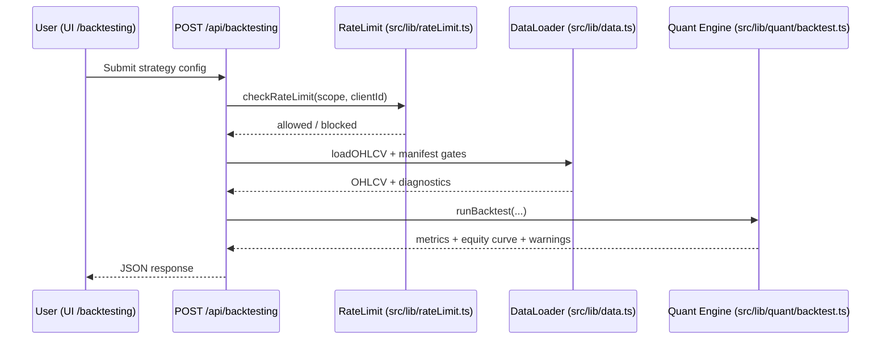

# Figure 3.4: Backtesting Request Workflow (Sequence)

```mermaid
sequenceDiagram
  participant U as User (UI /backtesting)
  participant API as POST /api/backtesting
  participant RL as RateLimit (src/lib/rateLimit.ts)
  participant DL as DataLoader (src/lib/data.ts)
  participant Q as Quant Engine (src/lib/quant/backtest.ts)

  U->>API: Submit strategy config
  API->>RL: checkRateLimit(scope, clientId)
  RL-->>API: allowed / blocked
  API->>DL: loadOHLCV + manifest gates
  DL-->>API: OHLCV + diagnostics
  API->>Q: runBacktest(...)
  Q-->>API: metrics + equity curve + warnings
  API-->>U: JSON response
```

