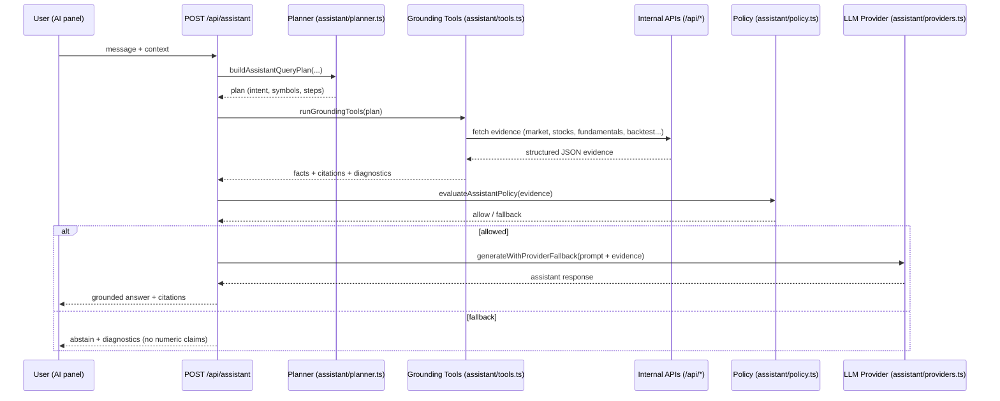

# Figure 3.5: Grounded Assistant Pipeline (planner -> tools -> policy -> provider)

```mermaid
sequenceDiagram
  participant U as User (AI panel)
  participant API as POST /api/assistant
  participant P as Planner (assistant/planner.ts)
  participant T as Grounding Tools (assistant/tools.ts)
  participant I as Internal APIs (/api/*)
  participant Y as Policy (assistant/policy.ts)
  participant L as LLM Provider (assistant/providers.ts)

  U->>API: message + context
  API->>P: buildAssistantQueryPlan(...)
  P-->>API: plan (intent, symbols, steps)
  API->>T: runGroundingTools(plan)
  T->>I: fetch evidence (market, stocks, fundamentals, backtest...)
  I-->>T: structured JSON evidence
  T-->>API: facts + citations + diagnostics
  API->>Y: evaluateAssistantPolicy(evidence)
  Y-->>API: allow / fallback
  alt allowed
    API->>L: generateWithProviderFallback(prompt + evidence)
    L-->>API: assistant response
    API-->>U: grounded answer + citations
  else fallback
    API-->>U: abstain + diagnostics (no numeric claims)
  end
```

