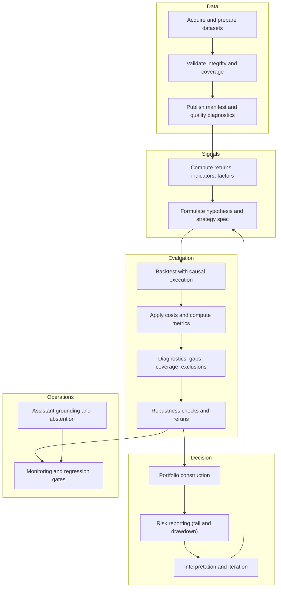
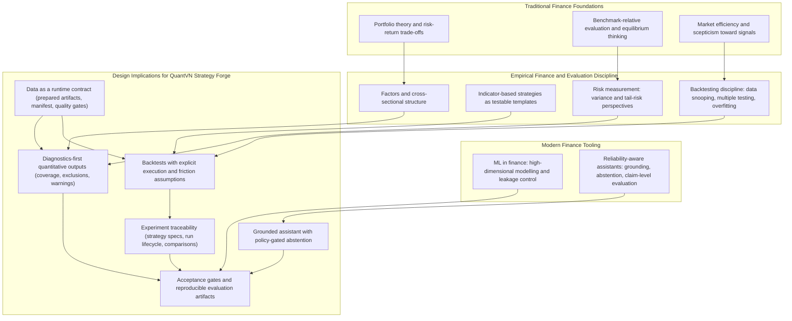
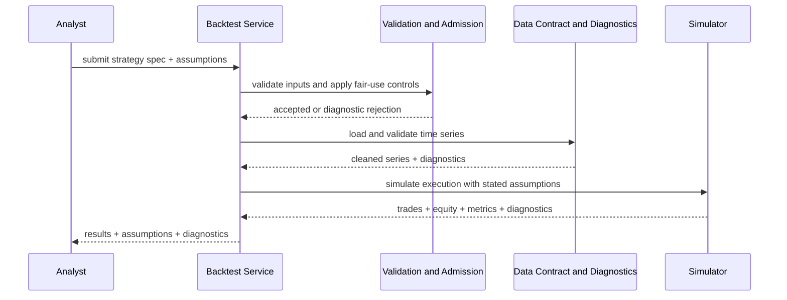
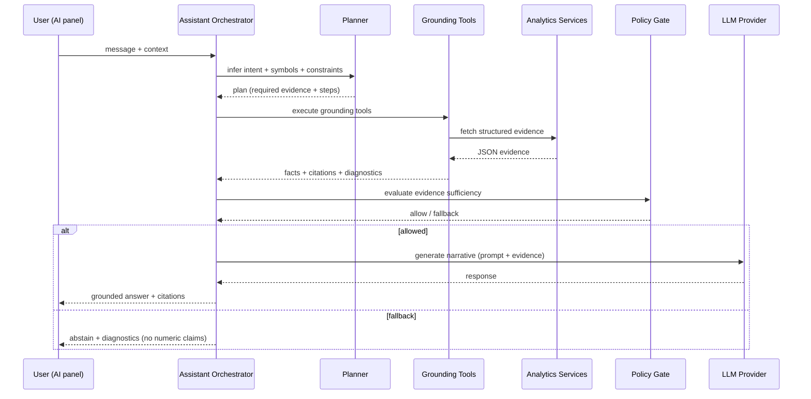

<!-- BEGIN: ch1_introduction.md -->
# Chapter 1: Introduction

Thesis title: QuantVN Strategy Forge: A Reliability-Gated AI Assistant for Trading Strategy Design and Backtesting on Vietnamese Equities (HOSE)

## 1.1 Background and Motivation
Quantitative finance provides a principled framework for turning market data into defensible decision support under uncertainty. In classical portfolio theory, portfolio selection is framed as an optimisation problem over risk and return, where diversification and covariance structure determine the efficient frontier (Markowitz, 1952). Equilibrium asset pricing then motivates risk-adjusted evaluation by linking expected returns to systematic exposure, providing a baseline for comparing assets and strategies beyond raw performance (Sharpe, 1964). Empirical finance adds a further constraint through the efficient market hypothesis, which argues that prices incorporate available information such that persistent statistical advantages should be difficult to exploit without bearing risk premia or leveraging frictions and constraints (Fama, 1970).

These foundations remain central to practice, but they become fragile when the supporting data infrastructure is weak or when evaluation discipline is informal. Quantitative workflows rely on derived statistics that amplify upstream errors: return series must be aligned across symbols and benchmarks; coverage windows must be comparable; and estimation must be stable enough to support ranking, optimisation, and risk attribution. In portfolio optimisation, small differences in estimated inputs can induce large changes in weights when the covariance matrix is ill-conditioned, motivating robust data validation and transparent diagnostics (Markowitz, 1952). In risk analysis, the interpretability of volatility- and beta-based metrics depends on consistent sampling windows and consistent return construction (Sharpe, 1964). In factor and cross-sectional analysis, outputs are conditional on universe definitions, overlap windows, and survivorship considerations (Fama & French, 1993; Fama & French, 2015).

Risk measurement provides a concrete illustration of why integrity constraints should be treated as first-class requirements. Variance captures symmetric dispersion, but it can underrepresent adverse outcomes in heavy-tailed return distributions. Tail-oriented measures such as Conditional Value at Risk (CVaR, also called expected shortfall) address this limitation and admit convex formulations that are attractive in practical systems, but they also increase sensitivity to sampling windows and missingness (Rockafellar & Uryasev, 2000). A reliability-conscious platform should therefore either enforce stable preconditions for tail metrics (for example, minimum history and consistent calendars) or communicate limitations explicitly through diagnostics. In product terms, the objective is not to compute more numbers, but to ensure that each reported number is accompanied by sufficient context for interpretation.

### 1.1.1 Strategy Design as a Search Problem
In applied quantitative finance, strategy development is often a search process over model families, parameter grids, assets, and time windows. This search creates a reliability risk: even if each individual backtest implementation is internally correct, repeated experimentation can produce apparently strong strategies that are in fact overfit to historical noise. The probability of backtest overfitting increases with the size of the search space and the degrees of freedom in the research process (Bailey et al., 2016). Related concerns arise under multiple testing and factor mining, where many candidate predictors are evaluated and only the winners are reported (Harvey et al., 2016).

Consequently, a quantitative platform should not treat backtest outputs as self-validating evidence. Instead, it should enforce conservative execution assumptions, incorporate transaction frictions, and provide diagnostics that highlight fragility. Classic work in empirical finance and technical analysis also shows that simple rules can appear profitable in-sample under particular choices of data and assumptions (Brock et al., 1992; Lo et al., 2000). In a product setting, these findings reinforce that backtests should be reported with explicit assumptions and with guardrails that help users distinguish evidence from artefact.

### 1.1.2 From Traditional Analytics to ML in Finance
Modern ML methods extend empirical finance by combining many features and nonlinear interactions under regularisation and careful evaluation. In asset pricing contexts, ML models can extract predictive structure from high-dimensional characteristic sets, supporting cross-sectional ranking and forecasting under disciplined validation (Gu et al., 2020). However, ML research and statistical learning theory both emphasise that high-capacity models can overfit without careful control of complexity and robust evaluation procedures (Hastie et al., 2009). For a thesis-scale product, the implication is not that an ML model must be the core novelty, but that evaluation discipline must be engineered: outputs should be produced under explicit preconditions and measured against repeatable acceptance criteria.

### 1.1.3 Conversational Interfaces and the Reliability Problem
User expectations for analytic systems are shifting toward interactive and conversational interfaces. Large language models can help users express analysis intent and interpret results, but fluency is not evidence. Truthfulness evaluations show that models can produce confident but unsupported claims, and that scale alone does not guarantee factual reliability (Lin et al., 2022). In numerically dense domains such as finance, this risk is amplified because responses frequently contain numbers, comparisons, and implied recommendations.

Claim-level evaluation frameworks therefore motivate a stricter standard: responses should be assessed and produced as collections of atomic claims, each of which should be supported by evidence (Min et al., 2023). When evidence is missing, abstention becomes a first-class requirement, as demonstrated in question answering benchmarks that explicitly test unanswerable cases (Rajpurkar et al., 2018). Hallucination detection work further motivates evaluating consistency and contradiction under sampling-based checks (Manakul et al., 2023). In a product context, these findings point toward an engineering approach: restrict numeric claims to tool-grounded evidence and treat abstention as a safety feature.

Retrieval-augmented generation (RAG) provides a general architecture for grounding generation in retrieved context (Lewis et al., 2020). In a reliability-critical finance product, retrieved context can be the platform's own deterministic tool outputs rather than open-web snippets. This tool-grounded framing improves auditability and reproducibility because numeric claims can be traced to specific internal tools and dataset snapshots.

## 1.2 Context and Practical Setting
This thesis targets Vietnamese equities on the Ho Chi Minh City Stock Exchange (HOSE) at daily frequency. From a product perspective, the user problem is end-to-end: analysts and retail investors need coherent workflows for screening, charting, backtesting, portfolio and risk analysis, and factor diagnostics. From a systems perspective, the reliability of these workflows depends on the interaction between data preparation, runtime validation, conservative evaluation assumptions, and user interpretation.

QuantVN Strategy Forge is implemented as a web-based platform that integrates interactive user workflows with an internal quantitative service interface. User-facing workflows include screening, charting, backtesting, portfolio optimisation, risk and factor analysis, and a strategy builder. Quantitative computation is deterministic, and the assistant layer is implemented as a reliability-gated orchestration flow that can abstain when evidence is insufficient.

The committee context (fintech) motivates an additional focus: data discussion is treated primarily as an operational contract rather than as a modelling contribution. Prepared datasets, integrity manifests, and loader-level quality gates define when numeric outputs may be produced. This framing aligns with the conditional nature of finance metrics: risk-return quantities are meaningful only when their input assumptions are satisfied (Markowitz, 1952; Sharpe, 1964; Rockafellar & Uryasev, 2000).

## 1.3 Problem Statement
This thesis addresses the problem of building and evaluating a reliability-critical quantitative finance platform for Vietnamese equities in which numeric outputs are produced only when their evidentiary basis is verifiable and interpretable.

The platform must provide standard analytical capabilities over local datasets, including screening, charting, backtesting, portfolio optimisation, factor analysis, and risk reporting. It must surface diagnostics that explain when and why results are limited by data quality, coverage, or alignment constraints.

On top of these deterministic services, an assistant interface must enable conversational queries without introducing numeric hallucinations. The assistant should be permitted to produce numeric claims only when internal tools return sufficient evidence; otherwise it must abstain and provide actionable diagnostics. This requirement is motivated by truthfulness and claim-level evaluation work showing that fluent generation can be misleading when evidence is absent (Lin et al., 2022; Min et al., 2023), and by unanswerability principles indicating that abstention can be safer than guessing (Rajpurkar et al., 2018).

The problem is therefore end-to-end. Reliability depends on data preparation, runtime validation, time-series alignment, and conservative evaluation assumptions in backtesting and optimisation. It also depends on a grounded generation pipeline that plans evidence needs, retrieves structured facts from internal tools, and enforces policy constraints that block unsupported numeric statements (Lewis et al., 2020). The product problem being solved is not simply usability; it is to make "asking questions" compatible with the evidentiary standards required by quantitative finance.

## 1.4 Research Gap and Rationale
The literature suggests that quantitative systems can fail in ways that are not visible in a single headline metric. First, backtests can appear convincing while being overfit to historical noise due to repeated experimentation and selection, motivating disciplined evaluation and transparency (Bailey et al., 2016). Multiple-testing concerns further motivate scepticism about apparently strong patterns discovered through large-scale exploration (Harvey et al., 2016). Second, ML systems can capture nonlinear structure in high-dimensional data but can degrade under nonstationarity without careful validation and monitoring (Gu et al., 2020; Hastie et al., 2009). Third, LLM-based assistants can improve usability but can also generate unsupported claims; reliability therefore requires grounding and evaluation at the level of atomic claims (Lin et al., 2022; Min et al., 2023).

In a fintech product setting, these observations motivate a design rationale: reliability should be operationalised as explicit gates and measurable criteria that connect system design to evaluation. In this thesis, that means:

1. Enforcing data readiness constraints before computing outputs.
2. Constraining backtesting assumptions (execution timing and frictions) to reduce optimistic bias.
3. Implementing a grounded assistant with policy gating and abstention that can be evaluated with reproducible scripts.

QuantVN Strategy Forge is presented as a response to these gaps. Instead of positioning the assistant as an unconstrained generator, the system treats the assistant as an evidence-seeking interface to deterministic analytics and enforces policy-gated abstention for under-evidenced requests (Lewis et al., 2020; Lin et al., 2022; Min et al., 2023; Rajpurkar et al., 2018). Instead of treating data preparation as external to the product, the system makes data readiness observable and enforces quality constraints prior to computation. The intended outcome is a platform where users can explore, compare, and iterate on strategies while preserving traceability of assumptions and limits.

## 1.5 Research Objectives
The thesis pursues four objectives aligned with the product problem in Section 1.3.

1. Design and implement a web-based quantitative analysis system for Vietnamese equities that consolidates core workflows into a coherent product.
2. Operationalise data reliability as a runtime contract through validation, integrity manifests, and quality diagnostics so that exclusions and limitations are observable rather than implicit.
3. Implement an assistant interface that routes user intent through deterministic internal tools and applies evidence-gated policies for numeric outputs, including conservative abstention when evidence is insufficient.
4. Define and apply reproducible evaluation procedures and measurable acceptance criteria so that reliability improvements can be quantified and regressions can be detected under iterative development.

## 1.6 Research Questions
This thesis is organised around five research questions.

RQ1 (Data reliability). How can a local market-data pipeline and runtime validation layer reduce instability in downstream quantitative analytics that depend on aligned time series and robust estimators?

RQ2 (Diagnostics and transparency). Which diagnostics and exclusion policies best communicate data readiness and limitations to end users while preserving analytical usefulness?

RQ3 (Grounded assistant). To what extent does a tool-grounded assistant pipeline with policy gating reduce unsupported numeric claims compared to unguided generation, as motivated by truthfulness and claim-level evaluation work (Lin et al., 2022; Min et al., 2023)?

RQ4 (Abstention vs coverage). What trade-off emerges between strict abstention policies (refusing low-evidence answers) and response coverage, and how does this trade-off affect perceived trustworthiness (Rajpurkar et al., 2018)?

RQ5 (Operational evaluation). Which evaluation metrics and acceptance gates provide the most actionable operational definition of reliability for iterative engineering under model/provider variability and dataset changes, in a way that resists backtest overfitting incentives (Bailey et al., 2016; Harvey et al., 2016) and aligns with tool-grounded generation principles (Lewis et al., 2020)?

### 1.6.1 Research Hypotheses
To complement the research questions, this thesis formulates five testable hypotheses. The hypotheses are stated at the system-behaviour level, because the thesis contribution is an engineering system whose reliability properties can be measured through reproducible gates.

H1 (Data reliability). A local preparation pipeline combined with runtime manifest and quality gates will reduce data-induced instability in downstream analytics by failing fast or returning explicit diagnostics when inputs violate basic integrity constraints (Markowitz, 1952; Sharpe, 1964). Evidence will be collected through data readiness probes and dataset quality reports (Gate A/B).

H2 (Diagnostics and transparency). Diagnostics-first outputs (coverage ratios, gap diagnostics, and explicit exclusion reasons) will reduce the risk of silent failure in strategy evaluation and cross-sectional analytics by making limitations observable at the point of use, rather than as hidden logs. Evidence will be collected by verifying that key quantitative services return completeness-critical diagnostics under both nominal and degraded data conditions (Gate C) and by inspecting exported artifacts.

H3 (Grounded assistant). A tool-grounded assistant pipeline with policy gating will reduce the rate of unsupported numeric claims relative to unguided generation or non-enforced modes, as measured by `unsupportedClaimRate` and claim-level precision metrics derived from grounded evidence checks (Lewis et al., 2020; Lin et al., 2022; Min et al., 2023). Evidence will be collected by running the assistant evaluation suites under comparable prompts and configurations (Gate E).

H4 (Abstention vs coverage). Stricter enforcement of evidence sufficiency (policy modes that block under-evidenced numeric outputs) will increase abstention correctness (`abstentionAccuracy`) while reducing response coverage on ambiguous or low-evidence cases, making the trade-off measurable rather than anecdotal (Rajpurkar et al., 2018; Lin et al., 2022). Evidence will be collected by comparing evaluation runs across policy modes and reporting both abstention accuracy and coverage-related diagnostics (Gate E).

H5 (Operational evaluation). Scriptable acceptance gates with machine-readable artifacts will detect regressions and instability under iterative development and provider variability more reliably than ad hoc manual testing, thereby providing an actionable operational definition of reliability for the project lifecycle (Bailey et al., 2016; Harvey et al., 2016). Evidence will be collected via multi-suite stability and drift-style evaluation runs with archived artifacts (Gate 0 and Gate F).

## 1.7 Methodological Overview
This thesis follows an applied engineering-research methodology in which system behaviour is made measurable through explicit evaluation criteria.

The methodology is structured to test the hypotheses in Section 1.6.1 through reproducible gates and artifacts rather than through one-off demonstrations.

The platform is implemented as a deterministic analytics surface with a validated data contract. Strategy evaluation is operationalised through backtesting under explicit execution and transaction-friction assumptions, reflecting the backtest overfitting and optimistic-bias concerns raised in the finance literature (Bailey et al., 2016). Where appropriate, the thesis adopts evaluation concepts from the econometrics and backtesting literature that explicitly address data snooping and multiple testing, such as reality-check-style thinking (White, 2000) and superior predictive ability testing (Hansen, 2005), while acknowledging that a thesis product may implement pragmatic gates rather than full statistical testing.

For the assistant layer, the methodology is grounded generation with reliability gating. The assistant plans tool usage, executes deterministic internal tools, and applies policy constraints before any model output is returned. This design follows the RAG framing of conditioning generation on retrieved context (Lewis et al., 2020) and uses claim-level reliability objectives motivated by truthfulness benchmarks (Lin et al., 2022), atomic factuality evaluation (Min et al., 2023), hallucination checking (Manakul et al., 2023), and abstention principles (Rajpurkar et al., 2018). The thesis does not claim to solve the general problem of LLM hallucination; instead, it operationalises a product-level reliability contract for numeric finance outputs using measurable gates.

## 1.8 Scope and Assumptions
The scope of the system is HOSE-focused Vietnamese equity analysis at daily frequency using prepared local datasets and a manifest-governed runtime data contract.

The platform is designed for decision support and education; it does not implement automated order execution, brokerage integration, or real-time trading. It therefore should not be interpreted as an execution system and it does not make claims about realised trading performance.

The assistant is designed to operate over the platform's internal tools and datasets, not to search the open web. The thesis assumes that the runtime dataset preparation pipeline is executed prior to evaluation runs and that health and data readiness checks pass. Because local datasets have explicit coverage and freshness constraints, limitations in universe size and history are treated as explicit boundaries of the work.

## 1.9 Contributions
This thesis makes three contributions.

First, it provides a data reliability approach for local Vietnamese equity datasets, emphasising validation of records, integrity manifests, and runtime quality reporting that can explain missing coverage and exclusion reasons.

Second, it provides a modular quantitative analytics stack delivered through user workflows and an internal service interface, including backtesting, portfolio optimisation, factor analysis, and risk reporting under explicit assumptions consistent with classical finance foundations (Markowitz, 1952; Sharpe, 1964; Rockafellar & Uryasev, 2000) and modern evaluation discipline (Bailey et al., 2016).

Third, it provides a grounded assistant pipeline with policy gating and abstention behaviour that ties numeric outputs to evidence and supports claim-level evaluation, reducing hallucination risk through measurable acceptance criteria (Lewis et al., 2020; Lin et al., 2022; Min et al., 2023; Manakul et al., 2023; Rajpurkar et al., 2018).

These contributions are system contributions rather than claims of new financial theory. The originality lies in integrating quantitative workflows, data integrity constraints, and assistant reliability mechanisms into a coherent product that can be evaluated using reproducible gates.

## 1.10 Evaluation Perspective (Why Reliability is Measurable)
A system that produces numeric financial outputs is reliability-critical because users tend to operationalise those outputs. In such settings, a correct response is not simply a well-phrased narrative; it is a statement supported by evidence under explicit assumptions. For quantitative analytics, the evidence is deterministic computation over validated datasets. For the assistant, the evidence is tool-grounded facts and tool-scoped citations produced by deterministic internal tools.

Therefore, this thesis treats evaluation as part of the design. It defines acceptance gates for data readiness and integrity, quantitative realism and diagnostic completeness, and assistant reliability metrics such as unsupported claim rate, claim precision, and abstention accuracy. The goal is not to claim perfect correctness, but to provide an operational definition of reliability that can be rerun and audited over time.

## 1.11 Practical Significance
QuantVN Strategy Forge is positioned as a thesis-grade fintech product. Its practical significance lies in consolidating a Vietnamese equity workflow (screening, backtesting, risk, factors, portfolio comparison) into a coherent interface while making reliability explicit. The grounded assistant is designed to reduce a specific and high-impact failure mode: unsupported numeric claims.

If successful, the product can serve as a template for how AI assistants may be integrated into numerically dense decision-support systems: evidence-first, policy-gated, and evaluated by reproducible metrics rather than subjective impressions.

## 1.12 Thesis Structure
Chapter 2 reviews the theoretical foundations that motivate the system design. It begins with traditional finance (portfolio theory, asset pricing, and empirical factors), transitions to evaluation discipline and machine learning in finance, and then reviews reliability and grounding for language-model assistants. Chapter 3 presents the system design and methodology, describing the architecture, data pipeline, grounding tools, policy logic, and evaluation approach. Chapter 4 documents the implementation and experimental results, mapping features to concrete engineering artifacts and summarising evaluation outcomes using the defined reliability metrics. Chapter 5 concludes by answering the research questions, discussing limitations, and proposing future work.

## References
Bailey, D. H., Borwein, J. M., Lopez de Prado, M., & Zhu, Q. J. (2016). The probability of backtest overfitting. *Quantitative Finance, 16*(6), 813-825. https://doi.org/10.1080/14697688.2015.1061509

Brock, W., Lakonishok, J., & LeBaron, B. (1992). Simple technical trading rules and the stochastic properties of stock returns. *The Journal of Finance, 47*(5), 1731-1764. https://doi.org/10.1111/j.1540-6261.1992.tb04681.x

Fama, E. F. (1970). Efficient capital markets: A review of theory and empirical work. *The Journal of Finance, 25*(2), 383-417. https://doi.org/10.1111/j.1540-6261.1970.tb00518.x

Fama, E. F., & French, K. R. (1993). Common risk factors in the returns on stocks and bonds. *Journal of Financial Economics, 33*(1), 3-56. https://doi.org/10.1016/0304-405X(93)90023-5

Fama, E. F., & French, K. R. (2015). A five-factor asset pricing model. *Journal of Financial Economics, 116*(1), 1-22. https://doi.org/10.1016/j.jfineco.2014.10.010

Gu, S., Kelly, B., & Xiu, D. (2020). Empirical asset pricing via machine learning. *The Review of Financial Studies, 33*(5), 2223-2273. https://doi.org/10.1093/rfs/hhaa009

Hansen, P. R. (2005). A test for superior predictive ability. *Journal of Business & Economic Statistics, 23*(4), 365-380. https://doi.org/10.1198/073500105000000063

Harvey, C. R., Liu, Y., & Zhu, H. (2016). ...and the cross-section of expected returns. *The Review of Financial Studies, 29*(1), 5-68. https://doi.org/10.1093/rfs/hhv059

Hastie, T., Tibshirani, R., & Friedman, J. (2009). *The elements of statistical learning: Data mining, inference, and prediction* (2nd ed.). Springer. https://doi.org/10.1007/978-0-387-84858-7

Lewis, P., Perez, E., Piktus, A., Petroni, F., Karpukhin, V., Goyal, N., Kuttler, H., Lewis, M., Yih, W.-t., Rocktaschel, T., Riedel, S., & Kiela, D. (2020). Retrieval-augmented generation for knowledge-intensive NLP tasks. *Advances in Neural Information Processing Systems, 33*, 9459-9474. https://arxiv.org/abs/2005.11401

Lin, S., Hilton, J., & Evans, O. (2022). TruthfulQA: Measuring how models mimic human falsehoods. In *Proceedings of the 60th Annual Meeting of the Association for Computational Linguistics (Volume 1: Long Papers)* (pp. 3214-3252). Association for Computational Linguistics. https://doi.org/10.18653/v1/2022.acl-long.229

Lo, A. W., Mamaysky, H., & Wang, J. (2000). Foundations of technical analysis: Computational algorithms, statistical inference, and empirical implementation. *The Journal of Finance, 55*(4), 1705-1765. https://doi.org/10.1111/0022-1082.00265

Manakul, P., Liusie, A., & Gales, M. (2023). SelfCheckGPT: Zero-resource black-box hallucination detection for generative large language models. In *Proceedings of the 2023 Conference on Empirical Methods in Natural Language Processing* (pp. 9004-9017). Association for Computational Linguistics. https://doi.org/10.18653/v1/2023.emnlp-main.557

Markowitz, H. (1952). Portfolio selection. *The Journal of Finance, 7*(1), 77-91. https://doi.org/10.1111/j.1540-6261.1952.tb01525.x

Min, S., Krishna, K., Lyu, X., Lewis, M., Yih, W.-t., Koh, P. W., Iyyer, M., Callison-Burch, C., Hajishirzi, H., & Zettlemoyer, L. (2023). FActScore: Fine-grained atomic evaluation of factual precision in long form text generation. In *Proceedings of the 2023 Conference on Empirical Methods in Natural Language Processing* (pp. 12076-12100). Association for Computational Linguistics. https://doi.org/10.18653/v1/2023.emnlp-main.741

Rajpurkar, P., Jia, R., & Liang, P. (2018). Know what you do not know: Unanswerable questions for SQuAD. In *Proceedings of the 56th Annual Meeting of the Association for Computational Linguistics (Volume 2: Short Papers)* (pp. 784-789). Association for Computational Linguistics. https://doi.org/10.18653/v1/P18-2124

Rockafellar, R. T., & Uryasev, S. (2000). Optimization of conditional value-at-risk. *The Journal of Risk, 2*(3), 21-41. https://doi.org/10.21314/JOR.2000.038

Sharpe, W. F. (1964). Capital asset prices: A theory of market equilibrium under conditions of risk. *The Journal of Finance, 19*(3), 425-442. https://doi.org/10.1111/j.1540-6261.1964.tb02865.x

White, H. (2000). A reality check for data snooping. *Econometrica, 68*(5), 1097-1126. https://doi.org/10.1111/1468-0262.00152

<!-- END: ch1_introduction.md -->

<!-- BEGIN: ch2_literature_review.md -->
# Chapter 2: Literature Review and Theoretical Background

This chapter develops the theoretical and empirical background used to justify the system requirements and evaluation methodology of QuantVN Strategy Forge. The review is organised to preserve a direct link to the product problem stated in Chapter 1: quantitative outputs and assistant-mediated explanations must remain defensible under scrutiny. Accordingly, the narrative begins with traditional finance theory (portfolio choice, equilibrium pricing, market efficiency), then moves to empirical asset pricing and factors, risk measurement, and backtesting discipline, and finally transitions to modern machine learning (ML) in finance and reliability-aware AI assistants.

The thesis adopts a unifying methodological stance: quantitative outputs are conditional statements. A system may compute risk metrics, ranks, factor exposures, or backtest outcomes, but those numbers are meaningful only under explicit assumptions about data integrity, sampling windows, execution models, and evaluation discipline. This conditional view is reinforced by both classical finance theory (assumption-driven) and modern ML and LLM reliability research (generalisation and truthfulness). The chapter culminates in two summaries: Figure 2.1 formalises the end-to-end quant cycle as a workflow, while Figure 2.2 maps the literature to concrete design commitments that are operationalised in Chapter 3.

## 2.1 Portfolio Theory and the Meaning of Risk-Return Trade-Offs
Mean-variance portfolio theory formalises portfolio selection as an optimisation problem over expected returns and return variance, where diversification and covariance structure determine the efficient frontier (Markowitz, 1952). In this view, risk is not a scalar attribute of an asset but a relational property of assets jointly distributed. Covariances, correlations, and overlap windows therefore become first-class objects.

### 2.1.1 Estimation as a System Constraint
The practical interpretation of Markowitz optimisation is constrained by estimation. Expected returns and covariances must be estimated from historical samples, and those estimates are sensitive to window length, missingness, and calendar mismatches. Even without claiming a specific estimator, a reliable system should treat the estimation pipeline as part of the evidence. In a fintech product, this motivates (i) explicit minimum-history constraints, (ii) diagnostics about overlap and exclusions, and (iii) a preference for deterministic, reproducible computation.

### 2.1.2 Portfolio Outputs as Conditional Evidence
Because portfolio outputs depend on estimated inputs, they should be interpreted as conditional evidence rather than as stable truths. A system that provides portfolio optimisation should therefore either constrain the conditions under which it returns an optimisation output or provide transparency about sensitivity and exclusions. This is consistent with the broader thesis view that "reliability" includes not only correctness of computation but also correctness of interpretation.

## 2.2 Equilibrium Pricing and Benchmark-Relative Evaluation
The Capital Asset Pricing Model (CAPM) links expected return to systematic risk exposure, providing a benchmark for risk-adjusted comparisons and motivating beta as a canonical measure of market risk (Sharpe, 1964). While the CAPM is not universally accepted as a descriptive model, its conceptual role persists in practice: benchmark-relative risk attribution, beta-like interpretations, and performance normalisation remain common.

### 2.2.1 Performance Measurement and the Need for Comparable Samples
Performance evaluation literature emphasises that risk-adjusted comparisons depend on consistent assumptions and comparable samples. For example, the Sharpe ratio and related measures are meaningful only if return series are constructed consistently and reflect comparable sampling windows. Early empirical work on mutual fund performance illustrates how performance evaluation becomes a measurement problem rather than a purely narrative one (Sharpe, 1966). For product design, the implication is direct: a system that ranks strategies by risk-adjusted metrics must document and enforce the return-construction and sampling assumptions that define those metrics.

### 2.2.2 System Implication: Alignment and Traceability
A reliable platform should make benchmark alignment explicit. Beta-like quantities depend on synchronised return series; shifting or mismatched calendars can bias estimates. Therefore, the system should surface overlap windows, date alignment methods, and exclusions as part of the returned evidence.

## 2.3 Market Efficiency and the Epistemology of Signals
The efficient market hypothesis argues that prices incorporate available information such that persistent statistical advantages should be hard to obtain without bearing risk premia or exploiting frictions (Fama, 1970). EMH therefore provides a discipline for strategy design: it motivates scepticism toward patterns that appear strong in-sample and encourages explicit justification for why a pattern should persist.

From a product perspective, EMH motivates conservative defaults and transparent diagnostics. If signals are expected to be weak and noisy, then the system should avoid presenting a single backtest as definitive evidence. Instead, it should help users reason about assumptions and limitations.

## 2.4 Empirical Factors and Cross-Sectional Structure
Empirical asset pricing shows that a single market beta is often insufficient to explain cross-sectional return differences. The Fama-French three-factor model extends CAPM by introducing size and value factors (Fama & French, 1993). Later work proposes a five-factor model incorporating profitability and investment-related dimensions (Fama & French, 2015). These models provide a structured bridge between traditional equilibrium reasoning and implementable analytics.

### 2.4.1 Factors as a Design Requirement, Not a Taxonomy
The thesis does not claim that a specific factor set is the only correct model. Instead, the factor literature motivates design constraints:

1. Factor estimates are meaningful only on comparable samples; therefore, symbol coverage and overlap windows must be observable.
2. Factor outputs should be conditional on a declared universe, window, and data-quality contract.
3. Exclusions due to insufficient data should be transparent and reproducible.

These constraints motivate why QuantVN Strategy Forge treats coverage diagnostics and exclusion reasons as product-level outputs rather than as internal logs.

### 2.4.2 Relating Factors to Strategy Workflows
Factors are commonly consumed through workflows such as screening (filtering), portfolio tilts (construction), and explanatory diagnostics (attribution). Therefore, factor analytics should interoperate with screening and portfolio modules under a shared data contract. When the assistant explains a factor ranking, it should reference the underlying computed evidence rather than narrating plausible financial reasoning without traceability.

### 2.4.3 Factor Construction, Regression Attribution, and "Explanations" as Estimates
In practical quantitative workflows, factors are not only "economic concepts" but also concrete engineered time series and cross-sectional portfolios. Even for canonical factors, construction choices matter: the return frequency, the treatment of missing values, and the universe definition all affect the realised factor return series and therefore the measured exposures. In other words, "factor exposure" is not a property that exists independently of the measurement pipeline. It is an estimate computed from a chosen sample under a chosen construction.

A common explanatory workflow is regression-based attribution. Performance is decomposed into contributions from factor exposures and an unexplained residual often described as alpha. This logic is historically connected to equilibrium pricing and benchmark-relative reasoning: CAPM-style decompositions interpret average returns relative to systematic risk exposures (Sharpe, 1964), and multifactor models extend this logic to additional dimensions of risk or characteristic structure (Fama & French, 1993; Fama & French, 2015). In managed portfolio settings, adding momentum to the factor set can change interpretations of persistence by reclassifying part of the return as systematic exposure rather than idiosyncratic skill (Carhart, 1997). The methodological lesson is that explanations are model-dependent. A platform should therefore treat explanations as conditional on the factor set and the estimation window, rather than presenting a single explanatory narrative as uniquely correct.

This conditionality has direct consequences for an AI-assisted strategy system. Users often ask "why" questions that are not purely descriptive, such as why a strategy performed well or why a symbol is ranked highly. A reliability-aware assistant should convert such questions into evidence-grounded statements. For example, an explanation can be phrased as: over the chosen sample and under the selected factor model, the strategy's returns covary with a small set of factor returns, while the residual component is sensitive to costs and window choice. This aligns the explanation with measurable outputs and avoids unsupported causal claims.

From a system design perspective, this motivates three additional design constraints.
1. **Expose factor definitions and sample windows.** Because factor series depend on construction, users should see the factor set, the window, and basic diagnostics rather than being presented with an abstract label alone.
2. **Represent attribution outputs as estimates with uncertainty.** Even if a platform does not implement full confidence intervals, it should communicate that exposures and residuals are estimated from finite samples and may vary across windows. This discourages overinterpretation of small differences and supports comparative analysis under consistent assumptions.
3. **Make factor models interoperable with strategy specifications.** A factor explanation is most useful when it refers to the same returns and the same decision timing used in backtesting. If factor exposures are estimated on returns that are inconsistent with the strategy's execution assumptions, the explanation becomes a narrative detached from the evaluated evidence.

These constraints support the thesis's broader claim that quant outputs should be treated as conditional evidence rather than as unconditional truths. In a fintech committee setting, this perspective is valuable because it ties interpretability to reproducibility: explanations are not only "more understandable" but also traceable to computations under stated assumptions.

### 2.4.4 Discount Rates and Conditional Interpretation
Factor models and characteristic signals are often interpreted as if they were stable properties. However, a large portion of return predictability can be framed as variation in discount rates and risk premia rather than as time-invariant mispricing. Cochrane (2011) emphasizes discount-rate variation as a central lens for interpreting empirical regularities. For system design, this perspective matters because it discourages overconfident narratives. If expected returns vary with state variables and regimes, then a factor exposure or cross-sectional rank should be reported as an estimate conditional on the sample window and the current regime, not as a permanent attribute of a symbol.

In a fintech product, the practical consequence is to shift from declarative claims ("Stock X is a value stock, therefore it will outperform") toward evidence-oriented summaries ("Over the chosen sample, the symbol's computed characteristics align more closely with value-like exposures, under the defined factor construction"). The assistant layer should also avoid attributing causality beyond what is supported by the computed evidence. This is particularly important for committee-facing demonstrations: the system should be conservative in interpretation and explicit about assumptions.

### 2.4.5 Factor Proliferation, Multiple Testing, and Post-Discovery Decay
The empirical factor literature is also shaped by a reliability problem: a large number of candidate factors and characteristics have been proposed, and many are evaluated on overlapping datasets. When a research pipeline tests many predictors, some will appear significant by chance. Harvey et al. (2016) highlight this issue in the cross-section of expected returns, motivating stricter standards for statistical evidence and a more skeptical interpretation of newly proposed factors.

Another important empirical regularity is that published predictability can weaken after discovery. McLean and Pontiff (2016) document that anomaly-based return predictability tends to decline after publication, consistent with learning and arbitrage reducing exploitable structure. For a product, this motivates two design attitudes. First, the system should treat factor and anomaly signals as hypotheses that require re-evaluation rather than as durable edges. Second, the system should support re-runs and comparisons under consistent assumptions so that users can detect degradation over time.

These considerations also motivate the role of diagnostics and gates. A platform that enables easy exploration of many strategies or signals increases the search space and therefore can increase the risk of overfitting to historical noise (Bailey et al., 2016). Therefore, the product should guide the user toward evaluation discipline: explicit transaction frictions, causal execution assumptions, minimum-history constraints, and reproducible reruns are practical mechanisms for resisting the tendency to cherry-pick impressive but fragile outcomes.

## 2.5 Momentum, Persistence, and the Strategy-Design Bridge
Many practical strategies are motivated by empirical anomalies. Momentum, for example, is documented as a cross-sectional regularity in which past winners tend to outperform past losers over intermediate horizons (Jegadeesh & Titman, 1993). Multifactor models incorporating momentum are often used to explain performance persistence in managed portfolios (Carhart, 1997). The existence of such regularities does not imply easy exploitation, but it motivates why strategy-design platforms often include momentum-style rules.

For a product, the implication is again conditionality: strategies inspired by anomalies should be evaluated under conservative assumptions and with explicit costs and diagnostics, because apparent profitability can be sensitive to execution and sample choices.

### 2.5.1 Implementation Sensitivity: Universe, Rebalancing, and Capacity
Anomaly evidence is typically reported under specific portfolio construction and rebalancing conventions. Small implementation choices can materially affect results. For example, how the universe is filtered, how frequently positions are updated, and how signals are formed (ranking vs thresholding) can change turnover and therefore the influence of transaction costs. A product that provides momentum or factor-tilt templates should therefore represent these choices explicitly and allow users to inspect their effect through diagnostics (turnover proxies, exposure measures, and net-vs-gross comparisons).

From a systems perspective, this is another instance of conditional outputs. A momentum rule is not a single number; it is a process that depends on a specification. The platform should treat the specification as the primary object and the backtest metrics as derived evidence under that object. This encourages users to revise hypotheses by modifying explicit parameters rather than by implicitly changing hidden assumptions.

### 2.5.2 Persistence, Factor Adjustment, and Avoiding Overconfident Narratives
Performance persistence is often analyzed through factor-adjusted lenses. Carhart (1997) shows that accounting for momentum as a factor can alter interpretations of performance persistence. The implication for a product is that explanations should be framed carefully. If a strategy's performance is largely explained by known exposures, the correct interpretation is not necessarily that the strategy is "skilled" but that it loads on systematic dimensions. Conversely, if performance remains after accounting for common exposures, the remaining component should still be treated as evidence under assumptions rather than as proof of persistent alpha.

This motivates a conservative assistant behavior. When users ask "why did the strategy work," the assistant should connect explanations to measurable diagnostics and exposures rather than relying on speculative causal stories. A reliability-aware assistant should also highlight that anomaly profitability can weaken over time, consistent with post-discovery decay (McLean & Pontiff, 2016), and therefore should encourage reruns and comparisons under consistent assumptions.

### 2.5.3 Momentum as a Case Study in End-to-End Constraints
Momentum is a useful case study because it links several themes in this chapter: empirical evidence, implementation sensitivity, and evaluation discipline. The original anomaly result is typically framed in terms of forming portfolios based on past returns and holding them over intermediate horizons (Jegadeesh & Titman, 1993). However, implementing such a strategy in a real system requires making several decisions that determine whether the hypothesis is even being tested.

First, timing and information availability matter. A momentum signal based on recent returns must be computed from returns that are known at decision time. If a backtest forms positions at the same close used to compute the signal without accounting for the ordering of information, it can implicitly assume execution at a price that was not actually available when the signal was formed. For a product, this suggests that signal computation and execution should be expressed as a causal pipeline: signals are computed from information available up to time t, and execution is simulated at time t+1 or under another explicitly specified convention. This type of causal bookkeeping is not an implementation detail; it is part of the scientific meaning of the backtest.

Second, turnover and costs are not secondary for momentum-style rules. Portfolio ranking strategies often induce substantial turnover, particularly when the universe is large or the holding horizon is short. Transaction costs and slippage therefore play a central role in determining whether the strategy is viable. Moreover, when turnover is high, a naive cost model can produce a false sense of robustness. The optimal execution literature frames trading as a trade-off between speed (reducing exposure to adverse price moves) and impact (moving the market by trading aggressively), motivating why execution assumptions should be explicit rather than implicit (Almgren & Chriss, 2001). In a thesis platform, a simplified cost model can still be informative if it is accompanied by sensitivity analysis and by a clear separation of gross versus net performance.

Third, momentum connects naturally to factor-based interpretation. Because momentum appears as a systematic dimension in multifactor settings, explanations should distinguish between "alpha" narratives and exposure narratives (Carhart, 1997). A strategy that looks profitable might be profitable primarily because it loads on momentum-like return components that are correlated with other risk dimensions. A reliability-aware assistant should therefore avoid statements that imply persistent skill unless the evidence supports such a claim under the chosen factor model and window.

Finally, the persistence of the anomaly itself should be treated as uncertain. Evidence that predictability decays after publication suggests that any momentum strategy should be periodically re-evaluated rather than treated as a permanent edge (McLean & Pontiff, 2016). This reinforces why the product and the thesis emphasise reproducible workflows: users should be able to rerun the same strategy specification under updated samples, revised cost assumptions, and consistent evaluation gates. In this framing, momentum is not a "template to deploy"; it is a hypothesis family that must be tested repeatedly under transparent conditions.
## 2.6 Technical Analysis and Indicator-Based Strategies
Technical analysis is often implemented through indicators and rules such as moving-average crossovers, RSI thresholds, Bollinger-band breakout/mean-reversion rules, and trend/momentum filters. While such rules are widely used in practice, their evidence base depends strongly on how they are evaluated.

Early empirical work shows that simple technical trading rules can produce in-sample patterns in historical data, motivating both interest and scepticism (Brock et al., 1992). Subsequent research develops computational and statistical frameworks for technical pattern detection and inference, emphasising that technical signals should be assessed with explicit statistical reasoning and careful out-of-sample discipline (Lo et al., 2000).

### 2.6.1 Design Implication: Indicators Are Not Evidence Without Evaluation
Indicator computation is deterministic, but the inference drawn from indicators is not. Therefore, a strategy platform should treat indicator-based strategies as hypotheses to be tested under explicit backtesting assumptions rather than as reusable "recipes" whose performance can be assumed. This motivates why QuantVN Strategy Forge emphasises a backtesting module with explicit execution timing, cost modelling, and diagnostic reporting.

### 2.6.2 Data-Snooping in Rule Discovery and Why "Many Rules" Is a Reliability Risk
Indicator-based strategies are particularly vulnerable to a subtle failure mode: it is easy to generate a large number of plausible rules and then select those that perform best in-sample. This creates the appearance of evidence even when the strategy family is effectively a high-dimensional search. Data-snooping perspectives formalize this risk. White (2000) motivates the need to adjust conclusions when strategies are selected after testing many candidates. Sullivan et al. (1999) apply bootstrap-style reasoning to technical trading rules, illustrating that impressive historical performance can occur through selection on the same sample.

From a product standpoint, this motivates explicit constraints. A strategy builder that makes it easy to try many combinations increases the search space and therefore can increase the risk of backtest overfitting (Bailey et al., 2016). The system does not need to prevent exploration, but it should communicate that a backtest result is conditional evidence under a search process. Practical safeguards include:
- exposing the number of strategies or parameter combinations tested in an experiment log,
- providing sensitivity views (how results change with small parameter perturbations),
- enforcing conservative default assumptions (causal execution, nonzero costs), and
- requiring minimum usable history after cleaning before metrics are reported.

In a thesis product, such safeguards can be implemented as deterministic gates and diagnostics rather than as full statistical corrections. The goal is to reduce user overconfidence by making fragility visible.

### 2.6.3 Data Integrity in Indicator Strategies: Corporate Actions, Survivorship, and Regime Breaks
Indicator strategies operate directly on price series. As a result, they are sensitive to data integrity problems and structural breaks. Even when raw data appear plausible, hidden issues can distort signals:
- **Corporate actions and discontinuities.** Splits, dividends, and symbol changes can introduce discontinuities that resemble large price moves. If the dataset is not adjusted consistently, indicator thresholds and drawdown metrics can be distorted.
- **Survivorship and universe drift.** If the dataset implicitly excludes failed or delisted assets, reported profitability can be biased upward (Brown et al., 1992). In practical platforms, this motivates explicit universe definitions and clear statements about coverage boundaries.
- **Regime breaks and market structure.** Even when data are correct, regimes can change (liquidity, volatility, policy regimes), causing indicator strategies to degrade. This reinforces the need for monitoring and repeatable evaluation rather than one-off demonstrations.

These concerns motivate why data validation should be observable. A reliability-first platform should show what was filtered, which rows were dropped, and which symbols were excluded. When an assistant explains indicator-based results, it should reference these diagnostics rather than presenting results as unconditional truths.

## 2.7 Risk Measurement: Variance, Tail Risk, and Coherence
Risk measurement translates return series into interpretable constraints for decision making. Classical portfolio theory typically uses variance as a proxy for risk, partly because it leads to tractable optimisation and aggregation through covariances (Markowitz, 1952). However, variance and volatility are symmetric measures: they penalise upside and downside deviations equally and can underrepresent adverse outcomes in heavy-tailed return distributions. In many real markets, return distributions exhibit skewness and kurtosis that make downside risk particularly salient for practitioners and fintech users who reason in terms of drawdowns and tail events rather than average dispersion.

Tail-oriented measures address this limitation by focusing on quantiles and tail expectations. Value at Risk (VaR) summarises the loss quantile at a given confidence level, while Conditional Value at Risk (CVaR, also called expected shortfall) summarises the expected loss conditional on exceeding that quantile. CVaR supports convex optimisation formulations and is widely used in risk-aware allocation contexts (Rockafellar & Uryasev, 2000).

### 2.7.1 Coherence and Why the Risk Definition Matters
Risk measures are not interchangeable summaries; they encode properties that affect portfolio aggregation and therefore user interpretation. Artzner et al. (1999) formalise a set of axioms for "coherent" risk measures, including monotonicity, translation invariance, positive homogeneity, and subadditivity. The subadditivity property is particularly relevant for portfolio systems: it expresses the diversification principle that combining positions should not increase measured risk beyond the sum of standalone risks. When a risk measure violates such properties, a platform can inadvertently encourage fragile allocations because optimisation under an incoherent objective may produce counterintuitive or unstable allocations under small distributional changes.

For system design, coherence is less about academic elegance and more about interpretability and user safety. If the platform reports a tail metric, it should communicate what the metric guarantees and what it does not. For example, CVaR can be a more stable target for downside-oriented optimisation, but it still depends on sampling and assumptions about the tail beyond observed data (Rockafellar & Uryasev, 2000).

### 2.7.2 Estimation, Nonstationarity, and the Limits of Point Risk Numbers
The central operational challenge is estimation. Any risk number is an estimator computed from a finite sample. Its reliability depends on usable history after cleaning, overlap across assets, and the stationarity of the underlying process. Short samples and missing data points can materially change tail estimates because tails are defined precisely by rare events. Nonstationarity further complicates inference: a stable-looking estimate over one window can become misleading when volatility regimes shift. Consequently, risk reporting should be treated as conditional evidence under a stated window and data contract, consistent with the broader thesis stance that quantitative outputs are meaningful only under explicit assumptions (Fama, 1970; Hastie et al., 2009).

For a product, the implication is that risk metrics should be accompanied by diagnostics rather than presented as unconditional truths. A reliability-first system should surface the sample window, the number of observations used, the amount of missingness removed, and whether returns were computed at a consistent frequency. These diagnostics help users interpret whether changes in risk reflect actual changes in market behaviour or merely changes in data availability and cleaning.

### 2.7.3 Risk Reporting as a Workflow Input (Not Only a Dashboard Output)
In an end-to-end quantitative workflow, risk metrics serve two roles. First, they are constraints for portfolio construction: mean-variance reasoning uses covariances to allocate capital under a risk tolerance (Markowitz, 1952). Second, they are monitoring signals: the same tail and volatility summaries can be tracked over time to detect drift and regime breaks that may invalidate earlier backtests. This dual role motivates consistent, reproducible computation. If risk is computed differently across experiments, comparisons become narrative rather than evidence-driven.

The platform implication is methodological: tail metrics should not be presented as context-free numbers. A reliability-critical system should either enforce stable preconditions (minimum history, consistent return construction, explicit frequency) or communicate limitations through structured warnings and exported diagnostics.

## 2.8 Backtesting Discipline, Data Snooping, and Multiple Testing
Backtesting is the principal mechanism by which strategy ideas are translated into quantitative evidence. However, backtests can be misleading when strategies are discovered through repeated experimentation.

Bailey et al. (2016) formalise the probability of backtest overfitting and show how the risk rises with the degrees of freedom in the research process. Data-snooping concerns are also emphasised in econometrics: when many strategies are tested on the same sample, conventional significance claims can become unreliable. The "reality check" perspective motivates controlling for selection effects under multiple comparisons (White, 2000). Superior Predictive Ability tests further provide a framework for comparing candidate predictors while accounting for data snooping (Hansen, 2005). In empirical asset pricing, multiple testing issues are also highlighted in the context of factor discovery and the cross-section of expected returns (Harvey et al., 2016).

### 2.8.1 Product Implication: Conservative Defaults and Diagnostics
A thesis product cannot implement every advanced statistical test; however, the literature implies that a product should resist optimistic bias by design. Conservative defaults (causal execution, explicit frictions), clear reporting of assumptions, and diagnostic-rich outputs are pragmatic implementations of the same discipline.

### 2.8.2 Evidence as a Workflow, Not a Screenshot
The core implication for system design is that "evidence" should be reproducible and auditable. A platform should enable rerunning backtests under recorded assumptions and should export diagnostics that explain data coverage, cleaning, and exclusions. This thesis operationalises that requirement through reproducible scripts and acceptance gates (described later), rather than relying on ad hoc demonstrations.

### 2.8.3 Transaction Costs, Slippage, and Execution as First-Class Assumptions
Backtest credibility depends critically on whether simulated execution resembles plausible trading. Even a simple long-only strategy can have performance that is highly sensitive to turnover once realistic costs are applied, and indicator-based or short-horizon strategies can be dominated by frictions if those frictions are underestimated. Therefore, it is methodologically unsafe to treat transaction costs as an optional add-on: they are part of the hypothesis being tested.

At minimum, backtests should distinguish between gross returns (signal-only) and net returns (after costs) to avoid confusing signal strength with unmodelled frictions. A rigorous treatment of execution further recognises that trading itself moves prices in liquidity-limited settings. The optimal execution literature models a trade-off between market impact and timing risk, motivating the idea that execution assumptions should be explicit and parameterised rather than hidden (Almgren & Chriss, 2001). For a thesis platform that targets transparency rather than institutional-scale microstructure, the main implication is pragmatic: strategy evaluation should include explicit cost knobs and should report sensitivity of results to plausible cost ranges.

Execution modelling is also tied to capacity. A strategy can look attractive at small scale but degrade when scaled due to impact and limited liquidity. Because capacity is difficult to estimate without detailed order book data, a conservative product stance is to treat capacity as an uncertainty and to encourage users to interpret backtests as conditional evidence under an assumed cost and liquidity regime rather than as a scalable guarantee.

Practically, this implies that cost modelling should be decomposable and reportable. Rather than presenting a single opaque "cost %" adjustment, systems can expose interpretable components such as per-trade fees, a spread proxy, and a slippage or impact proxy that scales with turnover. Even if these components are simplified, their explicitness encourages users to ask the correct scientific question: whether a strategy's edge is robust to plausible friction regimes. This design also supports comparison across strategy families. A low-turnover factor tilt may be relatively insensitive to costs, whereas a short-horizon indicator strategy may be viable only under optimistic execution assumptions. Making these distinctions visible is a reliability feature, because it reduces the risk that users infer tradability from gross backtest charts.

### 2.8.4 Metric Choice, Sampling Uncertainty, and Overconfident Ranking
Backtests typically report summary statistics such as mean return, volatility, drawdown, and Sharpe ratio. These summaries are convenient, but their stability depends on sample length and return distributional properties. In particular, risk-adjusted metrics such as the Sharpe ratio can exhibit nontrivial sampling behaviour in finite samples and under non-normal returns, implying that small differences in reported Sharpe ratios are often not meaningful (Lo, 2002). This matters directly for product UX: ranking many strategies by a single scalar metric invites overinterpretation when confidence intervals overlap or when results hinge on a small number of extreme observations.

Consequently, the literature suggests two design disciplines. First, systems should expose enough evidence for users to assess stability: windows, number of observations, and whether performance is concentrated in a particular regime. Second, systems should encourage robustness reasoning rather than single-number optimisation. Sensitivity analysis (varying window lengths, rebalancing frequency, cost assumptions, and parameter values) is a practical surrogate for more formal multiple-testing corrections when a product cannot implement the full statistical machinery (White, 2000; Bailey et al., 2016).

## 2.9 End-to-End Quantitative Research Cycle (Data -> Signals -> Backtests -> Portfolios -> Monitoring)
The preceding sections can be synthesised into a single methodological claim: quantitative systems should be designed around an end-to-end research cycle rather than around isolated metrics. In practice, the credibility of a quantitative conclusion depends on the entire chain. A strategy can fail because the signal is weak, because the data are invalid, because execution assumptions are optimistic, or because evaluation was implicitly conditioned on the same data used for discovery. Reliability therefore requires controlling the cycle end-to-end and making that control observable to users.

This section makes the research cycle explicit and ties each stage to the literature. The purpose is not to add new theoretical contributions, but to explain why the system design in Chapter 3 emphasises (i) data contracts and diagnostics, (ii) conservative evaluation assumptions, and (iii) reproducible evaluation gates for the assistant layer. For a fintech committee, the key point is practical: the product should help users distinguish evidence from artefact.

### 2.9.1 Stage 1: Data Integrity and Hidden Biases
Data issues can create systematic biases, not just noise. Survivorship bias is a canonical example. If failed or delisted assets are missing, backtests and performance summaries can be biased upward because the sample overrepresents survivors. Brown et al. (1992) show how survivorship bias can materially distort performance studies, motivating explicit universe definitions and transparent handling of coverage boundaries.

In a product setting, integrity risks tend to recur in recognizable forms:
- **Calendar mismatch and missingness.** Inconsistent trading calendars across symbols and benchmarks can bias covariance estimates and beta-like measures (Sharpe, 1964).
- **Duplicate sessions and price outliers.** Duplicate days or outlier prints can create spurious indicator crossings and distort drawdowns (Brock et al., 1992; Lo et al., 2000).
- **Silent filtering.** Implicit filtering during preparation can change results without being visible at the UI layer.
- **Inconsistent symbol histories.** Heterogeneous listing histories create non-comparable samples for cross-sectional ranks and portfolio optimisation (Markowitz, 1952; Fama & French, 1993).

The design implication is that data must be treated as a runtime contract. The system should expose what datasets exist, which periods they cover, which symbols are included, and what validation rules were applied. When conditions are not met, the system should prefer diagnostic explanations to silent degradation. This principle is particularly important in heterogeneous-universe settings, where coverage varies widely across symbols and time.

### 2.9.2 Stage 2: Feature Construction and Hypothesis Formation
After data are validated, workflows transform raw time series into derived objects: returns, rolling statistics, technical indicators, factor exposures, and cross-sectional ranks. These transformations embed assumptions about windows and sampling. Technical indicators are deterministic, but their semantics depend on window length and the stability of the input series (Lo et al., 2000). Factor models provide structured summaries of cross-sectional variation, but their interpretation depends on the factor definitions and the sample window (Fama & French, 1993; Fama & French, 2015).

Hypothesis formation is where domain judgment enters. EMH encourages scepticism about strong patterns without a reason for persistence (Fama, 1970). Anomaly evidence such as momentum (Jegadeesh & Titman, 1993) motivates plausible strategy templates, but the correct interpretation remains conditional: anomalies may weaken, shift regimes, or be arbitraged away. Evidence of decay in anomaly profitability after publication reinforces the need for cautious interpretation (McLean & Pontiff, 2016).

The product implication is that strategies should be represented as explicit, testable specifications rather than as informal narratives. A strategy spec should include the strategy family, parameter values, execution semantics, and cost assumptions so that the hypothesis is recordable and revisable.

### 2.9.3 Stage 3: Backtesting as Conditional Evidence Under Search
Backtesting produces evidence only with respect to the assumptions that define the simulation. When strategy development is a search process, backtest results are vulnerable to overfitting and selection bias. Bailey et al. (2016) formalise the probability of backtest overfitting, while econometric perspectives emphasise data-snooping risk under repeated comparisons (White, 2000; Hansen, 2005). For technical trading rules, bootstrap-style reasoning highlights how apparent profitability can arise through data snooping even when individual rules look intuitive (Sullivan et al., 1999).

These results motivate practical evaluation commitments that can be implemented as product guardrails:
- Make execution timing explicit and causal (avoid implicit look-ahead).
- Separate gross and net performance (attribute results to signal vs costs).
- Report diagnostics that expose cleaning, gaps, and usable history.
- Treat backtests as comparative evidence, not as proofs of edge.

An additional implication is that backtesting should be coupled with experiment traceability. When strategy development is iterative, the final chosen strategy is typically the outcome of many implicit decisions: parameter tweaks, universe filters, indicator variants, and cost assumptions. From the perspective of data-snooping, those decisions are not neutral; they increase the effective degrees of freedom and can inflate apparent performance (White, 2000; Sullivan et al., 1999; Bailey et al., 2016). Therefore, an evidence-oriented platform should encourage the user to treat a backtest as one step in a logged workflow rather than as a standalone artefact. Practically, this means recording the strategy specification and the evaluation configuration, exposing how many variants were tested, and enabling reruns under the same configuration. Even if the platform does not implement formal selection-adjusted p-values, it can still reduce overconfidence by making the search process visible and by encouraging out-of-sample reruns under consistent protocols (Hansen, 2005).

Furthermore, the reliability of performance ranking is limited by metric instability. Risk-adjusted metrics such as the Sharpe ratio are widely used, but their sampling distributions can be nontrivial under non-normal returns and finite samples, motivating caution when differences are small (Lo, 2002). A pragmatic product response is to enforce minimum history and to surface diagnostic warnings rather than to claim fine-grained ranking precision.

### 2.9.4 Stage 4: Portfolios and Risk Controls
Even if a single-asset strategy appears promising, capital allocation introduces new constraints. Portfolio construction inherits the conditional nature of mean-variance reasoning: outputs depend on overlap windows and covariance estimation (Markowitz, 1952). Risk reporting similarly depends on consistent return construction and sampling windows (Sharpe, 1964). Tail-risk reasoning motivates coherent risk measures and conditional value-at-risk optimisation, but these measures intensify dependence on stable sampling and explicit assumptions (Artzner et al., 1999; Rockafellar & Uryasev, 2000).

The product implication is that portfolio and risk outputs should be presented as conditional summaries with explicit diagnostics. When the data contract is not satisfied (insufficient overlap, quality issues), the system should not silently proceed as if the output were equally reliable.

### 2.9.5 Stage 5: Monitoring, Drift, and Iteration
Quantitative systems should be treated as iterative processes rather than one-off analyses. Predictability can decay as markets learn or as conditions change. McLean and Pontiff (2016) document that anomaly-based predictability tends to weaken after publication, consistent with learning and arbitrage reducing exploitable structure. More broadly, nonstationarity motivates monitoring and repeatable evaluation rather than static validation.

For a product with an assistant layer, monitoring has an additional dimension: provider variability and prompt sensitivity can change answer quality even when deterministic tools are stable. Consequently, reliability gates and reproducible evaluation suites become part of the operational lifecycle rather than only thesis experiments.

Figure 2.1 summarises the end-to-end research cycle framing used throughout this thesis.



Figure 2.1: Quantitative research and evaluation cycle (conceptual).

## 2.10 Machine Learning in Finance: High-Dimensional Prediction and Factor Modelling
ML extends empirical finance by allowing nonlinear interactions and high-dimensional feature sets. In asset pricing contexts, ML can improve prediction and cross-sectional ranking by combining many features under regularisation and careful validation (Gu et al., 2020). Related work connects ML to factor modelling and interpretable structure, suggesting that ML-based approaches can be used to estimate factor structures and risk premia under strong evaluation discipline (Kelly et al., 2019).

### 2.10.1 Generalisation and Robustness
General statistical learning principles distinguish training fit from generalisation, emphasising that high-dimensional models require control of complexity and robust evaluation (Hastie et al., 2009). In finance, nonstationarity and regime change make generalisation difficult. Therefore, a product that incorporates ML-inspired components should include explicit evaluation gates and regression tests to detect when behaviour degrades.

### 2.10.2 Deep Learning for Financial Prediction and the Baseline Problem
Deep learning has been applied to financial prediction tasks, often motivated by the ability of recurrent and sequence models to capture nonlinear temporal dependencies. For example, long short-term memory (LSTM) networks have been studied in the context of market prediction, with reported performance that depends strongly on the data representation, sampling choices, and evaluation setup (Fischer & Krauss, 2018). While such results indicate that deep models can extract useful structure, they also highlight a recurring problem in applied finance ML: the baseline is often underestimated. Simple linear models, volatility-scaled rules, or factor-based predictors can be competitive, and a complex model may appear to "win" primarily because the comparison is not controlled rigorously.

For a fintech system, the purpose of citing deep learning is not to claim that a platform should automatically deploy complex predictive models. Rather, it is to emphasise that model complexity amplifies evaluation risk. When users (or an assistant) propose a sophisticated model, the system should respond by strengthening the evidence requirements: clear baselines, walk-forward evaluation, and explicit reporting of sample windows and leakage controls (Hastie et al., 2009; Gu et al., 2020).

### 2.10.3 Time-Series Validation and Leakage Control
Validation in finance differs from typical i.i.d. settings because time ordering is part of the data-generating process. If training data include information that would not have been available at decision time, the resulting backtest becomes an artefact of leakage rather than evidence of predictability. Leakage can occur through many channels: using future-adjusted prices incorrectly, constructing features that implicitly use future returns, or selecting assets based on information that is only known ex post (for example, survivorship-based universe definitions). These risks reinforce why the thesis treats data integrity and causality as primary system concerns rather than optional "data cleaning."

As a practical stance, a thesis platform should make time causality explicit in both model evaluation and backtests: signals should be shifted to reflect information availability, and evaluation should be organised as forward-looking splits rather than random shuffles. This is consistent with the broader learning-theoretic distinction between fit and generalisation (Hastie et al., 2009) and with empirical finance practice where predictability claims are credible only when out-of-sample protocols are transparent (Gu et al., 2020).

### 2.10.4 Thesis Positioning
This thesis does not claim a new alpha model. Instead, it adopts ML-inspired evaluation discipline to motivate reliability gates and evidence grounding. Strategy suggestions and assistant outputs should be testable by deterministic backtesting, and numeric comparisons should trace to internal tool outputs.

## 2.11 Finance LLMs: Capability Context, Not a Substitute for Evidence
Recent work explores language models specialised for finance tasks. BloombergGPT is an example of a large language model trained on a mixture of general data and financial domain data, motivated by improvements in finance-specific language understanding and generation (Wu et al., 2023). FinGPT provides an open-source framing for financial LLM development and adaptation (Yang et al., 2023). These references provide capability context: domain adaptation can improve task performance.

However, capability does not imply reliability for numeric decision support. A model may produce plausible narratives or numbers without computation. Therefore, a product-level design should treat the assistant as an orchestration layer that retrieves evidence and applies policy gating before generating narrative explanations.

## 2.12 Grounded Generation and Reliability-Aware Evaluation for Assistants
Retrieval-augmented generation (RAG) conditions generation on retrieved context to improve factuality and reduce unsupported statements (Lewis et al., 2020). In a reliability-critical finance product, the retrieval source can be the platform's deterministic internal tools rather than open-web documents, improving auditability and reproducibility.

### 2.12.1 Grounding Is Necessary but Not Sufficient
Grounding alone does not guarantee truthfulness. TruthfulQA demonstrates that models may mimic human falsehoods even when they appear helpful and confident (Lin et al., 2022). Claim-level evaluation motivates scoring atomic assertions rather than holistic answer impressions, enabling fine-grained measurement of factual precision (Min et al., 2023). Abstention is also critical: SQuAD 2.0 demonstrates that systems must learn when to answer and when to decline due to insufficient evidence (Rajpurkar et al., 2018). Hallucination detection work such as SelfCheckGPT motivates evaluating consistency and contradiction under sampling-based checks (Manakul et al., 2023).

### 2.12.2 Tool Use and Agentic Orchestration
Recent agentic frameworks emphasise combining reasoning with tool use. ReAct proposes interleaving reasoning and action, motivating tool-grounded reasoning loops (Yao et al., 2022). Toolformer explores learning to use tools via self-supervision, motivating a systematic view of tool invocation as part of model capability (Schick et al., 2023). RAG evaluation frameworks such as RAGAS provide a way to measure RAG quality along dimensions such as faithfulness and answer relevance, motivating the idea that grounding pipelines should be evaluated rather than assumed (Es et al., 2023).

In this thesis, these ideas are instantiated pragmatically: the assistant is designed as a planner-to-tools-to-policy-to-provider pipeline. Tools retrieve evidence from deterministic internal services; policy gating blocks unsupported numeric claims; and the provider stage is used for narrative explanation only after evidence sufficiency is satisfied.

## 2.13 Synthesis: Design Implications for QuantVN Strategy Forge
The reviewed literature motivates a single overarching thesis implication: in quantitative finance, numbers are conditional estimates, and reliability is achieved by making the conditions explicit and verifiable. This implication becomes a product requirement in systems that aim to support decision-making. QuantVN Strategy Forge therefore treats reliability not as a user preference but as a design constraint that shapes data handling, computation, presentation, and assistant behaviour.

First, traditional finance theory implies interpretability constraints. Portfolio and risk analytics should be computed only on aligned, validated return series with explicit assumptions; otherwise, quantities such as beta, volatility, and efficient-frontier outputs can be misleading (Markowitz, 1952; Sharpe, 1964). In product terms, this motivates minimum-history constraints, calendar alignment policies, and evidence-bearing diagnostics rather than silent defaults.

Second, empirical finance and evaluation discipline imply transparency constraints. Factor analytics and backtesting should surface diagnostics that reveal coverage, exclusions, and fragility, and should adopt conservative assumptions to resist optimistic bias and overfitting incentives (Fama & French, 1993; Fama & French, 2015; Bailey et al., 2016; White, 2000; Harvey et al., 2016). In product terms, backtests are best treated as comparative evidence within a traceable workflow, not as proofs of edge.

Third, modern AI assistant literature implies evidence constraints. Conversational interfaces can improve usability, but must be grounded, evaluated at the claim level, and permitted to abstain when evidence is missing (Lewis et al., 2020; Lin et al., 2022; Min et al., 2023; Manakul et al., 2023; Rajpurkar et al., 2018). In product terms, a finance assistant should behave as an orchestrator of evidence retrieval and interpretation, with policy-gated abstention as a reliability feature.

Figure 2.2 summarises how the literature reviewed in this chapter translates into system-level requirements and methodological commitments that will be instantiated in Chapter 3.



Figure 2.2: Literature-to-design map (from finance theory to system requirements).

Chapter 3 translates these implications into the system architecture and methodology of QuantVN Strategy Forge, and Chapter 4 reports implementation-linked evaluation results using reproducible gate suites.

The goal is a system whose outputs remain defensible under scrutiny and rerunnable over time.

## References
Almgren, R., & Chriss, N. (2001). Optimal execution of portfolio transactions. *Journal of Risk, 3*(2), 5-39. https://doi.org/10.21314/JOR.2001.041

Artzner, P., Delbaen, F., Eber, J.-M., & Heath, D. (1999). Coherent measures of risk. *Mathematical Finance, 9*(3), 203-228. https://doi.org/10.1111/1467-9965.00068

Bailey, D. H., Borwein, J. M., Lopez de Prado, M., & Zhu, Q. J. (2016). The probability of backtest overfitting. *Quantitative Finance, 16*(6), 813-825. https://doi.org/10.1080/14697688.2015.1061509

Brock, W., Lakonishok, J., & LeBaron, B. (1992). Simple technical trading rules and the stochastic properties of stock returns. *The Journal of Finance, 47*(5), 1731-1764. https://doi.org/10.1111/j.1540-6261.1992.tb04681.x

Brown, S. J., Goetzmann, W. N., Ibbotson, R. G., & Ross, S. A. (1992). Survivorship bias in performance studies. *Review of Financial Studies, 5*(4), 553-580. https://doi.org/10.1093/rfs/5.4.553

Carhart, M. M. (1997). On persistence in mutual fund performance. *The Journal of Finance, 52*(1), 57-82. https://doi.org/10.1111/j.1540-6261.1997.tb03808.x

Cochrane, J. H. (2011). Presidential address: Discount rates. *The Journal of Finance, 66*(4), 1047-1108. https://doi.org/10.1111/j.1540-6261.2011.01671.x

Es, S., James, J., Espinosa-Anke, L., & Schockaert, S. (2023). RAGAS: Automated evaluation of retrieval augmented generation. *arXiv*. https://doi.org/10.48550/arXiv.2309.15217

Fama, E. F. (1970). Efficient capital markets: A review of theory and empirical work. *The Journal of Finance, 25*(2), 383-417. https://doi.org/10.1111/j.1540-6261.1970.tb00518.x

Fama, E. F., & French, K. R. (1993). Common risk factors in the returns on stocks and bonds. *Journal of Financial Economics, 33*(1), 3-56. https://doi.org/10.1016/0304-405X(93)90023-5

Fama, E. F., & French, K. R. (2015). A five-factor asset pricing model. *Journal of Financial Economics, 116*(1), 1-22. https://doi.org/10.1016/j.jfineco.2014.10.010

Fischer, T., & Krauss, C. (2018). Deep learning with long short-term memory networks for financial market predictions. *European Journal of Operational Research, 270*(2), 654-669. https://doi.org/10.1016/j.ejor.2017.11.054

Gu, S., Kelly, B., & Xiu, D. (2020). Empirical asset pricing via machine learning. *The Review of Financial Studies, 33*(5), 2223-2273. https://doi.org/10.1093/rfs/hhaa009

Hansen, P. R. (2005). A test for superior predictive ability. *Journal of Business & Economic Statistics, 23*(4), 365-380. https://doi.org/10.1198/073500105000000063

Harvey, C. R., Liu, Y., & Zhu, H. (2016). ...and the cross-section of expected returns. *The Review of Financial Studies, 29*(1), 5-68. https://doi.org/10.1093/rfs/hhv059

Hastie, T., Tibshirani, R., & Friedman, J. (2009). *The elements of statistical learning: Data mining, inference, and prediction* (2nd ed.). Springer. https://doi.org/10.1007/978-0-387-84858-7

Jegadeesh, N., & Titman, S. (1993). Returns to buying winners and selling losers: Implications for stock market efficiency. *The Journal of Finance, 48*(1), 65-91. https://doi.org/10.1111/j.1540-6261.1993.tb04702.x

Kelly, B., Pruitt, S., & Su, Y. (2019). Characteristics are covariances: A unified model of risk and return. *Journal of Financial Economics, 134*(3), 501-524. https://doi.org/10.1016/j.jfineco.2019.05.001

Lewis, P., Perez, E., Piktus, A., Petroni, F., Karpukhin, V., Goyal, N., Kuttler, H., Lewis, M., Yih, W.-t., Rocktaschel, T., Riedel, S., & Kiela, D. (2020). Retrieval-augmented generation for knowledge-intensive NLP tasks. *Advances in Neural Information Processing Systems, 33*, 9459-9474. https://arxiv.org/abs/2005.11401

Lin, S., Hilton, J., & Evans, O. (2022). TruthfulQA: Measuring how models mimic human falsehoods. In *Proceedings of the 60th Annual Meeting of the Association for Computational Linguistics (Volume 1: Long Papers)* (pp. 3214-3252). Association for Computational Linguistics. https://doi.org/10.18653/v1/2022.acl-long.229

Lo, A. W. (2002). The statistics of Sharpe ratios. *Financial Analysts Journal, 58*(4), 36-52. https://doi.org/10.2469/faj.v58.n4.2453

Lo, A. W., Mamaysky, H., & Wang, J. (2000). Foundations of technical analysis: Computational algorithms, statistical inference, and empirical implementation. *The Journal of Finance, 55*(4), 1705-1765. https://doi.org/10.1111/0022-1082.00265

Manakul, P., Liusie, A., & Gales, M. (2023). SelfCheckGPT: Zero-resource black-box hallucination detection for generative large language models. In *Proceedings of the 2023 Conference on Empirical Methods in Natural Language Processing* (pp. 9004-9017). Association for Computational Linguistics. https://doi.org/10.18653/v1/2023.emnlp-main.557

Markowitz, H. (1952). Portfolio selection. *The Journal of Finance, 7*(1), 77-91. https://doi.org/10.1111/j.1540-6261.1952.tb01525.x

McLean, R. D., & Pontiff, J. (2016). Does academic research destroy stock return predictability? *The Journal of Finance, 71*(1), 5-32. https://doi.org/10.1111/jofi.12365

Min, S., Krishna, K., Lyu, X., Lewis, M., Yih, W.-t., Koh, P. W., Iyyer, M., Callison-Burch, C., Hajishirzi, H., & Zettlemoyer, L. (2023). FActScore: Fine-grained atomic evaluation of factual precision in long form text generation. In *Proceedings of the 2023 Conference on Empirical Methods in Natural Language Processing* (pp. 12076-12100). Association for Computational Linguistics. https://doi.org/10.18653/v1/2023.emnlp-main.741

Rajpurkar, P., Jia, R., & Liang, P. (2018). Know what you do not know: Unanswerable questions for SQuAD. In *Proceedings of the 56th Annual Meeting of the Association for Computational Linguistics (Volume 2: Short Papers)* (pp. 784-789). Association for Computational Linguistics. https://doi.org/10.18653/v1/P18-2124

Rockafellar, R. T., & Uryasev, S. (2000). Optimization of conditional value-at-risk. *The Journal of Risk, 2*(3), 21-41. https://doi.org/10.21314/JOR.2000.038

Schick, T., Dwivedi-Yu, J., Dessi, R., Raileanu, R., Lomeli, M., Zettlemoyer, L., Cancedda, N., & Scialom, T. (2023). Toolformer: Language models can teach themselves to use tools. *arXiv*. https://doi.org/10.48550/arXiv.2302.04761

Sharpe, W. F. (1964). Capital asset prices: A theory of market equilibrium under conditions of risk. *The Journal of Finance, 19*(3), 425-442. https://doi.org/10.1111/j.1540-6261.1964.tb02865.x

Sharpe, W. F. (1966). Mutual fund performance. *The Journal of Business, 39*(1), 119-138. https://doi.org/10.1086/294846

Sullivan, R., Timmermann, A., & White, H. (1999). Data-snooping, technical trading rule performance, and the bootstrap. *The Journal of Finance, 54*(5), 1647-1691. https://doi.org/10.1111/0022-1082.00163

White, H. (2000). A reality check for data snooping. *Econometrica, 68*(5), 1097-1126. https://doi.org/10.1111/1468-0262.00152

Wu, S., Irsoy, O., Lu, S., Dabravolski, V., Dredze, M., Gehrmann, S., Kambadur, P., Rosenberg, D., & Wu, G. (2023). BloombergGPT: A large language model for finance. *arXiv*. https://arxiv.org/abs/2303.17564

Yang, H., Liu, X.-Y., Wang, Y., Nie, W., & Liu, J. (2023). FinGPT: Open-source financial large language models. *arXiv*. https://arxiv.org/abs/2306.06031

Yao, S., Zhao, J., Yu, D., Du, N., Shafran, I., Narasimhan, K., & Cao, Y. (2022). ReAct: Synergizing reasoning and acting in language models. *arXiv*. https://doi.org/10.48550/arXiv.2210.03629

<!-- END: ch2_literature_review.md -->

<!-- BEGIN: ch3_system_design_and_methodology.md -->
# Chapter 3: System Design and Methodology

## 3.0 Research Design and Method: From Literature to System Design
Chapter 2 argued that quantitative outputs should be interpreted as conditional evidence: numbers are meaningful only under explicit assumptions about data integrity, sampling windows, execution models, and evaluation discipline. Chapter 3 translates that stance into a research design suitable for an undergraduate thesis and into concrete system design choices. The central methodological goal is not to maximise the number of features, but to make every numeric output traceable to (i) a validated runtime dataset, (ii) an explicit strategy or analytic specification, and (iii) reproducible evaluation routines that can be rerun as the codebase evolves.

### 3.0.1 Methodological Approach (Applied Engineering Research)
The thesis follows an applied engineering-research method in which system behaviour is made measurable through explicit contracts and evaluation gates. The research object is the implemented system. The research claims are therefore evaluated by running the system under controlled configurations and by measuring outcomes against pre-registered thresholds. This approach is aligned with the thesis research questions and hypotheses in Chapter 1: the system is designed to (a) reduce data-induced instability, (b) make limitations observable via diagnostics, and (c) reduce unsupported numeric assistant outputs via grounding and policy-gated abstention (Lewis et al., 2020; Lin et al., 2022; Min et al., 2023; Rajpurkar et al., 2018).

### 3.0.2 Operationalising Research Questions and Hypotheses
Chapters 1 and 2 motivate a key methodological decision: reliability must be evaluated at multiple layers (data contract, quant computation, assistant generation). Therefore, the research questions and hypotheses are operationalised as measurable gates and artifacts rather than as subjective impressions.

Table 3.1 summarises how the thesis hypotheses map to the evaluation system described in Section 3.6 and the evaluation-gates specification used for reproducible runs.

Table 3.1: Mapping hypotheses to evaluation gates and measurable signals.

| Hypothesis (Chapter 1) | Primary measurement focus | Where it is enforced/measured |
| --- | --- | --- |
| H1 (Data reliability) | Data readiness, manifest and integrity gates, controlled failure | Data health checks, runtime loader gates, manifest checks (Gate A/B) |
| H2 (Diagnostics) | Presence and completeness of diagnostics and exclusion reasons | Diagnostics included in quantitative service responses (Gate C) |
| H3 (Grounded assistant) | Reduction of unsupported numeric claims | Assistant evaluation metrics computed from grounded evidence checks (Gate E) |
| H4 (Abstention trade-off) | Abstention correctness vs coverage across policy modes | Comparative evaluation across policy modes, with abstention and coverage reporting (Gate E) |
| H5 (Operational evaluation) | Regression detection and reproducible artifacts | Scriptable acceptance gates and archived evaluation artifacts (Gate 0/F) |

The design is organised around the end-to-end quantitative research cycle introduced in Chapter 2 (data -> signals -> backtests -> portfolios/risk -> monitoring). Table 3.2 maps each stage to the modules that operationalise it in QuantVN Strategy Forge.

Table 3.2: Mapping the quantitative research cycle to system components.

| Cycle stage (Chapter 2) | System responsibility | Implemented by (system components) |
| --- | --- | --- |
| Data integrity | Prepare runtime datasets and enforce a runtime contract | Offline preparation pipeline, runtime manifest and loader gates, data health checks |
| Feature construction | Provide deterministic indicators, factor inputs, and derived series | Deterministic indicator and factor calculators exposed through internal services |
| Backtesting discipline | Simulate strategies with explicit execution and cost assumptions, plus diagnostics | Backtesting engine, backtesting services, Strategy Lab run workflow |
| Portfolios and risk | Allocate capital and report risk under aligned time series and policy constraints | Portfolio optimisation and risk analytics services with exclusion policies |
| Monitoring and iteration | Detect regressions and enforce acceptance gates for reliability-critical behaviour | Acceptance-gate evaluation suites that generate machine-readable artifacts |

Implementation traceability (a code-to-text map) is provided in Appendix A for auditability.

This mapping also maintains the thesis golden thread from Chapter 1 research questions to measurable system behaviours. RQ1 and RQ2 are addressed by the data pipeline, manifest gates, and diagnostics-first service design; RQ3 and RQ4 are addressed by the tool-grounded assistant with policy-gated abstention; and RQ5 is addressed by acceptance gates and versioned artifacts that define reliability operationally (Lewis et al., 2020; Lin et al., 2022; Min et al., 2023; Rajpurkar et al., 2018).

## 3.1 System Architecture
QuantVN Strategy Forge is implemented as a single web application in which interactive user workflows and quantitative services are versioned together. This integrated deployment style reduces coordination and integration friction during iterative development: the user interface and the analytics services evolve as one system rather than as loosely coupled, independently versioned components. The platform supports end-user workflows for screening, charting, backtesting, portfolio analysis, risk analysis, factor analysis, and strategy construction, and it exposes a structured service interface designed to return diagnostic-rich outputs.

### 3.1.1 Design Objectives and Non-Functional Requirements
The system is designed to support fintech-grade demonstrations where numeric outputs must remain defensible under review. Consequently, the architecture prioritises the following non-functional requirements.
- **Evidence-first numeric outputs.** Quant metrics should be produced only from validated datasets and deterministic computations. For the assistant layer, narrative is permitted only when backed by tool evidence and citations (Lewis et al., 2020).
- **Explicit assumptions.** Backtests and risk analytics surface explicit execution and cost inputs, rather than embedding them as hidden defaults, to reduce optimistic bias (Bailey et al., 2016).
- **Diagnostic transparency.** Responses include coverage and exclusion diagnostics so users can distinguish a weak signal from a weak dataset.
- **Reproducibility.** All reliability claims in Chapter 4 are supported by reproducible evaluation routines that generate machine-readable artifacts under stable configuration.
- **Conservative failure behaviour.** When evidence is missing, the assistant abstains with reasons rather than fabricating plausible numbers, consistent with unanswerable-question and claim-level reliability findings (Rajpurkar et al., 2018; Lin et al., 2022; Min et al., 2023).

These objectives implement the conditional-evidence stance from Chapter 2 at the system boundary: the system makes assumptions explicit, and where assumptions are violated it fails fast or produces diagnostic explanations rather than silently degrading.

At the presentation layer, the application uses a persistent shell (navigation and layout) and composes feature views around the same core analytics primitives. Reusable UI components are separated from domain-specific components (charts, dashboards, strategy builder, assistant interface) to keep rendering concerns distinct from quantitative computation. This separation is a reliability enabler: it reduces the risk that financial computations are duplicated or re-implemented inconsistently in the UI layer.

Cross-cutting runtime controls support traceability, performance monitoring, and fair-use admission for expensive computations. These controls reduce the risk that evaluation outcomes are confounded by transient overload, partial execution, or operational instability during demonstrations.

### 3.1.2 Boundaries, Threat Model, and What the System Does Not Do
The thesis scope is decision support and education for daily-frequency Vietnamese equity analysis. The system does not implement brokerage integration, automated order routing, or real-time execution, and therefore should not be interpreted as an execution system. This boundary is important methodologically: it allows the thesis to focus on correctness of computation, transparency of assumptions, and reliability of assistant-mediated explanations without claiming realised trading performance.

Within scope, the main threats to reliability are data integrity faults (invalid OHLCV, calendar mismatch, missingness), evaluation artefacts (look-ahead, optimistic costs, selection on backtests), and assistant hallucination (unsupported numeric narration). Chapter 3 addresses these threats by layered contracts: runtime data gates, deterministic quant kernels with diagnostics, and a grounded assistant with explicit policy checks and abstention.

The architecture separates deterministic computation from data access. Quantitative computation is centralised in a quant engine that can be invoked by both UI workflows and the internal service interface. Data access is centralised in a runtime data layer that loads prepared datasets, resolves the active runtime representation (portable file baseline, optional embedded database acceleration), and enforces manifest- and quality-based readiness rules. Operational readiness is externally verifiable through data health checks that report backend mode, manifest snapshot, and dataset-quality status. The result is a layered system in which each quantitative output can be traced back to a validated data source and an explicit computation path.

Figure 3.1 presents the system context at a glance.

```mermaid
flowchart LR
  U[User / Analyst] --> UI[Web UI]
  UI --> S[Service Interface]
  S --> Q[Quant Engine (deterministic analytics)]
  S --> D[Data Layer (runtime contract)]

  subgraph RuntimeData[Runtime Data]
    DS[Prepared datasets + runtime manifest]
    DUCK[Optional embedded database dataset]
  end

  D --> DS
  D --> DUCK

  Q --> S
  D --> S
  S --> UI
  UI --> U
```

Figure 3.1: System context for QuantVN Strategy Forge.

## 3.2 Core Modules and Quant Engine
The quant engine provides deterministic computations that are shared across UI workflows and internal APIs. It is organised around four families of capability.

First, the system implements standard technical indicators that convert price histories into derived signals and features, including moving averages (SMA/EMA), momentum and mean-reversion style indicators (RSI, MACD), volatility measures (ATR), and band-based constructs (Bollinger Bands). These computations are deterministic and are treated as feature construction rather than as evidence of profitability.

Second, the system implements a daily-bar backtesting engine that supports representative strategy families suitable for education and demonstration. The engine supports two execution conventions (execute on the same close versus execute on the next open) and models transaction frictions using explicit cost assumptions. Before simulation, OHLCV series are cleaned deterministically and diagnostic metadata are computed (coverage ratios, gap statistics, and dropped-row counts) so that performance summaries can be interpreted in the context of data readiness.

This design choice is methodological rather than only organisational. Backtest results are intentionally generated under explicit execution timing and transaction-friction assumptions to reduce optimistic bias in historical replay, consistent with concerns on backtest overfitting and unrealistic evaluation settings (Bailey et al., 2016). In system terms, these constraints are enforced both at the service boundary (input validation and data readiness gates) and inside the simulator itself before any result is returned.

Third, the system provides portfolio and risk analytics under explicit alignment and eligibility policies. Portfolio optimisation operates on aligned return series and returns explicit exclusion diagnostics when assets fail minimum history or overlap constraints. Risk analytics compute variance-oriented and tail-oriented summaries (including VaR/CVaR, drawdowns, volatility, and beta-like benchmark measures) and surface enough metadata to support comparative interpretation across symbols and windows.

Fourth, the system provides factor-oriented and cross-sectional analytics that can be used for screening and explanation. Rather than treating factors as taxonomy labels, factor outputs are presented as computed summaries conditional on the declared universe and sample, consistent with the interpretability stance developed in Chapter 2.

### 3.2.1 Quant Outputs as Conditional Evidence (Design Principle)
The system treats quant outputs as conditional evidence rather than as unconditional truths. Concretely, most quantitative services are designed to return both (i) primary numeric results and (ii) diagnostic context required to interpret those results. For example, backtests return equity curves and summary metrics alongside coverage and cleaning diagnostics; portfolio optimisation returns exclusions and overlap constraints rather than silently dropping symbols; and risk analytics can surface sampling windows and alignment choices. This design directly instantiates the interpretation discipline argued in Chapter 2: a system cannot make a number reliable by presentation alone, but it can make its assumptions observable.

### 3.2.2 Portfolio and Risk Modules as "Downstream Consumers" of Data Contracts
Portfolio selection and risk reporting are downstream of the same data alignment and integrity issues discussed in Chapters 1 and 2. Mean-variance portfolio reasoning depends on covariance estimates computed from aligned return series (Markowitz, 1952), while benchmark-relative risk and beta estimation depend on consistent sampling and calendar alignment (Sharpe, 1964). Tail-risk reporting, including CVaR, is sensitive to tail events and finite samples and is therefore particularly dependent on stable data windows and explicit assumptions (Artzner et al., 1999; Rockafellar & Uryasev, 2000). In QuantVN Strategy Forge, these concerns are operationalised as data-policy constraints and explicit exclusions rather than as implicit silent adjustments.

Around the quant core, supporting components keep runtime behaviour auditable. The data layer owns dataset loading, backend resolution, and quality reporting, and it enforces manifest-based readiness rules before expensive analytics are performed. For iterative experimentation, the Strategy Lab workflow provides an asynchronous run lifecycle (initiate a run, observe progress, retrieve results) and supports persistence of run artefacts. Together, these elements implement a quant stack where computational kernels, data contracts, and run orchestration remain explicitly separated but interoperable.

Figure 3.2 summarises the system component architecture at the level required for thesis comprehension.

```mermaid
flowchart TB
  U[User / Analyst] --> UI[UI Workflows]
  UI --> S[Service Interface]

  S --> DATA[Data Layer\n(runtime contract + quality gates)]
  S --> QUANT[Quant Engine\n(indicators, backtesting, risk, factors, portfolio)]
  S --> LAB[Strategy Lab\n(async runs + comparison)]

  S --> ASSIST[Assistant Orchestrator\n(planner -> tools -> policy -> provider)]

  subgraph Runtime[Runtime Data]
    DS[Prepared datasets\n(file baseline, optional embedded database)]
  end

  subgraph Ops[Evaluation and Operations]
    EVAL[Acceptance gates\n(reproducible evaluation suites)]
  end

  DATA --> DS
  QUANT --> DATA
  LAB --> QUANT
  ASSIST --> S
  EVAL --> S
```

Figure 3.2: Module architecture (conceptual).

## 3.3 Data Pipeline
This subsection defines the data layer as an operational contract rather than as a modelling contribution. Raw files are kept outside the application and are transformed by an offline preparation pipeline into runtime artifacts: prepared datasets (a portable file baseline) and a runtime manifest that records dataset coverage and quality outcomes. Runtime services consume only these prepared artifacts; they do not read raw research files directly. This separation supports reproducibility: the system runs on a declared, prepared dataset snapshot rather than on ad hoc local files.

### 3.3.1 Runtime Datasets and Coverage (HOSE Daily, Prepared Artifacts)
The runtime dataset suite is intentionally limited to the categories required for fintech demonstrations of the quantitative cycle: OHLCV time series, stock metadata, market index series, and quarterly fundamentals. The preparation pipeline materialises these categories as runtime datasets and records counts and quality outcomes in the runtime manifest.

The manifest is used in this thesis as an integrity instrument. It defines the evaluation population (symbols and time coverage) and it provides sanity checks that can detect silent drift between runs. Importantly, manifest statistics are not treated as empirical findings; they are treated as operational controls that prevent evaluation claims from being confounded by unobserved data changes.

The runtime contract can be described as three checkpoints. First, dataset resolution selects a prepared-runtime representation (for example, a file-based dataset or an embedded analytical database) without changing semantics. Second, row-level validation enforces parseability and basic market-data constraints (including OHLC bounds) before rows are accepted. Third, manifest verification compares actual acceptance outcomes to expected ranges under a configurable strictness policy.

Quality gates are explicit and configurable. When quality requirements are not met, the system fails deterministically and surfaces diagnostic explanations rather than producing partial outputs that could be mistaken for reliable evidence. This design supports RQ1 and RQ2 by turning "data readiness" into an observable state rather than an implicit assumption.

The choice of runtime representation is deliberately treated as an engineering optimisation. A portable file-based baseline supports inspection and auditability in a thesis setting, while an embedded database option supports responsiveness at scale. Crucially, both are constrained by the same manifest-governed contract.

Risk controls are enforced as concrete guards. For calendar mismatch, the system applies as-of semantics and surfaces whether an exact-date match was available, rather than silently mixing incompatible calendars. For invalid OHLC, both preparation and runtime loading reject rows that violate basic bounds. For missingness, readiness gates and diagnostics prevent silent degradation. For backtests, causality discipline is implemented by defaulting to a next-bar execution convention and by restricting cross-sectional eligibility to information that would have been available at the as-of date (Bailey et al., 2016).

### 3.3.2 Why File-Based Artifacts + Manifest + Optional Embedded Database Are Sufficient for This Thesis
The design choice to treat file-based artifacts as the baseline runtime format is pragmatic. File artifacts are portable, inspectable, and easy to version and audit during thesis work. An embedded analytical database can be enabled as an acceleration path. The manifest provides a lightweight contract layer that makes dataset readiness explicit, aligning with RQ1 and RQ2 by turning "data availability" into an observable state rather than an implicit assumption. The embedded database option is treated as a performance optimisation, not a new data source: switching representations should not change quantitative semantics, only execution cost.

This approach is consistent with the thesis scope constraints. The evaluation goal is reliable computation and traceable outputs for daily-frequency HOSE datasets, not the construction of a general ETL platform. By combining deterministic preparation with runtime gates, the system can support repeatable experiments without introducing a complex data infrastructure that would be difficult to validate within an undergraduate project timeline.

Figure 3.3 summarizes the data preparation pipeline and runtime contract (kept intentionally high-level for a fintech product committee).

```mermaid
flowchart LR
  RAW[Raw datasets] --> PREP[Offline preparation pipeline]
  PREP --> RDS[Runtime datasets (file-based)]
  PREP --> MAN[Runtime manifest (coverage + quality)]
  RDS --> LOADER[Runtime loader + quality gates]
  MAN --> LOADER

  PREP -->|optional| DUCKEXP[Embedded database export]
  DUCKEXP --> DUCK[Runtime dataset (embedded database)]
  DUCK --> LOADER

  LOADER --> S[Analytics Services]
  S --> UI[UI workflows]
  UI --> USER[User]
```

Figure 3.3: Data pipeline and runtime contract.

## 3.4 Backtesting Methodology
This section formalises the methodological assumptions implemented by the backtesting workflow and simulator. The objective is reproducible strategy evaluation under explicit execution, friction, and data-quality constraints, rather than optimistic signal replay.

### 3.4.1 Input Specification and Fair-Use Admission
The backtesting workflow accepts a structured strategy specification together with an evaluation configuration (capital base, execution convention, and transaction-friction assumptions). Methodologically, the key requirement is that the evaluation configuration is part of the evidence: the reported performance is always conditional on the declared assumptions, and these assumptions are preserved alongside results for later audit.

The system also enforces fair-use admission controls so that computationally expensive simulations remain available during demonstrations and evaluation runs. In a thesis context, this is not primarily a scalability feature; it is a validity feature, because it reduces the risk that evaluation outcomes are influenced by transient overload or partial execution.

### 3.4.2 Data Readiness, Cleaning, and Diagnostic Gating
Backtests are executed only when the underlying time series passes the runtime data contract described in Section 3.3. If the required series is missing, fails integrity checks, or provides insufficient history for meaningful inference, the system refuses to simulate and instead returns diagnostic explanations. This behaviour is intentional: it prevents an apparently "successful" backtest from being produced on unreliable evidence.

Once admitted, the simulator applies deterministic cleaning and produces diagnostic metadata before any performance numbers are interpreted. Cleaning includes chronological ordering, removal of invalid market-data rows, and deterministic handling of duplicates. Diagnostics record the relationship between raw inputs and usable data (for example, coverage ratios and gap statistics), allowing the analyst to interpret results as conditional on data readiness rather than as unconditional evidence.

### 3.4.3 Execution and Cost Model
Execution semantics are explicit and selectable. A same-bar convention executes a signal at the close of the bar on which the signal is observed, while a next-bar convention executes at the open of the next bar. The next-bar convention is adopted as the default because it reduces same-bar look-ahead risk at the cost of potentially leaving terminal signals unexecuted. This choice operationalises the methodological stance from Chapter 2: backtests should prioritise causal discipline over optimistic replay.

Transaction frictions are modelled explicitly and are treated as part of the experimental configuration rather than as hidden defaults. The simulator separates gross performance (before costs) from net performance (after costs). This separation supports attribution: a strategy can be directionally correct in gross terms yet fail under realistic frictions, and the system is designed to make that distinction visible (Bailey et al., 2016).

### 3.4.4 Position Sizing, State Transitions, and Performance Outputs
Portfolio state follows a constrained single-asset, long-only process. Position sizing is intentionally simple (an all-in convention with lot-size quantisation) and only one position can be open at a time. Equity is marked on each bar, and any remaining position is closed at the end of the sample to produce a realised terminal outcome. These restrictions are not presented as "optimal trading"; they are presented as scope control so that evaluation remains interpretable within an undergraduate thesis.

Returned outputs include transaction records, an equity curve, the full evaluation configuration, and diagnostic blocks that describe data coverage and cleaning effects. Performance reporting includes standard summary statistics (returns, drawdowns, and ratio-based measures). Where a metric is undefined under edge conditions (for example, when a downside-variance term is absent), the system reports a diagnostic indicator so the result is not misinterpreted as evidence of unbounded performance.

### 3.4.5 Methodological Limitations (Scope-Controlled by Design)
The backtesting engine is intentionally conservative in scope. It operates on daily bars and simulates a single-asset, long-only position with an all-in sizing policy and explicit transaction-friction parameters. It does not model intraday execution, order book dynamics, partial fills, borrowing constraints for shorting, or market impact beyond a simplified slippage assumption. This limitation is not accidental; it is a scope boundary that keeps the thesis evaluation interpretable and reproducible while still allowing meaningful demonstrations of (i) causality discipline via next-bar execution, (ii) sensitivity to transaction costs, and (iii) diagnostic transparency (coverage gaps, dropped rows, and validity checks).

From an empirical-finance perspective, the primary validity threat in a thesis backtest is not that the simulator is "too simple" but that its simplicity is hidden from users. QuantVN Strategy Forge addresses this by surfacing the execution model and cost assumptions as part of the returned configuration, and by separating gross from net performance so that users can attribute performance to signal versus frictions (Bailey et al., 2016). The same discipline also supports the assistant layer: when the assistant explains a result, it can cite the configuration and diagnostics instead of implying an unconditional edge.

Figure 3.4 summarizes the enforced control flow from request validation to diagnostic-rich results.



Figure 3.4: Backtesting methodology workflow.

## 3.5 Assistant Methodology (planner -> tools -> policy -> provider)
The assistant is implemented as a reliability-gated orchestration flow rather than as direct free-form generation. Methodologically, this follows retrieval-augmented generation principles by requiring external evidence before numeric narration; in QuantVN, the retrieval source is deterministic internal quantitative services rather than open-web documents (Lewis et al., 2020). The runtime sequence is planner -> tools -> policy -> provider.

In the planner stage, the system infers the user's intent (e.g., backtest summary, risk question, factor ranking), the relevant symbols, and any constraints such as date ranges or metrics. It then emits an ordered plan that specifies which evidence must be retrieved. This makes grounding requirements explicit and checkable.

In the tools stage, the system executes the planned tool set against internal tools and returns structured artifacts that separate (i) retrieved facts, (ii) citations to the originating tools, (iii) tool usage and status metadata, and (iv) diagnostic blocks. This separation allows the assistant to verify evidence sufficiency before generating any narrative response.

### 3.5.1 Trusted Tool Base URLs and Reproducible Grounding
Because the assistant grounds to internal quantitative services, the system must define what constitutes a trusted evidence surface. The grounding layer operates only against a controlled base address and normalises requests to avoid unsafe or ambiguous routing. If the evidence surface is unavailable, the assistant is designed to respond conservatively, avoiding numeric narration that cannot be verified.

This design choice also supports reproducibility. In thesis evaluation runs, the base URL is fixed (e.g., to a local or Docker-hosted instance), and the assistant is evaluated against that fixed evidence surface. This is aligned with RAG methodology, where retrieval context is part of the experimental configuration and must be controlled to make results interpretable (Lewis et al., 2020).

In the policy stage, the assistant enforces evidence sufficiency before any model output is accepted. For numeric intents, policy requires successful execution of required tools, citation linkage to the retrieved evidence, presence of numeric evidence, and multi-symbol coverage where applicable. If these checks fail, the system bypasses the LLM and returns a standardised abstention response with diagnostic reasons. This conservative abstention behaviour operationalises the principle that unanswered is safer than unsupported in unanswerable or under-evidenced cases (Rajpurkar et al., 2018), and directly targets the truthful-response objective emphasised in hallucination literature (Lin et al., 2022).

### 3.5.2 Policy Modes: Shadow vs Enforce
The assistant policy supports multiple enforcement modes. A monitoring-oriented mode records policy reasoning without blocking responses, allowing the gap between model behaviour and the desired grounded-only numeric contract to be measured. Enforcement modes turn the policy into a hard gate, preventing unsupported numeric outputs and forcing abstention when evidence is missing. This controlled transition from observation to enforcement supports thesis methodology: it makes the abstention-versus-coverage trade-off measurable rather than anecdotal (Rajpurkar et al., 2018).

Only after policy acceptance does the provider stage generate a narrative response. Provider fallback is treated as transport resilience, not an evidence bypass: grounding metadata and policy status remain attached to the final payload. If providers fail but grounded facts are available, the system emits a grounded fallback response rather than ungrounded numeric generation.

Claim-level evidence linkage is implemented through tool-scoped policy checks and response-level traceability. Required signals bind expected tools; policy verifies citation presence for required evidence sources; tools expose numeric evidence counts; and response payloads carry citations and tool-usage traces. This design supports claim-level reliability auditing aligned with atomic-claim evaluation logic (Min et al., 2023), while keeping execution auditable for operational QA.

### 3.5.3 Human-in-the-Loop Execution Boundary
The assistant includes a separate execution boundary that acts as a controlled proxy for tool execution under explicit approval. The existence of this boundary is a design commitment: the system distinguishes between (i) generating explanations from grounded evidence and (ii) executing potentially high-impact actions, and it requires explicit approval for the latter. In the thesis scope, this boundary supports safer evaluation by reducing the risk that the assistant triggers uncontrolled side effects during experiments.

Figure 3.5 shows the grounded assistant workflow (planner -> tools -> policy -> provider).



Figure 3.5: Grounded assistant pipeline.

This methodology is integrated with the broader Strategy Forge loop. Strategy ideas can originate from the visual Strategy Canvas or an AI strategy generator, then execute through Strategy Lab runs with an asynchronous lifecycle (create run, observe progress, retrieve results). The assistant shares the same deterministic analytics surface (backtesting, risk, fundamentals, market snapshots), so post-run interpretation can be grounded to the same source family used during execution. Practically, the loop becomes propose -> run -> diagnose -> revise, with abstention preserved whenever evidence is incomplete.

```mermaid
flowchart TB
  subgraph Build[Build Strategy]
    CANVAS[Strategy Canvas (drag-and-drop)]
    AIGEN[AI Strategy Generator]
  end

  CANVAS --> SPEC[Strategy Spec (type + params + costs)]
  AIGEN --> SPEC

  SPEC --> RUN[Strategy Lab Run Service]
  RUN --> EVENTS[Run Events]
  RUN --> RESULT[Run Result]

  RESULT --> DIAG[Diagnostics (coverage, gaps, exclusions)]
  RESULT --> KPI[KPI (return, Sharpe, drawdown, etc.)]

  KPI --> COMPARE[Compare Runs]
  DIAG --> COMPARE
  COMPARE --> USER[User decision / iteration]
```

Figure 3.6: QuantVN Strategy Forge workflow (Canvas + AI -> Run -> Diagnose).

### 3.5.4 Strategy Lab Run Lifecycle (Experimental Orchestration)
To support iterative strategy development under evaluation discipline, the Strategy Lab is treated as experimental orchestration rather than as a one-shot computation. Each run is initiated from an explicit strategy specification and an evaluation configuration, then proceeds through a lifecycle that makes progress, terminal outcomes, and diagnostic summaries observable. This lifecycle framing supports reproducibility and auditability: it ensures that results can be compared across runs under controlled assumptions and that failure modes are recorded rather than hidden.

Figure 3.7 summarises the run lifecycle and the artefacts produced for interpretation and comparison.

```mermaid
flowchart LR
  U[User / Analyst] --> C[Initiate run (strategy specification + assumptions)]
  C --> Q[Queued]
  Q --> R[Running]

  R --> E[Run events\n(progress, intermediate diagnostics)]
  R --> T{Terminal state}
  T -->|success| S[Completed]
  T -->|error| F[Failed]
  T -->|cancel| K[Canceled]

  S --> O[Run result\n(metrics + diagnostics)]
  F --> O2[Failure report\n(reason + diagnostics)]
  K --> O3[Cancellation summary]

  O --> COMP[Compare runs and iterate]
```

Figure 3.7: Strategy Lab run lifecycle (experimental orchestration).

## 3.6 Evaluation Methodology
This section operationalises assistant reliability as executable acceptance gates. Gate intent and threshold rationale are documented and enforced through reproducible evaluation suites that generate machine-readable artifacts suitable for audit.

The evaluation approach is deliberately operational: instead of treating evaluation as a one-time report, the thesis treats evaluation suites and acceptance gates as part of the research method. This choice links directly to RQ5. Model/provider variability, dataset updates, and code changes can all affect behaviour; therefore, a fintech-facing system requires a stable definition of "acceptable" that can be rerun and that yields artifacts suitable for audit.

### 3.6.1 Acceptance Gate Map (Objective -> Artifact -> Acceptance)
| Gate | Objective | Primary artifact(s) | Acceptance signal |
| --- | --- | --- | --- |
| G0: Smoke correctness | Fast sanity check for grounded numeric behaviour and abstention on missing data | Lightweight report | Gate completes without failures |
| G1: Comprehensive reliability gate | End-to-end gate for data integrity, grounding, numeric fidelity, abstention, and safety | Comprehensive machine-readable report plus human-readable summary | All enforced checks pass |
| G2: Change acceptance gate | Minimal acceptance gate for routing, policy, and basic latency budgets | Acceptance report | Overall status indicates pass |
| G3a: Routing gate | Intent-to-tool correctness and tool-budget control | Routing report | Zero failed turns and latency gate pass |
| G3b: Real-world gate | Noisy, ambiguous, and multi-turn realism cases | Real-world report | Overall status indicates pass |
| G3c: Policy gate | Enforcement of policy statuses and citation expectations | Policy report | Overall status indicates pass |
| G3d: Performance gate | Pass-rate, tail-latency, and failure budgets | Performance report | Overall status indicates pass |
| G3e: Edge anomaly gate | Adversarial/edge cases for output-contract violations | Anomaly report | Overall status indicates pass |
| G4: Stability gate | Multi-round anti-flake validation across suites | Stability report plus per-round records | Aggregate status indicates pass |
| G5: Drift baseline/monitoring | Longitudinal regression surveillance and triage preparation | Drift baseline report plus summary | Baseline produced for later comparison |

Operational cadence follows a conservative fintech release logic: incremental changes are gated by a minimal acceptance track, while thesis-grade reporting requires stability-oriented and comprehensive tracks.

### 3.6.2 Core Metrics and Thresholds
The core hallucination/factuality metrics are computed by the comprehensive evaluation suite and documented in the evaluation specification. They are designed around atomic claim extraction and evidence checks, consistent with the thesis emphasis on claim-level reliability rather than surface-level plausibility (Min et al., 2023).

| Metric family | Operational definition (summary) |
| --- | --- |
| Unsupported claim rate | Proportion of atomic claims lacking supporting tool evidence |
| Supported-claim precision | Accuracy rate among claims that are supported by evidence |
| Overall claim accuracy | Accuracy rate across all extracted claims |
| Abstention accuracy | Correctness of abstention decisions under insufficient evidence |
| Grounding pass rate | Proportion of turns satisfying grounding and citation requirements |
| Coverage guardrails | Coverage across symbols and across predefined scenario strata |
| Numeric-fidelity guardrails | Symbol-level pass rate for numeric-fidelity checks |
| Robustness guardrails | Pass rate under adversarial or deceptive prompts (when enforced) |

The first five metrics are the thesis core reliability KPIs; the remaining metric families act as guardrail diagnostics for distribution coverage, numeric fidelity, and robustness. The concrete numeric thresholds used in evaluation runs are reported in Appendix B to keep Chapter 3 focused on methodological rationale rather than configuration details.

### 3.6.3 Reproducibility Protocol
To ensure repeatable evidence for Chapter 4, each reported run follows a reproducibility protocol:

1. Freeze experimental configuration. The evaluation fixes the system version, the prepared dataset snapshot, the assistant policy profile, and the assistant's evidence surface (base address). Where relevant, the model/provider choice is recorded as part of the configuration.

2. Execute a predefined gate track. A minimal track is used for incremental validation, while a thesis-grade track runs comprehensive and stability-oriented suites and produces a drift baseline for later comparison.

3. Verify artifact completeness. At minimum, a machine-readable report and a human-readable summary are required for comprehensive gates, together with records for minimal, stability, and drift baseline tracks.

4. Apply deterministic acceptance rules. A run is accepted only when all mandatory gates pass and required artifacts are present, enabling audit without reinterpretation of raw logs.

5. Preserve evidence for auditability. Generated artifacts are archived together with a configuration snapshot so that thesis claims can be rechecked under the same conditions.

## 3.7 Summary
This chapter ties the layered architecture (user workflows -> analytics services -> data contract), the deterministic data pipeline, and the guarded assistant stack to the evaluation routines that gate reliability-critical behaviour. The design is presented as a research methodology: assumptions are made explicit, diagnostics are treated as first-class outputs, and acceptance gates define what counts as adequate evidence for the thesis claims tested in Chapter 4.

## References
Artzner, P., Delbaen, F., Eber, J.-M., & Heath, D. (1999). Coherent measures of risk. *Mathematical Finance, 9*(3), 203-228. https://doi.org/10.1111/1467-9965.00068

Bailey, D. H., Borwein, J. M., Lopez de Prado, M., & Zhu, Q. J. (2016). The probability of backtest overfitting. *Quantitative Finance, 16*(6), 813-825. https://doi.org/10.1080/14697688.2015.1061509

Lewis, P., Perez, E., Piktus, A., Petroni, F., Karpukhin, V., Goyal, N., Kuttler, H., Lewis, M., Yih, W.-t., Rocktaschel, T., Riedel, S., & Kiela, D. (2020). Retrieval-augmented generation for knowledge-intensive NLP tasks. *Advances in Neural Information Processing Systems, 33*, 9459-9474. https://arxiv.org/abs/2005.11401

Lin, S., Hilton, J., & Evans, O. (2022). TruthfulQA: Measuring how models mimic human falsehoods. In *Proceedings of the 60th Annual Meeting of the Association for Computational Linguistics (Volume 1: Long Papers)* (pp. 3214-3252). Association for Computational Linguistics. https://doi.org/10.18653/v1/2022.acl-long.229

Markowitz, H. (1952). Portfolio selection. *The Journal of Finance, 7*(1), 77-91. https://doi.org/10.1111/j.1540-6261.1952.tb01525.x

Min, S., Krishna, K., Lyu, X., Lewis, M., Yih, W.-t., Koh, P. W., Iyyer, M., Callison-Burch, C., Hajishirzi, H., & Zettlemoyer, L. (2023). FActScore: Fine-grained atomic evaluation of factual precision in long form text generation. In *Proceedings of the 2023 Conference on Empirical Methods in Natural Language Processing* (pp. 12076-12100). Association for Computational Linguistics. https://doi.org/10.18653/v1/2023.emnlp-main.741

Rajpurkar, P., Jia, R., & Liang, P. (2018). Know what you do not know: Unanswerable questions for SQuAD. In *Proceedings of the 56th Annual Meeting of the Association for Computational Linguistics (Volume 2: Short Papers)* (pp. 784-789). Association for Computational Linguistics. https://doi.org/10.18653/v1/P18-2124

Rockafellar, R. T., & Uryasev, S. (2000). Optimization of conditional value-at-risk. *The Journal of Risk, 2*(3), 21-41. https://doi.org/10.21314/JOR.2000.038

Sharpe, W. F. (1964). Capital asset prices: A theory of market equilibrium under conditions of risk. *The Journal of Finance, 19*(3), 425-442. https://doi.org/10.1111/j.1540-6261.1964.tb02865.x


<!-- END: ch3_system_design_and_methodology.md -->

<!-- BEGIN: references_apa.md -->
# References (APA 7th)

Almgren, R., & Chriss, N. (2001). Optimal execution of portfolio transactions. *Journal of Risk, 3*(2), 5-39. https://doi.org/10.21314/JOR.2001.041

Artzner, P., Delbaen, F., Eber, J.-M., & Heath, D. (1999). Coherent measures of risk. *Mathematical Finance, 9*(3), 203-228. https://doi.org/10.1111/1467-9965.00068

Bailey, D. H., Borwein, J. M., Lopez de Prado, M., & Zhu, Q. J. (2016). The probability of backtest overfitting. *Quantitative Finance, 16*(6), 813-825. https://doi.org/10.1080/14697688.2015.1061509

Brock, W., Lakonishok, J., & LeBaron, B. (1992). Simple technical trading rules and the stochastic properties of stock returns. *The Journal of Finance, 47*(5), 1731-1764. https://doi.org/10.1111/j.1540-6261.1992.tb04681.x

Brown, S. J., Goetzmann, W. N., Ibbotson, R. G., & Ross, S. A. (1992). Survivorship bias in performance studies. *Review of Financial Studies, 5*(4), 553-580. https://doi.org/10.1093/rfs/5.4.553

Carhart, M. M. (1997). On persistence in mutual fund performance. *The Journal of Finance, 52*(1), 57-82. https://doi.org/10.1111/j.1540-6261.1997.tb03808.x

Cochrane, J. H. (2011). Presidential address: Discount rates. *The Journal of Finance, 66*(4), 1047-1108. https://doi.org/10.1111/j.1540-6261.2011.01671.x

Es, S., James, J., Espinosa-Anke, L., & Schockaert, S. (2023). RAGAS: Automated evaluation of retrieval augmented generation. *arXiv*. https://doi.org/10.48550/arXiv.2309.15217

Fama, E. F. (1970). Efficient capital markets: A review of theory and empirical work. *The Journal of Finance, 25*(2), 383-417. https://doi.org/10.1111/j.1540-6261.1970.tb00518.x

Fama, E. F., & French, K. R. (1993). Common risk factors in the returns on stocks and bonds. *Journal of Financial Economics, 33*(1), 3-56. https://doi.org/10.1016/0304-405X(93)90023-5

Fama, E. F., & French, K. R. (2015). A five-factor asset pricing model. *Journal of Financial Economics, 116*(1), 1-22. https://doi.org/10.1016/j.jfineco.2014.10.010

Fischer, T., & Krauss, C. (2018). Deep learning with long short-term memory networks for financial market predictions. *European Journal of Operational Research, 270*(2), 654-669. https://doi.org/10.1016/j.ejor.2017.11.054

Gu, S., Kelly, B., & Xiu, D. (2020). Empirical asset pricing via machine learning. *The Review of Financial Studies, 33*(5), 2223-2273. https://doi.org/10.1093/rfs/hhaa009

Hansen, P. R. (2005). A test for superior predictive ability. *Journal of Business & Economic Statistics, 23*(4), 365-380. https://doi.org/10.1198/073500105000000063

Harvey, C. R., Liu, Y., & Zhu, H. (2016). ...and the cross-section of expected returns. *The Review of Financial Studies, 29*(1), 5-68. https://doi.org/10.1093/rfs/hhv059

Hastie, T., Tibshirani, R., & Friedman, J. (2009). *The elements of statistical learning: Data mining, inference, and prediction* (2nd ed.). Springer. https://doi.org/10.1007/978-0-387-84858-7

Jegadeesh, N., & Titman, S. (1993). Returns to buying winners and selling losers: Implications for stock market efficiency. *The Journal of Finance, 48*(1), 65-91. https://doi.org/10.1111/j.1540-6261.1993.tb04702.x

Kelly, B., Pruitt, S., & Su, Y. (2019). Characteristics are covariances: A unified model of risk and return. *Journal of Financial Economics, 134*(3), 501-524. https://doi.org/10.1016/j.jfineco.2019.05.001

Lewis, P., Perez, E., Piktus, A., Petroni, F., Karpukhin, V., Goyal, N., Kuttler, H., Lewis, M., Yih, W.-t., Rocktaschel, T., Riedel, S., & Kiela, D. (2020). Retrieval-augmented generation for knowledge-intensive NLP tasks. *Advances in Neural Information Processing Systems, 33*, 9459-9474. https://arxiv.org/abs/2005.11401

Lin, S., Hilton, J., & Evans, O. (2022). TruthfulQA: Measuring how models mimic human falsehoods. In *Proceedings of the 60th Annual Meeting of the Association for Computational Linguistics (Volume 1: Long Papers)* (pp. 3214-3252). Association for Computational Linguistics. https://doi.org/10.18653/v1/2022.acl-long.229

Lo, A. W. (2002). The statistics of Sharpe ratios. *Financial Analysts Journal, 58*(4), 36-52. https://doi.org/10.2469/faj.v58.n4.2453

Lo, A. W., Mamaysky, H., & Wang, J. (2000). Foundations of technical analysis: Computational algorithms, statistical inference, and empirical implementation. *The Journal of Finance, 55*(4), 1705-1765. https://doi.org/10.1111/0022-1082.00265

Manakul, P., Liusie, A., & Gales, M. (2023). SelfCheckGPT: Zero-resource black-box hallucination detection for generative large language models. In *Proceedings of the 2023 Conference on Empirical Methods in Natural Language Processing* (pp. 9004-9017). Association for Computational Linguistics. https://doi.org/10.18653/v1/2023.emnlp-main.557

Markowitz, H. (1952). Portfolio selection. *The Journal of Finance, 7*(1), 77-91. https://doi.org/10.1111/j.1540-6261.1952.tb01525.x

McLean, R. D., & Pontiff, J. (2016). Does academic research destroy stock return predictability? *The Journal of Finance, 71*(1), 5-32. https://doi.org/10.1111/jofi.12365

Min, S., Krishna, K., Lyu, X., Lewis, M., Yih, W.-t., Koh, P. W., Iyyer, M., Callison-Burch, C., Hajishirzi, H., & Zettlemoyer, L. (2023). FActScore: Fine-grained atomic evaluation of factual precision in long form text generation. In *Proceedings of the 2023 Conference on Empirical Methods in Natural Language Processing* (pp. 12076-12100). Association for Computational Linguistics. https://doi.org/10.18653/v1/2023.emnlp-main.741

Rajpurkar, P., Jia, R., & Liang, P. (2018). Know what you do not know: Unanswerable questions for SQuAD. In *Proceedings of the 56th Annual Meeting of the Association for Computational Linguistics (Volume 2: Short Papers)* (pp. 784-789). Association for Computational Linguistics. https://doi.org/10.18653/v1/P18-2124

Rockafellar, R. T., & Uryasev, S. (2000). Optimization of conditional value-at-risk. *The Journal of Risk, 2*(3), 21-41. https://doi.org/10.21314/JOR.2000.038

Schick, T., Dwivedi-Yu, J., Dessi, R., Raileanu, R., Lomeli, M., Zettlemoyer, L., Cancedda, N., & Scialom, T. (2023). Toolformer: Language models can teach themselves to use tools. *arXiv*. https://doi.org/10.48550/arXiv.2302.04761

Sharpe, W. F. (1964). Capital asset prices: A theory of market equilibrium under conditions of risk. *The Journal of Finance, 19*(3), 425-442. https://doi.org/10.1111/j.1540-6261.1964.tb02865.x

Sharpe, W. F. (1966). Mutual fund performance. *The Journal of Business, 39*(1), 119-138. https://doi.org/10.1086/294846

Sullivan, R., Timmermann, A., & White, H. (1999). Data-snooping, technical trading rule performance, and the bootstrap. *The Journal of Finance, 54*(5), 1647-1691. https://doi.org/10.1111/0022-1082.00163

White, H. (2000). A reality check for data snooping. *Econometrica, 68*(5), 1097-1126. https://doi.org/10.1111/1468-0262.00152

Wu, S., Irsoy, O., Lu, S., Dabravolski, V., Dredze, M., Gehrmann, S., Kambadur, P., Rosenberg, D., & Wu, G. (2023). BloombergGPT: A large language model for finance. *arXiv*. https://arxiv.org/abs/2303.17564

Yang, H., Liu, X.-Y., Wang, Y., Nie, W., & Liu, J. (2023). FinGPT: Open-source financial large language models. *arXiv*. https://arxiv.org/abs/2306.06031

Yao, S., Zhao, J., Yu, D., Du, N., Shafran, I., Narasimhan, K., & Cao, Y. (2022). ReAct: Synergizing reasoning and acting in language models. *arXiv*. https://doi.org/10.48550/arXiv.2210.03629

<!-- END: references_apa.md -->
