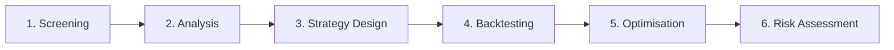
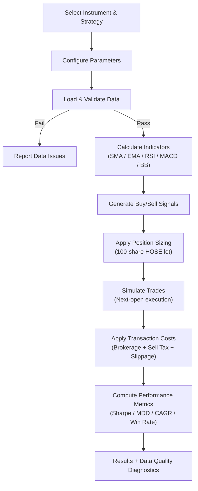

# 4. Research Results and Discussion

This chapter presents the research results of QuantVN Strategy Forge, focusing on how each core capability addresses the identified gaps in quantitative tools for Vietnamese retail investors.

## 4.1 Overview of the Developed Platform

QuantVN Strategy Forge has been developed as a web-based quantitative analysis platform for the Ho Chi Minh Stock Exchange (HOSE). The platform covers 412 HOSE-listed symbols with 768,718 daily price records from 2018 to 2025, supplemented by quarterly financial statements (balance sheets, income statements, and cash flow statements). Figure 4.1 shows the landing page, summarising the platform's scope.

## 4.2 Analytical Workflow

Figure 4.2 illustrates the recommended analytical workflow. The design reflects the systematic investment process described in the quantitative finance literature: screening a tradeable universe, analysing price behaviour, formulating and validating strategies through backtesting, constructing optimised portfolios, and assessing risks before executing decisions.

Figure 4.2: Systematic analytical workflow on the QuantVN platform — from universe screening through risk-informed investment decision.

## 4.3 Strategy Backtesting with Vietnamese Market Parameters

A core contribution of the platform is its backtesting engine, which incorporates Vietnamese market-specific parameters that are absent from most international tools:

- **Lot size:** 100 shares per HOSE trading regulation.
- **Transaction costs:** Brokerage fee (0.15%), sell-side tax (0.1%), and estimated slippage (0.05%).
- **Execution model:** Next-open price execution, reflecting realistic retail order fills.

These parameters matter because ignoring them — as generic international platforms do — can make strategies look more profitable than they actually are, especially for approaches with small per-trade margins. The platform supports five strategy types: SMA Crossover, EMA Crossover, RSI Mean Reversion, Bollinger Bands, and Momentum.

Figure 4.3 shows the backtesting process flow, from strategy configuration through signal generation to performance evaluation with data quality diagnostics.

Figure 4.3: Backtesting process flow integrating data quality validation and Vietnamese market cost parameters.

Each backtest produces performance metrics including total return, CAGR, Sharpe ratio, Sortino ratio, maximum drawdown, win rate, and profit factor, alongside data quality diagnostics (coverage ratio, largest data gap, usable rows) that allow investors to assess result reliability.

## 4.4 Visual Strategy Builder

The Strategy Builder provides a no-code, drag-and-drop interface for constructing custom trading strategies. Users compose strategies by connecting functional nodes on an interactive canvas — data sources, technical indicators, condition filters, and output metrics — without writing code. Figure 4.4 demonstrates a complete RSI Reversal strategy.

This visual approach lowers the barrier to quantitative strategy development, enabling retail investors to experiment with trading logic that traditionally requires programming expertise. Strategies built in the canvas can be directly backtested against historical HOSE data.

## 4.5 Portfolio Optimisation and Risk Assessment

The platform implements four portfolio optimisation methods suited to different investor profiles: Mean-Variance (Markowitz), Risk Parity, Minimum Variance, and Maximum Sharpe. The optimiser automatically excludes assets with insufficient trading history (fewer than 60 days) or inadequate pairwise data overlap (below 30 days), which prevents the kind of unreliable allocations that can result from sparse data — particularly for symbols with shorter listing histories on HOSE.

The risk dashboard complements portfolio construction with quantitative risk metrics:

Table 4.1: Key risk metrics provided by the platform.

| Metric | Purpose | Relevance for Vietnamese Investors |
|--------|---------|-----------------------------------|
| VaR (95%, 99%) | Maximum expected loss under normal conditions | Quantifies daily downside exposure |
| CVaR (Expected Shortfall) | Average loss in worst-case scenarios | Captures tail risk from sudden volatility spikes |
| Beta vs VN-Index | Systematic market risk exposure | Measures sensitivity to HOSE market movements |
| Maximum Drawdown | Worst historical peak-to-trough decline | Sets expectations for potential capital loss |
| Sortino Ratio | Risk-adjusted return (downside only) | More relevant than Sharpe for loss-averse investors |

Together, these give retail investors access to the same risk management toolkit that institutional fund managers use.

## 4.6 AI-Assisted Analysis

The platform includes an AI assistant that answers financial analysis questions by computing results through the platform’s own internal modules. When a user asks about a specific metric — say, the Sharpe ratio of a particular strategy — the assistant calls the relevant tool, retrieves the computed value, and builds its response around that number with an explicit data reference.

The key design choice is what happens when the assistant cannot ground a claim. Rather than generating a plausible-sounding number, it declines and explains why. This is deliberately conservative: in a financial context, a wrong number that sounds authoritative can cause more harm than saying "I don’t have enough data to answer that."

## 4.7 Discussion

### 4.7.1 Addressing the Research Gap

The gap from Chapters 1 and 2 is clear: institutional investors in Vietnam use terminals like Bloomberg and FiinPro, but retail investors — who make up over 80% of daily HOSE volume — have had no integrated quantitative toolset. QuantVN Strategy Forge is built to fill that space, putting screening, backtesting, portfolio optimisation, and risk assessment into one browser-based interface tailored for the Vietnamese market.

### 4.7.2 Value of Local Market Parameters

Integrating HOSE's 100-share lot size, Vietnam's sell-side tax, and realistic execution assumptions into the backtesting engine makes a practical difference. Without these, strategies can look profitable in simulation while actually being unprofitable after local costs are factored in. This is not a theoretical concern — it directly affects how retail investors allocate capital.

### 4.7.3 Data Quality Foundation

The validation pipeline traces every result back to verified inputs. Because the platform uses vnstock — a free but raw data source — corporate action gaps, trading halts, and coverage variations need to be handled explicitly. The pipeline makes these trade-offs visible rather than hiding them.

### 4.7.4 Limitations

Backtesting results are historical and should not be read as predictions of future performance. Only technical analysis strategies are currently supported — fundamental and event-driven strategies are not yet available. Coverage is limited to HOSE; the HNX and UPCoM exchanges are not included.

### 4.7.5 Hypothesis Evaluation

The results presented in this chapter allow the research hypotheses (formulated in Chapter 2) to be evaluated as follows:

- **H1** *(Platform accessibility without programming knowledge)* — **Supported.** The platform is fully browser-based with 8 modules covering all identified analytical gaps (Table 2.1). No installation or coding is required.
- **H2** *(Vietnamese market parameters improve backtest realism)* — **Supported.** Section 4.3 demonstrates integration of HOSE's 100-share lot size, local transaction costs, and next-open execution — all absent from existing international tools.
- **H3** *(No-code strategy builder for non-technical investors)* — **Supported.** Section 4.4 demonstrates end-to-end strategy construction without code, addressing the gap in HOSE-compatible no-code tools.
- **H4** *(Data validation ensures reliability for open-source data)* — **Supported.** The pipeline validates 768,718 records with explicit quality gates and diagnostics reported alongside every backtest result.
- **H5** *(AI assistant with abstention avoids misleading outputs)* — **Partially Supported.** Section 4.6 demonstrates the grounding mechanism and abstention policy; formal user evaluation has not been conducted.

Detailed evidence and limitations for each hypothesis are provided in Appendix A.

## 4.8 Chapter Summary

This chapter has walked through the core capabilities of QuantVN Strategy Forge and the evidence for each research hypothesis. The platform fills a practical gap: Vietnamese retail investors can now screen stocks, backtest strategies with local market parameters, optimise portfolios, and assess risk — all in one interface, without needing to code or install anything.
